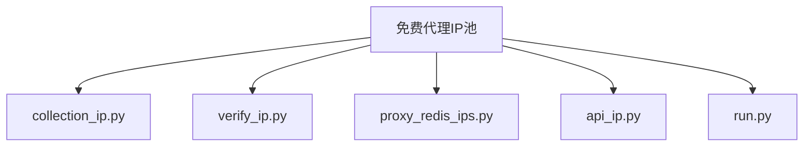

## 第15章：IP代理

---

我们在做爬虫的过程中经常会遇到这样的情况，最初爬虫正常运行，正常抓取数据，一切看起来都是那么美好，然而一杯茶的功夫可能就会出现错误，比如 403 Forbidden，这时候打开网页一看，可能会看到 “您的 IP 访问频率太高” 这样的提示。出现这种现象的原因是网站采取了一些反爬虫措施。比如，服务器会检测某个 IP 在单位时间内的请求次数，如果超过了这个阈值，就会直接拒绝服务，返回一些错误信息，这种情况可以称为封 IP。

### 15.1 基本原理

代理实际上指的就是代理服务器，英文叫作 proxy server，它的功能是代理网络用户去取得网络信息。形象地说，它是网络信息的中转站。在我们正常请求一个网站时，是发送了请求给 Web 服务器，Web 服务器把响应传回给我们。如果设置了代理服务器，实际上就是在本机和服务器之间搭建了一个桥，此时本机不是直接向 Web 服务器发起请求，而是向代理服务器发出请求，请求会发送给代理服务器，然后由代理服务器再发送给 Web 服务器，接着由代理服务器再把 Web 服务器返回的响应转发给本机。这样我们同样可以正常访问网页，但这个过程中 Web 服务器识别出的真实 IP 就不再是我们本机的 IP 了，就成功实现了 IP 伪装，这就是代理的基本原理。

### 15.2  爬虫代理

对于爬虫来说，由于爬虫爬取速度过快，在爬取过程中可能遇到同一个 IP 访问过于频繁的问题，此时网站就会让我们输入验证码登录或者直接封锁 IP，这样会给爬取带来极大的不便。

使用代理隐藏真实的 IP，让服务器误以为是代理服务器在请求自己。这样在爬取过程中通过不断更换代理，就不会被封锁，可以达到很好的爬取效果。

### 15.3 代理区分

根据代理的匿名程度，代理可以分为如下类别。

* 高度匿名代理，高度匿名代理会将数据包原封不动的转发，在服务端看来就好像真的是一个普通客户端在访问，而记录的 IP 是代理服务器的 IP。
* 普通匿名代理，普通匿名代理会在数据包上做一些改动，服务端上有可能发现这是个代理服务器，也有一定几率追查到客户端的真实 IP。代理服务器通常会加入的 HTTP 头有 HTTP_VIA 和 HTTP_X_FORWARDED_FOR。
* 透明代理，透明代理不但改动了数据包，还会告诉服务器客户端的真实 IP。这种代理除了能用缓存技术提高浏览速度，能用内容过滤提高安全性之外，并无其他显著作用，最常见的例子是内网中的硬件防火墙。
* 间谍代理，间谍代理指组织或个人创建的，用于记录用户传输的数据，然后进行研究、监控等目的代理服务器。

### 15.4 requests代理

对于 Requests 来说，代理设置非常简单，我们只需要传 proxies 参数即可。

```python
import requests

proxy = "47.122.65.254:8080"

proxies = {
    "http":"http://" + proxy,
    "https":"https://" + proxy,
}

try:
    resp = requests.get("http://httpbin.org/get", proxies=proxies)
    print(resp.text)
except requests.exceptions.ConnectionError as e:
    print(e.args)
```

运行结果如下：

```python
{
  "args": {}, 
  "headers": {
    "Accept-Encoding": "", 
    "Host": "httpbin.org", 
    "User-Agent": "python-requests/2.32.3", 
    "X-Amzn-Trace-Id": "Root=1-66b9ebd7-79c3911c49e6e82964506524"
  }, 
  "origin": "47.122.65.254", 
  "url": "http://httpbin.org/get"
}
```

requests 的代理设置简单很多，只需要构造代理字典，然后通过 proxies 参数即可。运行结果的 origin 是代理的 IP，这证明代理已经设置成功。

### 15.5 Selenium代理

```python
# Chrome

from selenium import webdriver
proxy = "47.122.65.254:8080"
options = webdriver.ChromeOptions()
options.add_argument('--proxy-server=http://' + proxy)
browser = webdriver.Chrome(options=options)
browser.get('http://httpbin.org/get')
print(browser.page_source)
browser.close()
```

输出结果

```python
{"args": {}, 
  "headers": {
    "Accept": "text/html,application/xhtml+xml,application/xml;q=0.9,*/*;q=0.8", 
    "Accept-Encoding": "gzip, deflate", 
    "Accept-Language": "zh-CN,en,*", 
    "Connection": "close", 
    "Host": "httpbin.org", 
    "User-Agent": "Mozilla/5.0 (Macintosh; Intel Mac OS X) AppleWebKit/538.1 (KHTML, like Gecko) PhantomJS/2.1.0 Safari/538.1"
  }, 
  "origin": "106.185.45.153", 
  "url": "http://httpbin.org/get"
}
```

### 15.5 免费IP代理池

免费代理IP时非常稳定的，可能把IP代理池搭建好了之后一个可用的都没有，所以，目的是锻炼程序设计的思路和能力、编码的能力，对已学内容的归总和练习。如果涉及到大批量，高并发的数据采集，还是需要使用付费代理。

#### 15.5.1 作用

实时的在互联网上采集免费的代理IP，存储在Redis数据库中，通过接口提供程序使用

#### 15.5.2 整体架构




- `collection_ip.py` 负责收集网页上的免费代理IP
- `verify_ip.py`负责验证免费代理IP的可用性
- `proxy_redis_ips.py`使用Redis数据库存储代理IP
- `api_ip.py`通过自写服务，实时提供可用的代理IP
- `run.py`程序统一启动入口

#### 15.5.3 代码实现

##### `collection_ip.py` 

```python
"""
该模块负责完成免费代理IP的采集

"""
import json
import time

from lxml import etree
import requests
import re
from threading import Thread
# 6.3 导入存储模块
from step02_proxy_ip_redis import ProxyRedis


# 5 此时你会发现，在两个类中存储数据的方法是一模一样的
# 这样的话是不是可以通过类的继承，把存储数据封装成基类，分别让两个采集类继承
class IPAbstract(Thread):
    def __init__(self):
        super().__init__()  # 初始化父类
        self.pr = ProxyRedis()  # 6.4 创建储存对象

    # 5.1 保存数据的方法
    def save_ip(self, ips):
        # 6.5 执行新增操作
        for ip in ips:
            self.pr.add_ip(ip)


# 3. 采集方法kuaidaili
# 3.1 把原来的采集方法kuaidaili 封装成类 KuaiIp:
class KuaiIp(IPAbstract):
    def __init__(self):  # 3.4 把参数都通过类初始化
        super().__init__()  # 继承父类方法
        self.session = requests.session()
        self.session.headers = {
            "accept": "text/html,application/xhtml+xml,application/xml;q=0.9,image/avif,image/webp,image/apng,*/*;q=0.8,application/signed-exchange;v=b3;q=0.7",
            "accept-encoding": "gzip, deflate, br, zstd",
            "accept-language": "zh-CN,zh;q=0.9",
            "cache-control": "no-cache",
            "cookie": "<REDACTED_SECRET>",
            "pragma": "no-cache",
            "priority": "u=0, i",
            "referer": "https://www.kuaidaili.com/free/inha/",
            "sec-ch-ua": "/"Chromium/";v=/"136/", /"Google Chrome/";v=/"136/", /"Not.A/Brand/";v=/"99/"",
            "sec-ch-ua-mobile": "?0",
            "sec-ch-ua-platform": "/"Windows/"",
            "sec-fetch-dest": "document",
            "sec-fetch-mode": "navigate",
            "sec-fetch-site": "same-origin",
            "sec-fetch-user": "?1",
            "upgrade-insecure-requests": "1",
            "user-agent": "Mozilla/5.0 (Windows NT 10.0; Win64; x64) AppleWebKit/537.36 (KHTML, like Gecko) Chrome/136.0.0.0 Safari/537.36"
        }

    def run(self):  # 3.3 通过类方法启动类方法，实现分页逻辑
        for i in range(1, 10):
            data = self.get_one_page_ip(i)  # 返回的数据给data
            self.save_ip(data)  # 3.5 保存数据
            print("=== 快代理等待采集下一页")
            time.sleep(5) # 这里可以加上等待，如果页面没有加载完，会导致提取不到内容而报错

    # 3.2 把原来的采集方法kuaidaili() 改名成 get_one_page_ip()
    def get_one_page_ip(self, page=1):

        if page == 1:
            url = "https://www.kuaidaili.com/free/intr/"
        else:
            url = f"https://www.kuaidaili.com/free/intr/{page}"
        resp = self.session.get(url)
        print("=== 快代理开始解析数据")
        pattern = re.compile(r"const fpsList = (?P<ip>.*?);", re.S)
        ips = pattern.search(resp.text).group("ip")  # 拿到的是字符串
        # print(ips)
        ips_list = json.loads(ips)  # 把字符串处理成字典
        result = []
        for ip_dic in ips_list:
            proxy_ip = ip_dic["ip"] + ":" + ip_dic["port"]
            print(proxy_ip)
            result.append(proxy_ip)
        return result
        # 程序写到此处，基本功能完成，但是会发现后续的什么分页逻辑、存储逻辑还没有实现，
        # 如果就这么写下去，会特别长，完全可以使用面相对象的方式，封装成类


# 4. ip89采集方法就跟快代理的模式一样了
class Ip_89(IPAbstract):
    # 4.1 初始化参数
    def __init__(self):
        super().__init__()  # 继承父类方法
        self.session = requests.session()
        self.session.headers = {
            "accept": "text/html,application/xhtml+xml,application/xml;q=0.9,image/avif,image/webp,image/apng,*/*;q=0.8,application/signed-exchange;v=b3;q=0.7",
            "accept-encoding": "gzip, deflate, br, zstd",
            "accept-language": "zh-CN,zh;q=0.9",
            "cache-control": "no-cache",
            "cookie": "<REDACTED_SECRET>",
            "pragma": "no-cache",
            "priority": "u=0, i",
            "referer": "https://www.89ip.cn/",
            "sec-ch-ua": "/"Chromium/";v=/"136/", /"Google Chrome/";v=/"136/", /"Not.A/Brand/";v=/"99/"",
            "sec-ch-ua-mobile": "?0",
            "sec-ch-ua-platform": "/"Windows/"",
            "sec-fetch-dest": "document",
            "sec-fetch-mode": "navigate",
            "sec-fetch-site": "same-origin",
            "sec-fetch-user": "?1",
            "upgrade-insecure-requests": "1",
            "user-agent": "Mozilla/5.0 (Windows NT 10.0; Win64; x64) AppleWebKit/537.36 (KHTML, like Gecko) Chrome/136.0.0.0 Safari/537.36"
        }

    # 4.2 启动方法
    def run(self):
        for i in range(1, 10):
            data = self.get_one_page_ip(i)
            self.save_ip(data)
            print("=== 89代理等待采集下一页")
            time.sleep(5)

    # 4.3 采集每一页的数据
    def get_one_page_ip(self, page):
        url = f"https://www.89ip.cn/pvq/index_{page}.html"
        resp = self.session.get(url)
        # print(resp.text)
        tree = etree.HTML(resp.text)
        print("=== 89代理开始解析数据")
        trs = tree.xpath("//table[@class='layui-table']/tbody/tr")
        result = []
        for tr in trs:
            ip = tr.xpath("./td[1]/text()")
            port = tr.xpath("./td[2]/text()")
            ip = "".join(ip).strip()
            port = "".join(port).strip()
            proxy_ip = ip + ":" + port
            print(proxy_ip)
            result.append(proxy_ip)
        return result


# 2. 主程序
def run():
    # while 1:  实际情况应该每隔多久采集一次，这里就不放开了
    # 2.1 快代理采集 --> 3.6 由原来的函数启动编程类对象启动
    # kuaidaili()
    KuaiIp().run()
    # 2.2 IP89采集--> 4.4 由原来的函数启动编程类对象启动
    # ip_89_caiji()
    Ip_89().run()
    # time.sleep(60 * 3)


# 1. 程序入口
if __name__ == '__main__':
    run()

```

##### `proxy_redis_ips.py`

```python
"""
该模块负责免费代理IP池数据存储
从网页获取的免费代理IP存储到Redis中
使用IP时，从Redis中取出数据

"""
from redis import Redis
import random


# 6 创建一个Redis类
class ProxyRedis:
    def __init__(self):  # 6.1 初始化链接数据库
        self.red = Redis(
            host="localhost",
            port=6379,
            db=1,
            password=<REDACTED_CREDENTIAL>,
            decode_responses=True  # 是否需要解码
        )

    # 6.2 向数据库增加IP数据
    def add_ip(self, ip):
        if not self.red.zrank("proxy_ip", ip):
            # zset存储数据，初始ip50分
            self.red.zadd("proxy_ip", {ip: 50})
            print(f"采集到了一个新IP{ip}，已经存储到Redis")
        else:
            print(f"采集到了一个新IP{ip},已经存在，丢弃！")

    # 10.2 获取数据的方法
    def get_all_ips(self):
        return self.red.zrange("proxy_ip", 0, -1)  # 取出所有IP

    # 12.7 IP可用，设置满分
    def set_max_score(self, ip):
        return self.red.zadd("proxy_ip", {ip: 100})  # 满分

    # 12.9 ip不可用，减分
    def desc_score(self, ip):
        self.red.zincrby("proxy_ip", -10, ip)  # 减10分
        # 如果减到0分，删除IP
        score = self.red.zscore("proxy_ip", ip)
        if score == 0:
            self.red.zrem("proxy_ip", ip)

    # 13.7 获取可用IP
    def get_usable_ip(self):
        # 首选选择满分的ip,就是从100分到100分, 0到-1全拿
        ips = self.red.zrangebyscore("proxy_ip", 100, 100, 0, -1)
        if not ips:
            # 没有满分的，随机拿一个就行，都一样
            ips = self.red.zrangebyscore("proxy_id", 1, 100, 0, -1)
        return random.choice(ips)  # 从里面随机选择一个返回

```

##### `verify_ip.py`

```python
"""
用来做IP校验的
拿到所有IP地址后，发送请求：
如果可以用，就是ok的，分值调整到100
如果不可用或者超时，就是ok的，分值减10


"""
# 9导入数据库模块
import time
from step02_proxy_ip_redis import ProxyRedis
# 11 检测可定是批量的检测，所以使用协程
import asyncio
import aiohttp
# 查看报错信息
import traceback


# 12.2 协程任务
async def check_work(ip, sem, pr):
    # 12.5 异常处理
    try:
        # 12.4 设置等待时间和请求头
        timeout = aiohttp.ClientTimeout(10)
        my_headers = {
            "accept": "text/html,application/xhtml+xml,application/xml;q=0.9,image/avif,image/webp,image/apng,*/*;q=0.8,application/signed-exchange;v=b3;q=0.7",
            "accept-encoding": "gzip, deflate, br, zstd",
            "accept-language": "zh-CN,zh;q=0.9",
            "cache-control": "no-cache",
            "connection": "keep-alive",
            "cookie": "<REDACTED_SECRET>",
            "host": "www.baidu.com",
            "pragma": "no-cache",
            "sec-ch-ua": "/"Chromium/";v=/"136/", /"Google Chrome/";v=/"136/", /"Not.A/Brand/";v=/"99/"",
            "sec-ch-ua-mobile": "?0",
            "sec-ch-ua-platform": "/"Windows/"",
            "sec-fetch-dest": "document",
            "sec-fetch-mode": "navigate",
            "sec-fetch-site": "none",
            "sec-fetch-user": "?1",
            "upgrade-insecure-requests": "1",
            "user-agent": "Mozilla/5.0 (Windows NT 10.0; Win64; x64) AppleWebKit/537.36 (KHTML, like Gecko) Chrome/136.0.0.0 Safari/537.36"
        }
        # 12.3 协程发起请求
        async with sem:
            async with aiohttp.ClientSession(timeout=timeout, headers=my_headers) as session:
                # 对校验网站，直接挂载代理访问
                async with session.get("http://www.baidu.com", proxy="http://" + ip) as resp:
                    await resp.content.read()
                    if resp.status in [200, 302]:  # 判断响应的状态码即可
                        print("ip可用，设置为100分")
                        # 12.6 IP可用，设置满分，到step02中补充方法
                        pr.set_max_score(ip)
                    else:
                        print("ip不可用，减10分")
                        # 12.8 IP不可用，减分，到step02中补充方法
                        pr.desc_score(ip)
    except Exception as e:
        # 如果IP报错了，也是不可用
        print("ip不可用，减10分")
        pr.desc_score(ip)
        # print(traceback.format_exc()) # 如果全是正确或者全是错误可以查看报错信息


# 12.1 创建协程函数
async def check_all_ips(ips, pr):
    # 设置信号量，控制并发量
    sem = asyncio.Semaphore(20)
    tasks = []
    for ip in ips:
        # 封装协程任务成对象，所以接着去创建任务对象
        tk = asyncio.create_task(check_work(ip, sem, pr))
        tasks.append(tk)
    await asyncio.wait(tasks)


# 8 启动函数
def run():
    time.sleep(10)  # 校验的启动要晚于采集
    # 10 创建数据库对象
    pr = ProxyRedis()
    while 1:
        # 10.1 从数据库中取数据，到step02中补充取数据的方法
        ips = pr.get_all_ips()
        # 12 启动协程时间循环，补充协程对象
        asyncio.run(check_all_ips(ips, pr))
        time.sleep(60 * 5)  # 每隔5分钟检测一次


# 7 程序入口
if __name__ == '__main__':
    run()

```

##### `api_ip.py`

```python
"""
api接口：让用户可以通过http协议访问免费代理池中的IP
例如：http://xxxx.xxx.xxx/get_ip

搭建服务器使用sanic
需要安装库
pip install sanci
pip install sanci_cors

"""
# 13.2 导入相关的库
import time
from step02_proxy_ip_redis import ProxyRedis
from sanic import Sanic, text
from sanic_cors import CORS  # 解决跨域问题，让访问api不受限制

# 13.3 创建一个web应用程序
app = Sanic("ip")
CORS(app)  # 接触跨域限制

# 13.4 创建数据库对象
red = ProxyRedis()


# 13.5 挂路由，当有人访问该url的时候，执行xxx操作
# 例如：http://127.0.0.1:10086/get_ip
@app.route("get_ip")
def sanic_server(req):
    # 定义一个函数，名字无所谓，这个的功能是拿到一个可用的ip
    # 13.6 获得可用的IP，需要到step02中补充方法
    ip = red.get_usable_ip()
    # 13.8 把返回的内容交给浏览器
    return text(ip)


# 13.1 启动函数
def run():
    time.sleep(20)  # 提供API接口应该晚于采集、校验
    # 13.9 启动web应用程序
    app.run(host="127.0.0.1", port=10086)
    # 最终提供的地址：http://127.0.0.1:10086/get_ip


# 13 程序入口
if __name__ == '__main__':
    run()

```

##### `run.py`

```python
"""
此模块作用：将整个程序串联起来，统一通过此程序启动
将各个模块的run()方法导入
通过多进程启动

"""
from multiprocessing import Process
from step01_collections_ip import run as col_run
from step03_verify_ip import run as verify_run
from step04_api接口 import run as api_run


# 14.1 启动方法
def run():
    # 14.2 创建采集IP进程
    p1 = Process(target=col_run)
    # 14.3 创建检验IP进程
    p2 = Process(target=verify_run)
    # 14.4 提供API进程
    p3 = Process(target=api_run)

    # 14.5启动进程
    p1.start()
    p2.start()
    p3.start()


# 14 程序入口
if __name__ == '__main__':
    run()

```

#### 15.5.4 代理IP池的用法

```python
import requests

def get_proxy_ip():
    """从代理池服务器地址获取ip"""
    url = "http://127.0.0.1:10086/get_ip"
    resp = requests.get(url)
    return "http://" + resp.text + "/"

def test_free_proxy_ip():
    url = "http://www.baidu.com/"
    my_headers = {
        "accept": "text/html,application/xhtml+xml,application/xml;q=0.9,image/avif,image/webp,image/apng,*/*;q=0.8,application/signed-exchange;v=b3;q=0.7",
        "accept-encoding": "gzip, deflate, br, zstd",
        "accept-language": "zh-CN,zh;q=0.9",
        "cache-control": "no-cache",
        "connection": "keep-alive",
        "cookie": "<REDACTED_SECRET>",
        "host": "www.baidu.com",
        "pragma": "no-cache",
        "referer": "https://www.baidu.com/link?url=HuqQSfMrcO0SodLlG2C8JjJaH0hL3np8JkQ_bUGMYItlsLzduw_QTG7aC3j6Ub5r&wd=&eqid=da85a63d000d55a600000003682d4271",
        "sec-ch-ua": "/"Chromium/";v=/"136/", /"Google Chrome/";v=/"136/", /"Not.A/Brand/";v=/"99/"",
        "sec-ch-ua-mobile": "?0",
        "sec-ch-ua-platform": "/"Windows/"",
        "sec-fetch-dest": "document",
        "sec-fetch-mode": "navigate",
        "sec-fetch-site": "same-origin",
        "sec-fetch-user": "?1",
        "upgrade-insecure-requests": "1",
        "user-agent": "Mozilla/5.0 (Windows NT 10.0; Win64; x64) AppleWebKit/537.36 (KHTML, like Gecko) Chrome/136.0.0.0 Safari/537.36"
    }
    session = requests.session()
    ip = get_proxy_ip()  # 拿到IP地址
    print("ip内容", ip)
    # 构造代理IP
    my_proxy_ip = {
        "http": ip,
        "https": ip,
    }
    resp = session.get(url, headers=my_headers, proxies=my_proxy_ip)  # 挂载IP
    if resp.status_code in [200, 302]:
        print("ip可用，以访问到网页内容")
    else:
        print("ip不可用，无法访问页面内容")


if __name__ == '__main__':
    test_free_proxy_ip()

```


### 15.6 付费代理的使用

按照使用流程，可以大致将付费代理分为两类：

* 一类是代理商提供代理提取接口，通过接口获取代理IP列表。这类代理地址的IP和端口是可见的，想用哪个就用哪个，灵活操纵即可。这种代理一般按时间或者按量收费。如：
  * 快代理  https://www.kuaidaili.com/
  * 芝麻代理  https://www.zhimaruanjian.com/
  * 多贝云代理  https://www.dobei.cn/
* 另一类是隧道代理，可以直接把这类代理设置为固定的IP和端口，无需进一步通过请求接口获取随机代理并设置。只需要知道一个固定的代理服务器地址即可，代理商会进一步将我们分发出去的请求发送给不同的代理服务器并做负载均衡。比较有代表性的有：
  * 阿布云代理  htts://www.abuyun.com/
  * 快代理  https://www.kuaidaili.com/
  * 多贝云代理  https://www.dobei.cn/

每一类在购买服务的时候网站都会提供对应的详细使用文档，参照文档即可。


