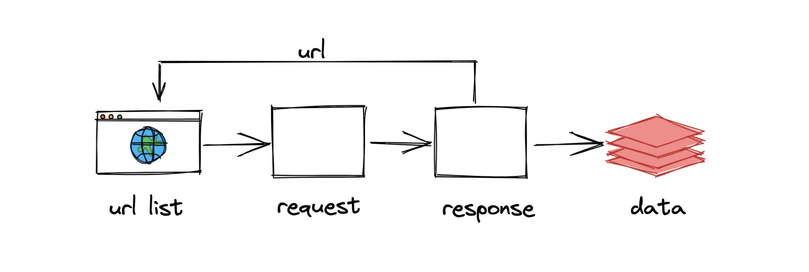
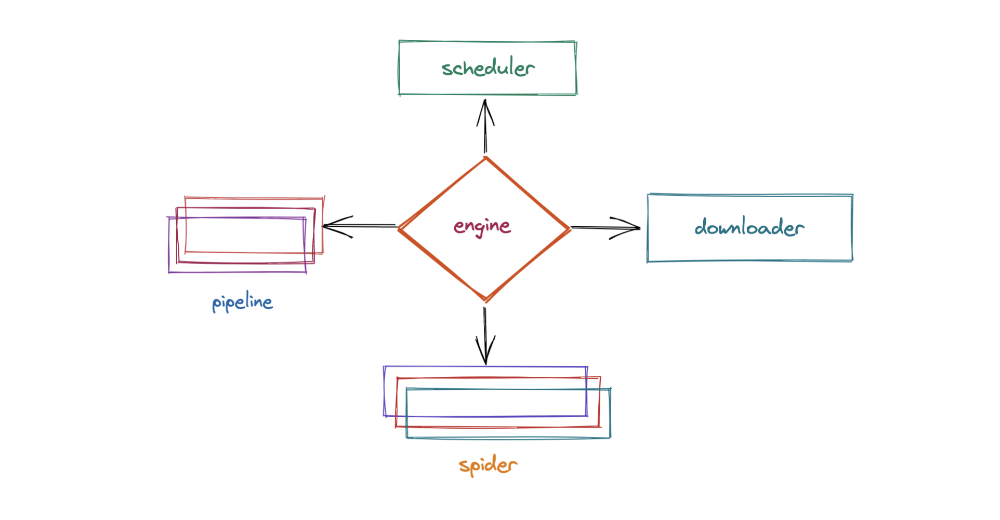
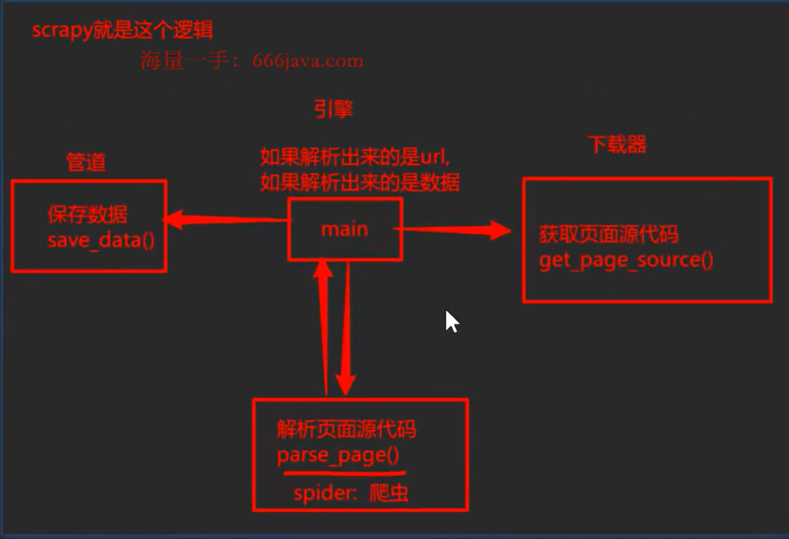
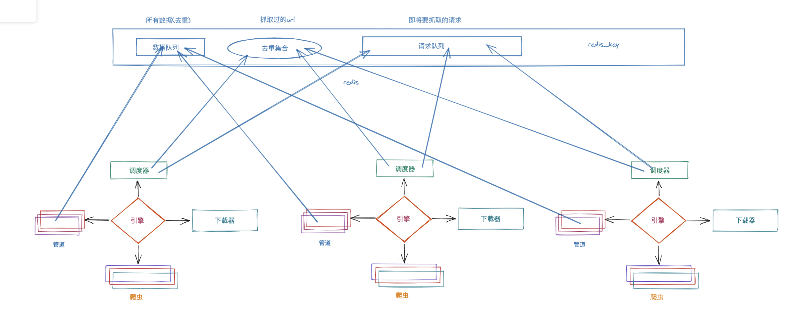

## 第18节：Scrapy框架

---

### 18.1 概念

​		框架本身是为了帮助程序员更快的完成大批量的开发工作而产生的。但是为了应对各种情况，框架一般都会给出丰富的功能，对于小白而言，刚开始学习会有点痛苦。而且，这类框架只有在公司内才有使用场景，如果只是为了接单做副业，那么工程化、框架、Scrapy可能是用不到的，学这个是为了开拓视野。所谓的爬虫工程化是指对爬虫的功能进行模块化，并达到可以批量生产的效果（不论是开发还是数据产出）。而Scrapy特点：速度快、可扩展性强、简单。

scrapy的官方文档：https://docs.scrapy.org/en/latest/ 可作为扩展阅读

没有学习Scrapy框架之前，我们写程序是这样的流程



而即将要学习的Scrapy框架的流程是这样的：



### 18.2  工作流程（重点）

```python
# 在没有学习框架之前的代码编写逻辑，伪代码，只为说明
def get_page_srouce():
	resp =requests.get(xxxxx)
    return resp.text |resp.json()

def parse_source():
	xpath, bs4,re
	return data

def save_data(data):
	txt,csv,mysql, mongodb

def main(): #负贡掌控全局
	# 首页的页面源代码
	ret-= get_page_source() # 获取页面源代们，发送网络请求
	data=parse_source(ret)# 解析出你的数据#需贤继续请求新的ur1
	while :
		# 详情页
		ret = get page source()#获取贞向源代码，发送网络请求
         data= parse_source(ret) #去解析出你要的数据save data(data)# 负贡数据储
		#详情贞如果还有分页、
		#...继续上述操作,

if __name__ = '__main__':
	main()
    

# scrapy 到目前位置并没有在上面代码的基础上增加了什么新东西，只是把上面的逻辑进行了模块化
# 要停止运行中的scrapy程序，按ctrl+c
```



#### 18.2.1 名词解释：

1. engine 引擎：Scrapy 的核心，用来衔接所有的模块，数据流程梳理；
2. scheduler 调度器：里面是 set 和 Queue，本质上可以看成是一个集合和队列，用来存储请求URL的容器。它决定了下一步要去爬取哪一个URL。set负责去除重复请求，Queue负责临时存放即将发起的请求；
3. downloader 下载器：它的本质就是用来发送请求的一个小模块，完全可以把它理解成`requests.get()`的功能，获取页面源代码，里面封装了 get 和 post 等请求方法，只不过它返回的是一个response对象；
4. spider 爬虫：这是我们要写的第一个部分的内容，负责解析下载器返回的response对象。也就是解析页面源代码提取我们要的数据内容；
5. pipeline 管道：这是我们要写的第二个部分的内容，主要用来存储数据（文件、图片等）和各种持久化操作。

#### 18.2.2 执行流程

​		由`engine`开始 ➡️ 到`spider`中找到起始URL，包装成起始的requests对象 ➡️ 到`scheduler` 中把这个起始请求，放入set集合去重后，把起始请求放入queue队列 ➡️`engine`再次拿到起始请求 ➡️ `downloader `拿到起始请求，开始下载页面源代码，把返回的内容封装成response ➡️`engine` 拿到response➡️找到`spider `进行解析内容➡️ `engine`解析的内容如果是数据➡️交给`pipeline` 做存储数据。（如果拿到的不是数据，仍然是requests请求，则会再次进入 scheduler 进行流转，直到拿到数据存储完成结束）

由此来看，Scrapy框架就是把我们平时写的爬虫进行了四分五裂的改造，对每一个功能进行了单独的封装，并且各个模块之间相互不做依赖，一切都有`engine`进行调配。这种思想就是`解耦`，让模块与模块之间的关联性更加松散，这样如果希望替换某一个模块的时候会非常容易，并且对其他模块也不会产生任何影响。

#### 18.2.3 Scrapy的安装

```python
# 国内清华源
pip install -i https://pypi.tuna.tsinghua.edu.cn/simple srcapy
# 官方
pip install scrapy
```

安装成功，直接创建项目即可；如果安装失败，先升级一下`pip`,然后重新安装`Scrapy`即可。


### 18.3 Scrapy 实例

在`pycharm`中可能存在`Scrapy`框架导包误报的情况，可以在在新窗口打开项目，操作步骤` pycharm -> file - > open -> 项目名 -> new window`

#### 18.3.1 创建项目

找到要创建项目的目录后，在目录文件夹鼠标右键现实菜单中选择`open in` 进入 `terminal`，就会进入创建项目的控制台。

```python
# 创建项目：
scrapy startproject 项目名
# 示例
scrapy startproject mySpider_2
```

创建好项目后，可以在pycharm里观察到Scrapy帮我们创建了一个文件夹，里面的目录结构如下：

```python
mySpider_2   # 项目所在文件夹, 建议用pycharm打开该文件夹
    ├── mySpider_2  		# 项目跟目录
    │   ├── __init__.py
    │   ├── items.py  		# 封装数据的格式
    │   ├── middlewares.py  # 所有中间件
    │   ├── pipelines.py	# 所有的管道，保存数据
    │   ├── settings.py		# 爬虫配置信息
    │   └── spiders			# 爬虫文件夹, 稍后里面会写入爬虫代码
    │       └── __init__.py
    └── scrapy.cfg			# scrapy项目配置信息,不要删它,别动它,善待它. 

```

#### 18.3.2 创建爬虫

```python
cd 文件夹  # 进入项目所在文件夹
scrapy genspider 爬虫名称 允许抓取的域名范围

# 示例
cd mySpider_2
scrapy genspider youxi 4399.com
```

至此，爬虫创建完毕，我们打开文件夹看一下

```python
├── mySpider_2
│   ├── __init__.py
│   ├── items.py
│   ├── middlewares.py
│   ├── pipelines.py
│   ├── settings.py
│   └── spiders
│       ├── __init__.py
│       └── youxi.py   # 多了一个这个. 
└── scrapy.cfg

```

#### 18.3.3 代码实例

`youxi.py`文件

```python
import scrapy

class My4399Spider(scrapy,Spider): # 继承scrapy的Spider
    name ='my4399' #spider的名字
    allowed_domains =['4399.com'] #限制该spider抓取的域名，只要不符合该域名的一概过掉
	  # 起始ur，在引擎开始工作的时候。自动封装成请求对象
      # 由引擎进行调度，交给下载器获取页面源代码，帮你装成响应对象
      # 引擎把响应对象交给spider进行解析，解析函数就是下面的parse
    start_urls =['http://www.4399.com/flash/game100 .htm']
	  # start_urls 返回的叫响应
I
	# 形参数 **kwargs 根据你的喜好进行增加，是引擎自动调用.参数也是引擎自动传递
    def parse(self,resp，**kwargs):	# resp:响应对象
		print(resp.text) #查看页面源代码
		pass
```

运行爬虫命令

```python
# 不能直接在py文件中右键运行run，而是需要在terminal中输入命令
scrapy crawl 爬虫名字

# 示例
scrapy crawl youxi
```

在`scrapy`项目跟目录下创建`runner.py`文件，文件内写如下代码，就可正常右键`run`程序。

```python
from scrapy.cmdline import execute

if _name_ =='__main__':
    # 在这里运行的好处是:可以开启调试功能
    # execute需要列表，所以把字符串变成列表
	execute("scrapy crawl baidu".split())
```

`settings.py`配置参数信息

`Python`中默认的日志级别`debug`任何内容都记录，`info` 一些提示信息，`warning` 警告，不会影响程序执行，`error` 报错，`critical `非常严重的错误。

`debug` < `info` < `warning` < `error`< `critical `

```python
# 把"warning"之下的信息过滤掉，可以最大限度的保留错误信息，又不会被无关的内容影响
LOG_LEVEL = "WARNING" 

# robot君子协议要设置为False
robotstxt_obey = False

# 在settings中配置，把这个延迟启用，让爬虫降速，意思就是让每一个URL在下载的时候都要延迟3秒
download_delay = 3
```

`youxi.py`文件中编写解析数据的代码

- 在面相过程的编写方式中，解析页面数据需要使用`lxml`包提供的`xpath`功能，而在`scrapy`中已经封装了这个功能，直接使用`resp.xpath`就可以使用

- 在解析后的数据列表中提取文本数据使用`extract()`或者`extract_first()`，提取列表中的全部或者提取第一个。在提取全部时，如果列表中没有内容，会报错`index out of range`；提取第一个时，没有没有内容，会返回`None`，好处是不会越界报错

- 返回数据：

  - 在不使用`scrapy`框架时，返回数据是在拿到全部数据时，存储在列表或者字典中统一返回

  - 在`scrapy`框架中，推荐使用`yield`返回数据，`yield`是指生成器的返回值，生成一条数据，就返回一条数据，不会影响函数的正常运行，而`return` 返回数据后，函数则会停止执行

  - `yield`返回的数据只能是`dict`、`item`、`requests`、`None`这四种类型，其他类型会报错，因为`engine`会根据数据类型判断下一步的执行方向，如果是数据，则发送给`pipeline`执行数据存储，如果是请求，则发送给`downloader`执行请求，如果是`None`则程序结束

  - 但是`scrapy`官方并不推荐返回数据的时候直接返回`dict`，因为`dict`没有约束，在实际开发中可能会存在写错的情况

  - 官方推荐使用`item`来约束数据结构，可以在`item.py`文件中提前定义好

  - ```python
    # item.py
    import scrapy
    
    class GameItem(scrapy.Item):
        # 定义数据结构
        name = scrapy.Field()
        leibie = srcapy.Field()
        shijian = scrapy.Field()
    
    ```

  - 需要在`youxi.py`文件中导入`from 项目名.items import 类名`这里可能存在`pycharm`误报红线，通过项目名鼠标右键`marker --> Sources Root`即可解决

  - ```python
    from mySpider_2.items import GameItem
    
    # 以下代码在spider中的parse替换掉原来的字典
    item = GameItem()
    item["name"] = name
    item["category"] = category
    item["date"] = date
    yield item
    ```

  - 

```python
# 1.使用spider模块解析内容
def parse(self,resp,**kwargs):# resp: 响应对象
    #查看贞源代码
    print(resp.text)
    # 现在的做法(scrapy中)
    li_list =resp.xpath("//*[@id='list']/li") # parsel
    for li in li_list:
		# name = li.xpath("./div[1]/a//text()").extract()
         name = li.xpath("./div[1]/a//text()").extract_first()
	     leibie = li.xpath("./span[1]/a/text()").extract first()
         shijian = li.xpath("./span[2]/text()").extract_first()
		print(name, leibie, shijian)
        # 给引擎返回数据
		game = GameItem() # 创建一个对象，负责数据存储
    	 game['name'] = name
         game['leibie'] = leibie
         game['time'] = time
		yield game
        # 下面这中直接使用字典的方式也可以用，没有影响，只是容易因为变量名太多或者忘记了而出错。
        yield {
            "name":name,
            "leibie":leibie,
            "time":time
        }
```

 `pipelines.py`文件中存储数据

- 默认情况下，是没有`pipeline`工作的，需要到`settings`中配置，找到`item_pipelines = {} `去掉注释，放开即可
- 在引擎得到数据后会进行判断，如果是数据则会进入pipeline中，自动调用 process_item 函数
- `process_item`中的`return`作用是将数据传递给下一个管道，也就是说`settings`配置文件中如果有多个管道，优先级最高的管道执行完毕后，保存的数据会被返回，传递给下一个管道继续存储，以此类推。如果其中一个管道没有返回值，则会直接返回`None`，这样下一个管道接收后就会报错

```python

class Pipeline:
    """保存数据"""
    # 固定写法：在程序跑起来的时候，打开一个w模式的文件，在获取数据的时候正常写入，但是仅限在pipeline中
    def open_spider(self,spider_name):
        self.f = open("data.csv",mode="w",encoding="utf-8")
    
    # 程序结束的时候执行关闭文件函数
    def close_spider(self,spider_name):
        self.f.close()
        
    def process_item(self, item, spider):# item 是要保存的数据，spider 数据是从哪个爬虫过来的
        print('这里是管道',item['name'],item['leibie'],item['time'])
        # 数据写入文件
        self.f.write(f"{item["name"]},{item["leibie"]},{item["time"]}")
        # 需要注意的是千万不能写 self.f.close(),这就与上面的函数冲突了
        return item # 注意return数据
    

```

 `pipelines.py`存储`MySQL`数据库

如果需要将数据存储到`mysql`数据库中，需要在数据库中先创建好表结构或者通过程序创建。

然后需要在`settings.py`文件中配置管道信息

```python
# 在管道内增加存储数据库的类名，后面的数字是优先级，代码距离engine的远近，数字越小代表优先级越高
ITEM_PIPELINES = {
   "game.pipelines.GamePipeline": 300,
   "game.pipelines.MySQLPipeline": 290,
}
```

 `pipelines.py`代码

```python
# 代码结构是固定的，罗列出来即可
class MySQLPipeline:
    # 爬虫开始时做的事情
	def open_spider(self,spider_name):
        # 连接mysql数据库
		sefl.conn = pymysql.connect(
            host="127.0.0.1",
            port=3306,
            database="cai",
            user='root',
            password=<REDACTED_CREDENTIAL>)
    # 爬虫结束时做的事情  
	def close_spider(self,spider name):
        self.conn.close()# 3.关闭数据库
 
	def process item(self, item, spider):
        # 存储数据
        try:
            cur = self.conn.cursor()
            name = item["name"]
            leibie = item["leibie"]
            time = item["time"]
            sql = f"insert into 表名(name,leibie,time) values('{name}','{leibie}','time')"
            cur.execute(sql)
            self.conn.commit()
        except Exception as e:
            print(e)
            if cur:
                cur.close()
            self.conn.rollback()
       return item
```

 `pipelines.py`存储`MongoDB`数据库

需要在`settings.py`文件中配置管道信息

```python
ITEM_PIPELINES = {
   "game.pipelines.GamePipeline": 300,
   "game.pipelines.MongoPipeline": 200,
}
```

 `pipelines.py`代码

```python
class MongoLPipeline:
	def lopen_spider(self,spider_name):
        # 2.连接Mongo数据库
		self.conn =pymongo.MongoClient(host="127.0.0.1"，port=27018）
		self.db = self.conn['python']
        
	def close_spider(self,spider name):
		# 3.关闭数据库
        self.conn.close()
    
    
	def process item(self, item, spider):
        # 存储数据
        self.db.ssq.insert_one({"name":item["name"],"leibie":item["leibie"],"time":item["time"]})
        return item

                                       
# 存储Redis也是一样的，可以自己尝试一下。 
```

 `pipelines.py`存储`Redis`数据库

需要在`settings.py`文件中配置管道信息

```python
ITEM_PIPELINES = {
    "game.pipelines.GamePipeline": 300,
    "game.pipelines.MongoPipeline": 299,
    "game.pipelines.RedisPipeline": 298,
}
```

### 18.4 `scrapy`下载图片

实例项目：https://desk.zol.com.cn/dongman/，这个案例中存在多次请求的情况，第一次请求，获取图集的地址，第二次请求，获取图集内容每一个图片的下载地址，第三次请求，请求下载图片。

```python
# spider.py文件
import scrapy
from urllib.parse import urljoin


class ZolSpider(scrapy.Spider):
    name = 'zol'
    allowed_domains = ['zol.com.cn']
    start_urls = ['https://desk.zol.com.cn/dongman/']

    def parse(self, resp, **kwargs):  # scrapy自动执行这个parse -> 解析数据
        # print(resp.text)
        # 1. 拿到详情页的url
        a_list = resp.xpath("//*[@class='pic-list2  clearfix']/li/a")
        for a in a_list:
            href = a.xpath("./@href").extract_first()
            if href.endswith(".exe"):
                continue

            # 仅限于scrapy
            href = resp.urljoin(href)  # resp.url 和你要拼接的东西
            # print(href)
            # 2. 请求到详情页. 拿到图片的下载地址

            # 发送一个新的请求
            # 返回一个新的请求对象
            # 我们需要在请求对象中, 给出至少以下内容(spider中)
            # url  -> 请求的url
            # method -> 请求方式
            # callback -> 请求成功后.得到了响应之后. 如何解析(parse), 把解析函数名字放进去
            yield scrapy.Request(
                url=href,
                method="get",
                # 当前url返回之后.自动执行的那个解析函数
                callback=self.suibianqimignzi,
            )

    def suibianqimignzi(self, resp, **kwargs):
        # 在这里得到的响应就是url=href返回的响应
        img_src = resp.xpath("//*[@id='bigImg']/@src").extract_first()
        # print(img_src)
        yield {"img_src": img_src}

```

关于`Request()`的参数：

- `url` 请求地址

- `method` 请求方式
- `callback` 回调函数
- `errback` 报错回调
- `dont_filter` 默认False，表示"不过滤", 该请求会重新进行发送
- `headers` 请求头 
- `cookies` cookie信息

接下来，下载图片。在`scrapy`中有一个`ImagesPipeline`可以实现自动图片下载功能，需要安装如下库：

```python
pip install pillow
```

进入`pipeline.py`文件中

```python
import scrapy
from itemadapter import ItemAdapter
# ImagesPipeline 图片专用的管道
from scrapy.pipelines.images import ImagesPipeline


class MyTuPipeline(ImagesPipeline):
    # 1. 发送请求(下载图片, 文件, 视频,xxx)
    def get_media_requests(self, item, info):
        url = item['img_src']
        yield scrapy.Request(url=url, meta={"sss": url})  # 直接返回一个请求对象即可

    # 2. 图片的存储路径
    # 完整的路径: IMAGES_STORE + file_path()的返回值
    # 在这个过程中. 文件夹自动创建
    def file_path(self, request, response=None, info=None, *, item=None):
        # 可以准备文件夹
        img_path = "dongman/imgs/kunmo/libaojun/liyijia"
        # 准备文件名字
        # 坑: response.url 没办法正常使用
        # file_name = response.url.split("/")[-1]  # 直接用响应对象拿到url
        # print("response:", file_name)
        file_name = item['img_src'].split("/")[-1]  # 用item拿到url
        print("item:", file_name)
        file_name = request.meta['sss'].split("/")[-1]
        print("meta:", file_name)

        real_path = img_path + "/" + file_name  # 文件夹路径拼接
        return real_path  # 返回文件存储路径即可

    # 3. 可能需要对item进行更新
    def item_completed(self, results, item, info):
        # print(results)
        for r in results:
            print(r[1]['path'])
        return item  # 一定要return item 把数据传递给下一个管道


```

然后，需要到`settings.py`文件中配置以下内容：

```python
LOG_LEVEL = "WARNING"
USER_AGENT = 'Mozilla/5.0 (Windows NT 10.0; Win64; x64) AppleWebKit/537.36 (KHTML, like Gecko) Chrome/101.0.4951.54 Safari/537.36'
ROBOTSTXT_OBEY = False
ITEM_PIPELINES = {
   'tu.pipelines.TuPipeline': 300,
   'tu.pipelines.MyTuPipeline': 301,
}
MEDIA_ALLOW_REDIRECTS = True
# 下载图片. 必须要给出一个配置
# 总路径配置
IMAGES_STORE = "./downloads"
```

### 18.5 模拟登陆

在`requests`中我们讲解处理`cookie`主要有两个方案。第一个方案，从浏览器里直接把`cookie`复制出来，放到`headers`中，这种方案简单粗暴。第二个方案，走正常的登录流程，通过`Session`来记录请求过程中的`cookie`，那么到了`scrapy`中如何处理`cookie`？

案例网站：http://www.woaidu.cc/bookcase.php。需求内容：看到登陆后的我的书架内容。也就是必须用到`cookie`。


创建项目，建立爬虫

```python
# 创建项目
Scrapy startproject xiaoshuo
# 创建爬虫
cd xiaoshuo
scrapy genspider denglu woaidu.cc
# marker 标记
source root
# 配置settings文件
log/robot/user_agent 等等
```

`spider.py`文件

```python
import scrapy
from scrapy import Request, FormRequest


class LoginSpider(scrapy.Spider):
    name = 'login'
    allowed_domains = ['woaidu.cc']
    start_urls = ['http://www.woaidu.cc/bookcase.php']

    def parse(self, response, **kwargs):
        print(response.text)
# 发起登录
```

运行爬虫

```python
scrapy crawl denglu
```

此时，会在控制台输出错误信息，提示没有登陆信息。一共有三种方式来处理`cookie`。

#### 18.5.1 方式一

直接从浏览器复制`cookie`，放到请求中去。这种方案和原来的`requests`几乎一模一样，但是需要注意的是`cookie`是需要通过`cookies`参数进行传递的。

```python
import scrapy

class DengSpider(scrapy.Spider):
    name = "deng"
    allowed_domains = ["woaidu.cc"]
    start_urls = ["http://www.woaidu.cc/bookcase.php"]

    def start_requests(self):
        cookies = "Hm_lvt_155d53bb19b3d8127ebcd71ae20d55b1=1825014283,1825263893,1825264973; HMACCOUNT=0BFAD8D83E97B549; username=User; t=727289967466d574c47bb09; Hm_lpvt_155d53bb19b3d8127ebcd71ae20d55b1=1725265123"
        cookie_dic = {}
        for cook in cookies.split("; "):
            k,v = cook.split("=")
            cookie_dic[k] = v
        yield scrapy.Request(url=self.start_urls[0], cookies=cookie_dic)

    def parse(self, resp, **kwargs):
        # 检测cookie是否可以延续
        yield scrapy.Request(url=self.start_urls[0], callback=self.chi, dont_filter=True)

    def chi(self, resp):
        # 能看到登陆后的内容. 没问题
        print(resp.text)

```

#### 18.5.2 方式二

完成登录过程

```python
import scrapy
import ddddocr # 过验证码
from urllib.parse import urlencode


class DengSpider(scrapy.Spider):
    name = "deng"
    allowed_domains = ["woaidu.cc"]
    start_urls = ["http://www.woaidu.cc/bookcase.php"]

    def start_requests(self):
        code_url = "http://www.woaidu.cc/code.php?0.40058681605703095"
        yield scrapy.Request(url=code_url, dont_filter=True, callback=self.code_verify)

    def code_verify(self, resp):
        result = ddddocr.DdddOcr(show_ad=False).classification(resp.body)

        data = {
            "LoginForm[username]": "<REDACTED_CREDENTIAL>",
            "LoginForm[password]": "<REDACTED_CREDENTIAL>",
            "LoginForm[captcha]": result,
            "action": "login",
            "submit": "登录"
        }
        print(urlencode(data, encoding="utf-8"))
        # 发送post请求有两种方式
        # 方式一：数据只能是字符串
        #yield scrapy.Request(
            #url="http://www.woaidu.cc/login.php",
            #method="POST",
            #body=urlencode(data, encoding="utf-8"),
            #callback=self.parse_login,
            #headers={
                #"Content-Type": "application/x-www-form-urlencoded"
            #}
        #)
        # 方式二：推荐用这种方案, 不用管头, 不用管内容, 直接怼字典
        yield scrapy.FormRequest(
                 url="http://www.woaidu.cc/login.php",
                 method="POST",
                 formdata=data,
                 callback=self.parse_login
         )
    def parse_login(self, resp):
        print(resp.text)
        # 能看到登陆后的内容. 没问题
        yield scrapy.Request(url=self.start_urls[0], callback=self.parse)

    def parse(self, resp,**kwargs):
        print(resp.text)

```

#### 18.5.3 方式三

在`settings.py`文件中配置默认的请求头，找到`default_request_headers`，在里面增加`cookie`信息。但是需要注意，需要把`cookies_enabled`设置成`False`。否则在下载器中间件中会被干掉。

```python
COOKIES_ENABLED = False

DEFAULT_REQUEST_HEADERS = {
  'Accept': 'text/html,application/xhtml+xml,application/xml;q=0.9,*/*;q=0.8',
  'Accept-Language': 'en',
  'Cookie': '<REDACTED_SECRET>',
  "User-Agent": "Mozilla/5.0 (Windows NT 10.0; Win64; x64) AppleWebKit/537.36 (KHTML, like Gecko) Chrome/101.0.4951.54 Safari/537.36"
}
```

### 18.6 处理分页

在处理分页的时候要注意，第一页的数据在页面源代码中，并不意味着后续的内容也会出现在页面源代码中，有可能编程接口返回了，所以，要多观察几页数据。

```python
# 传统处理分页的方式
class ShuoSpider(scrapy.Spider):
		name = 'shuo
		allowed domains =['17k.com']
		start_urls =['https://www.17k.com/all/book/2 0 0 0 0 0 0 0 1.html']
		def start_requests(self): #scrapy是协程，太快了，记得开启延迟，否则网站会崩
      	for i in range(1, 10):
        		url = f"https://www.17k.com/all/book/2_0_0_0_0_0_0_0_ {i}.html"
        		yield scrapy.Request(url=url,callback=self.parse)

		def parse(self,resp，**kwargs):
				# print(resp.text)
				trs = resp.xpath("//table/tbody/tr")
         for tr in trs:
					leibie = tr.xpath("./td[2]//text()").extract()
        	 mingzi = tr.xpath("./td[3]//text()").extract()
         	zuozhe = tr.xpath(".//li[@class='zz']/a/text()").extract_first()
         	print(leibie,mingzi,zuozhe)

```

方式二：利用调度器的中的 set 特性

```python
# 在第一页中，直接提取分页的连接，实现自动分页
class ShuoSpider(scrapy.Spider):
		name = 'shuo
		allowed domains =['17k.com']
		start_urls =['https://www.17k.com/all/book/2 0 0 0 0 0 0 0 1.html']

		def parse(self, resp, **kwargs):
				trs = resp.xpath("//table/tbody/tr")
         for tr in trs:
				leibie = tr.xpath("./td[2]//text()").extract()
        	 	 mingzi = tr.xpath("./td[3]//text()").extract()
         		 zuozhe = tr.xpath(".//li[@class='zz']/a/text()").extract_first()
         		 print(leibie,mingzi,zuozhe)
				# 解析完数据之后，可以提取分页的URL
        hrefs = resp.xpath("//div[@class='page']/a/@href").extract()
        for href in hrefs:
            if href.startswith("javascript"):
                continue
                print(href)	#2，3，4，5月
            href = resp.urljoin(href)
            print(href)
		   #???发送新的请求到2，3，4，5，6，
            #1:2，3，4，5，2,
            #2:1，3，4，5，6
            #3:1，2，4，5，6，7
            # 所以这种方式可以直接拿到所有的分页URL，是通过调度器里面的set集合实现的去重
			yield scrapy.Request(
				url=href，
            	# 这里调用自己，是因为每一个页面的处理方法都一样，且不会造成死循环，因为每一夜的地址是不同的。
            	callback=self.parse 
          )
```


### 18.7 `scrapy`中间件

中间件的作用，负责处理引擎和爬虫以及引擎和下载器之间的请求和相应。主要是可以对`requests`和`response`做预处理。为后面的操作做好充足的准备工作。

`scrapy`提供了两种中间件，在引擎和下载器中间的叫做`下载器中间件`；处于引擎和爬虫中间的叫做`爬虫中间件`。

#### 18.7.1 `DownloaderMiddleware`

下载器中间件，介于引擎和下载器之间，引擎获取到`request`对象后，会交给下载器去下载，在这之间我们可以设置中间件。它的执行流程是：

```python
engine得到request --> 中间件1（process_request） --> 中间件2（process_request） --> 下载器
																			  |
engine得到respones <-- 中间件1（process_request） <-- 中间件2（process_request）<--   |
```

`middlewares.py`就是配置中间件的文件

```python
class GameDownloaderMiddleware:
    # Not all methods need to be defined. If a method is not defined,
    # scrapy acts as if the downloader middleware does not modify the
    # passed objects.
    # 下面给的这几个功能，需要就留着，不需要可以删掉

    @classmethod # 这个装饰器不用管
    def from_crawler(cls, crawler):
        # 在创建spider的时候，会自动的执行这个函数.
        s = cls() # 创建当前类的对象 -> 就理解成每个函数中的self就可以
        # 引擎信号通信：当触发了signal=signals.spider_opened（爬虫被创建的时候）这个信号，就执行s.spider_opened这个函数，所以这个地方是可以自定义，什么信号出现就执行什么函数。
        crawler.signals.connect(s.spider_opened, signal=signals.spider_opened)
        return s

    # 重点：请求发送给下载器的时候，自动执行的函数，拦截请求，并对请求处理。
    def process_request(self, request, spider):
        # 参数request：就是当前的请求
        # 返回值必须是下面中的某一个:
        # None: 继续往后走，意思是走到后面的中间件或者引擎，取决于当前是否为最后一个中间件
        # Response object：停下来，请求不会走下载器，而是直接把响应对象给引擎。引擎把响应对象给spider
        # Request object：停下来，请求不会走下载器，而是直接把请求对象给到引擎，引擎继续走调度器
        return None

    # 重点：处理响应内容，拦截下载器返回的响应内容
    def process_response(self, request, response, spider):
        # 在响应对象反馈给引擎的时候自动执行，可以判断状态码、数据是否正常等等
			 # 返回的数据必须是以下两种：
        # - return a Response object：继续执行返回的响应内容……
        # - return a Request object：把请求对象直接返回给引擎
        return response

    def process_exception(self, request, exception, spider):
        # Called when a download handler or a process_request()
        # (from other downloader middleware) raises an exception.

        # Must either:
        # - return None: continue processing this exception
        # - return a Response object: stops process_exception() chain
        # - return a Request object: stops process_exception() chain
        pass

    def spider_opened(self, spider):
        spider.logger.info("Spider opened: %s" % spider.name)

```

使用中间件，需要配置`settings.py`文件，否则不起作用。这里的优先级与管道一样。

```python
DOWNLOADER_MIDDLEWARES = {
   'mid.middlewares.MidDownloaderMiddleware': 542,
   'mid.middlewares.MidDownloaderMiddleware1': 543,
   'mid.middlewares.MidDownloaderMiddleware2': 544,
}
```

#### 18.7.2 中间件的实际使用

设置统一的UA很简单，直接在`settings.py`中设置即可。

```python
USER_AGENT = 'Mozilla/5.0 (Macintosh; Intel Mac OS X 10_15_4) AppleWebKit/537.36 (KHTML, like Gecko) Chrome/92.0.4515.131 Safari/537.36'
```

但是上面这种不够理想，我需要动态随机设置`UA`，在每一次请求的时候，都想更换一个新的`User-Agent`。

chrome浏览器User-Agent集合：https://useragentstring.com/pages/useragentstring.php?name=Chrome

```python
# settings.py 文件中配置以下内容
USER_AGENT_LIST = [
    'Mozilla/5.0 (Windows NT 10.0; Win64; x64) AppleWebKit/537.36 (KHTML, like Gecko) Chrome/70.0.3538.77 Safari/537.36',
    'Mozilla/5.0 (X11; Ubuntu; Linux x86_64) AppleWebKit/537.36 (KHTML, like Gecko) Chrome/55.0.2919.83 Safari/537.36',
    'Mozilla/5.0 (Macintosh; Intel Mac OS X 10_8_3) AppleWebKit/537.36 (KHTML, like Gecko) Chrome/54.0.2866.71 Safari/537.36',
    'Mozilla/5.0 (X11; Ubuntu; Linux i686 on x86_64) AppleWebKit/537.36 (KHTML, like Gecko) Chrome/53.0.2820.59 Safari/537.36',
]
```

在`middlewares.py`文件中

```python
class MyRandomUserAgentMiddleware:

    def process_request(self, request, spider):
        UA = choice(USER_AGENT_LIST)
        request.headers['User-Agent'] = UA
        # 不要返回任何东西

    def process_response(self, request, response, spider):
        return response

    def process_exception(self, request, exception, spider):
        pass
```


**处理代理问题**

中间件的特性还可以用在代理上面。代理问题一直是我们作为一名爬虫工程师很蛋疼的问题，不加容易被检测，加了效率低。免费的可用`IP`更是凤毛麟角。没办法，无论如何还是得面对它。这里，我们采用两个方案来给各位展示`scrapy`中添加代理的逻辑。

```python
# 免费代码
class ProxyMiddleware:

    def process_request(self, request, spider):
        print("又来")
        proxy = choice(PROXY_LIST)
        request.meta['proxy'] = "https://"+proxy  # 设置代理
        return None

    def process_response(self, request, response, spider):
        print('有么有结果???')
        if response.status != 200:
            print("尝试失败")
            request.dont_filter = True  # 丢回调度器重新请求
            return request
        return response

    def process_exception(self, request, exception, spider):
        print("出错了!")
        pass
```

免费代理是在是太难用了，收费代理的使用方法，这里选择快代理。

```python
class MoneyProxyMiddleware:
    def _get_proxy(self):
        """
        912831993520336	<REDACTED_CREDENTIAL>	每次请求换IP
        tps138.kdlapi.com 15818
        需实名认证	5次/s	5Mb/s	有效	续费|订单详情|实名认证
        隧道用户名密码修改密码
        用户名：<REDACTED_CREDENTIAL>
        :return:
        """
        url = "http://tps138.kdlapi.com:15818"
        auth = basic_auth_header(username="<REDACTED_CREDENTIAL>", password=<REDACTED_CREDENTIAL>)
        return url, auth

    def process_request(self, request, spider):
        print("......")
        url, auth = self._get_proxy()
        request.meta['proxy'] = url
        request.headers['Proxy-Authorization'] = auth
        request.headers['Connection'] = 'close'
        return None

    def process_response(self, request, response, spider):
        print(response.status, type(response.status))
        if response.status != 200:
            request.dont_filter = True
            return request
        return response

    def process_exception(self, request, exception, spider):
        pass
```

#### 18.7.3 SpiderMiddleware(了解)

爬虫中间件，是处于引擎和爬虫之间的中间件，里面常用的方法有

```python
class CuowuSpiderMiddleware:
    # Not all methods need to be defined. If a method is not defined,
    # scrapy acts as if the spider middleware does not modify the
    # passed objects.

    @classmethod
    def from_crawler(cls, crawler):
        # This method is used by Scrapy to create your spiders.
        s = cls()
        crawler.signals.connect(s.spider_opened, signal=signals.spider_opened)
        return s

    def process_spider_input(self, response, spider):
        # 请求被返回, 即将进入到spider时调用
        # 要么返回None, 要么报错
        print("我是process_spider_input")
        return None

    def process_spider_output(self, response, result, spider):
        # 处理完spider中的数据. 返回数据后. 执行
        # 返回值要么是item, 要么是request.
        print("我是process_spider_output")
        for i in result:
            yield i
        print("我是process_spider_output")

    def process_spider_exception(self, response, exception, spider):
        print("process_spider_exception")
        # spider中报错 或者, process_spider_input() 方法报错
        # 返回None或者Request或者item.
        it = ErrorItem()
        it['name'] = "exception"
        it['url'] = response.url
        yield it

    def process_start_requests(self, start_requests, spider):
        print("process_start_requests")
        # 第一次启动爬虫时被调用.

        # Must return only requests (not items).
        for r in start_requests:
            yield r

    def spider_opened(self, spider):
        pass

```

items.py

```python
class ErrorItem(scrapy.Item):
    name = scrapy.Field()
    url = scrapy.Field()
```

spider.py

```python
class BaocuoSpider(scrapy.Spider):
    name = 'baocuo'
    allowed_domains = ['baidu.com']
    start_urls = ['http://www.baidu.com/']

    def parse(self, resp, **kwargs):
        name = resp.xpath('//title/text()').extract_first()
        # print(1/0)  # 调整调整这个. 简单琢磨一下即可~~
        it = CuowuItem()
        it['name'] = name
        print(name)
        yield it
```

pipeline.py

```python
from cuowu.items import ErrorItem

class CuowuPipeline:
    def process_item(self, item, spider):
        if isinstance(item, ErrorItem):
            print("错误", item)
        else:
            print("没错", item)
        return item

```


#### 18.7.4 selenium整合Scrapy

如果请求都是直接从selenium中获取Elements，但是selenium又太慢，而不是每一次请求都需要动态加载。所以希望程序可以使request和selenium共存。  

```python
# 创建项目
Scrapy startproject zhipin
# 创建爬虫
cd zhipin
scrapy genspider boss zhipin.com
# marker 标记
source root
# 配置settings文件
log/robot/user_agent 等等
#--------------------------------middlewares.py-------------------
from selenium.webdriver import Chrome
from selenium.webdriver.common.by import By
from scrapy.http,response.html import HtmlResponse!

class ZhipinSpiderMiddleware:...

class ZhipinDownloaderMiddleware:
	@classmethod
	def from_crawler(cls, crawler):
	s = cls()
	crawLer,signaLs.connect(s，开始，s1gnaL=s1gnaLs.splder opened）
	crawler.signals.connect(s.结束，signal=signals.spider_closed)
	return s

	def 开始(self，spider):
		#使用selenium来完成页面源代码(elements)的抓取
		#无头自己加工
		self.web=Chrome() #程序跑起来之后。去创建Chrome对象。程序跑完了之后,关掉web对象
		self.web.implicitly_wait(10)
                          
	def 结束(self, spider):
		self.web.close()

	def process_request(self,request,spider):
	#使用selenium来完成贞向源代码(elements)的抓取
		if isinstance(request,SeleniumRequest):# 判断请求是否是SeleniumRequest类型的
			self.web.get(request.url)	#直接访问即可
			self.web.find_element(By.XPATH,'//*[@id="header"]/div[1]/div[3]/div/a[1]')
			page_source =self.web.page source #就可以拿elements

			#组装一个响对象。返->引擎即可
			resp =HtmlResponse( #装响应对象
				status=200， #状态码
				url=request.url， #url
				body=page_source.en code("utf-8"), # 页面源代码request=request#请求对象
			return resp
    else：# 普通的请求仍然走下载器
        return None
```

```python
# spiders 的项目文件中----------------------
import scrapy
from zhipin.req import SeleniumRequest #导入自己创建的那个类

class BossSpider(scrapy.Spider):
		name = 'boss'
		allowed_domains =['zhipin.com']
		start_urls =['https://www,zhipin.com/c101010100/?query=python&page=2&ka=page-2']
    
	def start_requests(self):
    # 使用selenium类的请求
		yield SeleniumRequest(url=self.start_urls[0], dont_filter=True)
    # 不使用selenium的正常请求
    yield scrapy.Request(url=self.start urls[0])

  def parse(self, resp,**kwargs):
		print(resp.text)
```

```python
# 在项目的根目录下创建req.py文件，自己创建请求类，继承request父类
# 类内什么功能都没有，那么就完全继承父类方法、参数、功能和request
class SeleniumRequest(Request):
   pass
```

### 18.9 全站数据抓取

#### 18.9.1 常规spider

汽车之家的访问频率要做控制，不然会跳出验证

```python
DOWNLOAD_DELAY = 3
```

`spider.py`文件

```python
class ErshouSpider(scrapy.Spider):
    name = 'ershou'
    allowed_domains = ['che168.com']
    start_urls = ['https://www.che168.com/china/a0_0msdgscncgpi1ltocsp1exx0/']

    def parse(self, resp, **kwargs):
        # print(resp.text)
        # 链接提取器
        le = LinkExtractor(restrict_xpaths=("//ul[@class='viewlist_ul']/li/a",), deny_domains=("topicm.che168.com",) )
        links = le.extract_links(resp)
        for link in links:
            yield scrapy.Request(
                url=link.url,
                callback=self.parse_detail
            )
        # 翻页功能
        le2 = LinkExtractor(restrict_xpaths=("//div[@id='listpagination']/a",))
        pages = le2.extract_links(resp)
        for page in pages:
            yield scrapy.Request(url=page.url, callback=self.parse)

    def parse_detail(self, resp, **kwargs):
        title = resp.xpath('/html/body/div[5]/div[2]/h3/text()').extract_first()
        print(title)

```

这里使用了 `LinkExtractor` 链接提取器，可以非常方便的帮助我们从一个响应页面中提取到`url`链接，我们只需要提前定义好规则即可。参数如下： 

- `allow`接收一堆正则表达式, 可以提取出符合该正则的链接
- `deny`接收一堆正则表达式, 可以剔除符合该正则的链接
- `allow_domains`接收一堆域名, 符合里面的域名的链接被提取
- `deny_domains`接收一堆域名, 剔除不符合该域名的链接
- `restrict_xpaths`接收一堆`xpath`, 可以提取符合要求`xpath`的链接
- `restrict_css`接收一堆`css`选择器, 可以提取符合要求的`css`选择器的链接
- `tags`接收一堆标签名, 从某个标签中提取链接, 默认`a`,`area`
- `attrs`接收一堆属性名, 从某个属性中提取链接, 默认`href`

需要注意的是，在提取到的`url`中，是有重复的内容的，但是我们不用管，`scrapy`会自动帮我们过滤掉重复的`url`请求。 


#### 18.9.2 `CrawlSpider`抓取

`CrawlSpider` 就是把上面的逻辑进行了高度的封装，但是封装过后的灵活性就比较差，了解即可。`CrawlSpider` 里面封装了连接提取器，这样就可以把详情页的连接直接提取出来，因此只需要关注详情页的内容提取即可，按照这个逻辑，全站内容均可按逻辑进行提取。

创建项目

```python
scrapy startproject qichezhijia
```

进入项目

```python
cd qichezhijia
```

创建爬虫，此处需要使用`crawl`模板来创建爬虫

```python
scrapy genspider -t crawl ershouche che168.com
```

修改`spider.py`中的`rules`和回调函数

```python
class ErshoucheSpider(CrawlSpider):
    name = 'ershouche'
    allowed_domains = ['che168.com', 'autohome.com.cn']
    start_urls = ['https://www.che168.com/beijing/a0_0msdgscncgpi1ltocsp1exx0/']

    le = LinkExtractor(restrict_xpaths=("//ul[@class='viewlist_ul']/li/a",), deny_domains=("topicm.che168.com",) )
    le1 = LinkExtractor(restrict_xpaths=("//div[@id='listpagination']/a",))
    rules = (
        Rule(le1, follow=True),  # 单纯为了做分页
        Rule(le, callback='parse_item', follow=False), # 单纯提取数据
    )

    def parse_item(self, response):
        print(response.url)
```

`CrawlSpider`的工作流程：前期和普通的`spider`是一致的. 在第一次请求回来之后. 会自动的将返回的`response`按照`rules`中订制的规则来提取链接. 并进一步执行`callback`中的回调. 如果`follow`是`True`, 则继续在响应的内容中继续使用该规则提取链接.  相当于在`parse`中的`scrapy.request(xxx, callback=self.parse)`


### 18.10  增量式爬虫

增量式爬虫，顾名思义就是对网站进行反复抓取。然后发现新东西了就保存起来。遇到了以前抓取过的内容自动去重。思想就两个字，去重。并且可以反复去重。今天运行一下，明天再运行一下。将不同的数据过滤出来，相同的数据去除掉。

```python
# 可以使用URL去重，也可以使用数据做去重，数据做去重的话使用Redis数据库，如果能存进去则证明不重复
# 核心理念也就是：当URL在变化，数据不变，选择URL去重；当URL不变，数据在变，用数据去重；
```

代码逻辑

`spider.py`

```python
import scrapy
import re
import json
import redis
from scrapy.crawler import Crawler


class WangyiSpider(scrapy.Spider):
    name = "wangyi"
    allowed_domains = ["163.com"]
    start_urls = ["https://news.163.com/special/cm_guonei/?callback=data_callback"]
    wangyi_re_obj = re.compile(r"data_callback/((?P<code>.*)/)",re.S)

    conn = redis.Redis(host="127.0.0.1", port=6379, db=3, password=<REDACTED_CREDENTIAL>, decode_responses=True)

    def parse(self, resp, **kwargs):
        code = WangyiSpider.wangyi_re_obj.search(resp.text).group("code")
        news_list = json.loads(code)
        for news in news_list:
            tlink = news.get("tlink")
            print(tlink)
            # 如果存在了. 就过
            if self.conn.sismember("wangyi:news:urls", tlink):
                print("搞过了")
            else:
                yield scrapy.Request(
                    url=tlink,
                    callback=self.parse_detail
                )
                print("请求发出去了")

    def parse_detail(self, resp):
        post_title = resp.xpath("//h1[@class='post_title']//text()").extract()
        post_body = resp.xpath("//div[@class='post_body']//text()").extract()
        print(post_title)
        print(post_body)
        self.conn.sadd("wangyi:news:urls", resp.url)

```

`pipeline.py`

```python
from itemadapter import ItemAdapter
from redis import Redis
import json

class TianyaPipeline:

    def process_item(self, item, spider):
        #   2. 数据内容去重. 优点: 保证数据的一致性. 缺点: 需要每次都把数据从网页中提取出来
        print(json.dumps(dict(item)))
       
    	# 如果数据量很大. 建议计算MD5   32位的字符串
        r = self.red.sadd("wangyi:news:items", json.dumps(dict(item)))
        if r:
            # 进入数据库
            print("存入数据库", item['title'])
        else:
            print("已经在数据里了", item['title'])
        return item

    def open_spider(self, spider):
        self.red = Redis(password=<REDACTED_CREDENTIAL>, db=3)

    def close_spider(self, spider):
        self.red.close()

```


### 18.11 分布式爬虫

分布式爬虫，就是搭建一个分布式的集群，让其对一组资源进行分布联合爬取。

既然要集群来抓取，意味着会有好几个爬虫同时运行，那此时，就非常容易产生这样的问题：如果有重复的`url`怎么办？在原来的程序中，`scrapy`中会由调度器来自动完成这个任务，但是，此时是多个爬虫一起跑。而我们又知道不同的机器之间是不能直接共享调度器的。怎么办? 我们可以采用`redis`来作为各个爬虫的调度器。此时我们引出一个新的模块叫`scrapy-redis`在该模块中提供了这样一组操作。它们重写了`scrapy`中的调度器，并将调度队列和去除重复的逻辑全部引入到了`redis`中，这样就形成了这样一组结构。

```python
# 安装 Scrapy-Redis
pip install scrapy-redis
```



整体的工作流程：

- 某个爬虫从`redis_key`获取到起始`url`，传递给引擎，到调度器。然后把起始`url`直接丢到`redis`的请求队列里。开始了`scrapy`的爬虫抓取工作。
- 如果抓取过程中产生了新的请求，不论是哪个节点产生的，最终都会到`redis`的去重集合中进行判定是否抓取过。
- 如果抓取过，直接就放弃该请求，如果没有抓取过，自动丢到`redis`请求队列中。
- 调度器继续从`redis`请求队列里获取要进行抓取的请求，完成爬虫后续的工作。

接下来，我们用`scrapy-redis`完成上述流程

- 首先，创建项目。 和以前一样，该怎么创建还怎么创建

- 修改`Spider.py`，继承`RedisSpider`，将`start_urls`注释掉，更换成`redis_key`

- 然后再`settings.py`中对`redis`以及`scrapy_redis`配置一下

```python
# -settings文件中的改造
REDIS_HOST = "127.0.0.1"
REDIS_PORT = 6379
REDIS_DB = 8
REDIS_PARAMS = {
    "password":"<REDACTED_CREDENTIAL>"
}

# scrapy-redis配置信息  # 固定的
SCHEDULER = "scrapy_redis.scheduler.Scheduler"
SCHEDULER_PERSIST = True  # 如果为真. 在关闭时自动保存请求信息, 如果为假, 则不保存请求信息
DUPEFILTER_CLASS = "scrapy_redis.dupefilter.RFPDupeFilter" # 去重的逻辑. 要用redis的
ITEM_PIPELINES = {
   "shu.pipelines.ShuPipeline": 300,
    # redis提供了一个pipeline. 统一保存数据
    'scrapy_redis.pipelines.RedisPipeline': 301
}

```

到`Redis`数据库中输入命令：`lpush 爬虫名称：urls "这里放入起始url"` 回车，到此为止分布式爬虫完成。分布式爬虫的停止需要手动，`ctrl + C` 即可。使用`Redis` 可以实现断点续爬。

布隆过滤器，自行研究即可。对接单来说，无意义。


