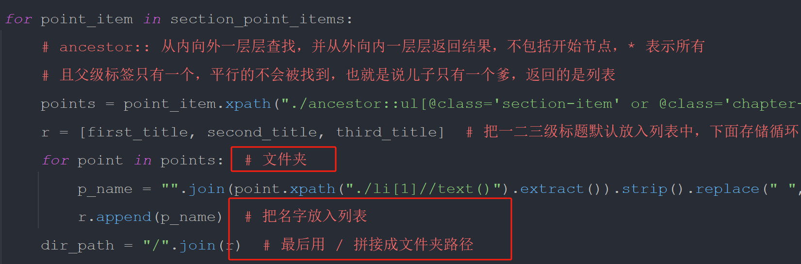
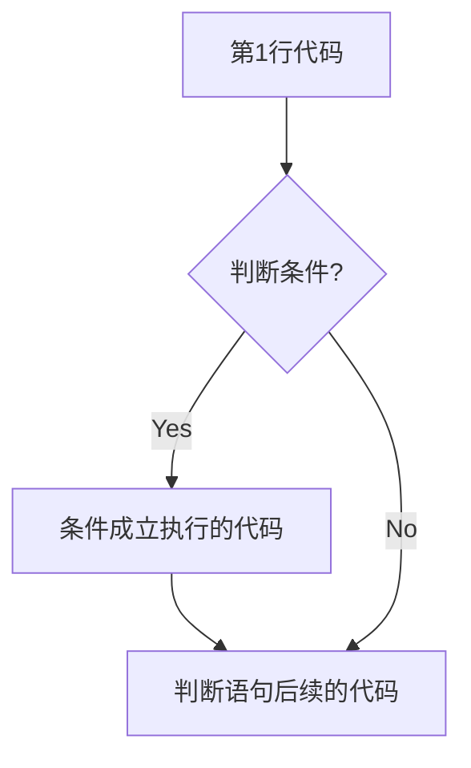

## 第1章：Python基础-上

---

### 1. 注释

#### 1.1 **注释的作用**

使用自己熟悉的语言，在程序中某些代码进行标注说明，增强程序的可读性



#### 1.2 **单行注释（行注释）**

以`#`开头，`#`右边的所有内容都被当作说明文字，而不是真正要执行的程序，只起到辅助说明作用，以下是代码示例：

```python
# 这是第一个单行注释
print("hello world")
```

为了保证代码的可读性，`#`后面建议先添加一个空格，然后在编写相应的说明文字

**在代码后面增加的单行注释：**

在程序开发时，同样可以使用`#`在代码的后面（旁边）增加说明性的文字

但是，需要注意的是，**为了保证代码的可读性，注释和代码之间**至少要有**两个空格**

```python
print("hello world")  # 输出 "hello world"
```


#### 1.3 **多行注释（块注释）**

如果希望编写的**注释信息很多，一行无法显示**，就可以使用多行注释

在Python程序中使用多行注释，可以用**一对连续的三个引号**（单引号或者双引号都可以）包裹注释信息，代码示例：

```python
"""
这是一个多行注释

在多行注释之间，可以写很多内容……

"""
print("hello world")
```

#### 1.4 **什么时候需要使用注释？**

1. 注释不是越多越好，对于一目了然的代码，不需要添加注释
2. 对于复杂的操作，应该在操作开始前写上若干行注释
3. 对于不是一目了然的代码，应该在其行尾添加注释（为了提高可读性，注释应该至少离开代码2个空格）
4. 绝不要描述代码，假设阅读代码的人比你更懂Python，他只是不知道你的代码要做什么
5. 在一些正规的开发团队，通常会有代码审核的惯例，就是一个团队中彼此阅读对方的代码

1. **关于代码的规范**

   1. Python官方专门针对Python的代码格式给出了建议，也就是俗称的PEP8规范
   2. 文档地址：https://www.python.org/dev/peps/pep-0008/
   3. 对应的中文文档：http://zh-google-styleguide.readthedocs.io/en/latest/google-python-styleguide/python_style_rules/

### 2. 变量的使用

程序是用来处理数据的，而变量是用来存储数据的

#### 2.1 **变量的定义**

在Python中，每个变量 **在使用前都必须赋值**，变量赋值以后，该变量才会被创建。等号`=`用来给变量赋值，`=`左边是一个变量名，`=`右边是存储在变量中值。变量定义之后，后续就可以直接使用了。

```python
变量名 = 值
# 定义QQ号变量
qq_number = "123456789"
# 输出QQ号内容
print(qq_number)
```

#### 2.2 **变量的类型**

在内存中创建一个变量，会包括：**变量名称**、**变量保存的数据**、**变量存储数据的类型**、**变量的地址**。

在Python中定义变量时，不需要指定类型，Python可以根据`=`右侧的值，自动推导出变量中存储的数据类型

##### 2.2.1 **变量的类型**

| 类型   | 类型符号                                              |
| ------ | ----------------------------------------------------- |
| 整型   | int                                                   |
| 浮点型 | float                                                 |
| 布尔型 | bool（True 真 非0数--非零即真；False 假 0）           |
| 复数性 | complex（主要用于科学计算，如：波动问题、平面场问题） |
| 字符串 | str                                                   |
| 列表   | list                                                  |
| 元组   | set                                                   |
| 字典   | dict                                                  |

> 使用 `type()` 函数可以查看一个变量的类型

##### 2.2.2 **变量之间的操作**

```python
# 数字型变量之间可以直接计算
a = 1
b = 2
c = a + b
print(c) # 3

# 字符串之间可以使用 + 拼接字符串
first_name = "张"
last_name = "三"
name = first_name + last_name
print(name) # 张三

# 字符串变量可以和整数使用 * 重复拼接相同的字符串
str = "-" * 10
print(str) # ----------
```

##### 2.2.3 **input函数实现键盘输入**

在Python中可以使用 `input` 函数从键盘等待用户的输入，用户输入的 **任何内容** Python都认为是一个 **字符串**

```python
"""
练习：超市买苹果
	1. 收银员输入苹果的价格，单位元/斤
	2. 收银员输入用户购买苹果的重量，单位:斤
	3. 计算并输出付款金额
"""
# 1. 输入苹果单价(小数)
apple_price = float(input("请输入苹果的价格："))
# 2. 输入苹果的重量(小数)
apple_weight = float(input("请输入苹果的重量："))
# 3. 计算金额
money = apple_price * apple_weight
print(money)
```

##### 2.2.4 **变量的格式化输出**

如果希望输出文字信息的同时，一起输出数据，就需要使用格式化操作符。`%` 被称为格式化操作符，专门用于处理字符串中的格式。包含 `%` 的字符串，被称为 **格式化字符串**。

| 格式化字符 | 含义                               |
| ---------- | ---------------------------------- |
| %s         | 字符串                             |
| %d         | 十进制整数                         |
| %f         | 浮点数，`%.2f` 表示小数点后显示2位 |
| %%         | 输出 `%`                           |

语法如下：

```python
print("我的名字是%s" % name)
print("我的名字是%s，我今年%d" % (name,age))
```


##### 2.2.5 **变量的命名**

**标识符和关键字**

**标识符：**就是程序定义的变量名、函数名。标识符可以由字母、下划线和数字组成，但是不能以数字开头，不能与关键字重名。

**关键字：** 就是在Python内部已经使用的标识符，具有特殊的功能和含义，开发者不允许定义和关键字相同的名字的标识符。通过下面的命令可以查看Python中的关键字

```python
import keywork
print(keyword.kwlist)
```

**变量的命名规则**

命名规则可以被视为一种惯例，并无绝对与强制。目的是为了增加代码的识别和可读性。Python中的标识符是区分大小写的。

1. 在定义变量时，为了保证代码格式，`=` 的左右应该各保留一个空格
2. 在Python中，如果变量名需要由二个或多个单词组成时，可以按照如下规则命名：
   1. 每个单词都使用小写字母
   2. 单词和单词之间使用`_` 下换线连接，例如：first_name  last_name
3. 驼峰命名法：
   1. 小驼峰命名法：第一个单词以小写字母开始，后续单词的首字母大写，例如：firstName
   2. 大驼峰命名法：每一个单词的首字母都采用大写字母，例如：FirstName

### 3. 运算符

#### 3.1 算数运算符

完成基本的算术运算使用的符号，用来处理四则运算

| 运算符 | 描述   | 实例                                        |
| ------ | ------ | ------------------------------------------- |
| +      | 加     | 10 + 20 = 30                                |
| -      | 减     | 10 - 20 = -10                               |
| *      | 乘     | 10 * 20 = 200                               |
| /      | 除     | 10 / 20 = 0.5                               |
| //     | 整除   | 返回除法的整数部分（商），9 // 2 结构输出 4 |
| %      | 取余数 | 返回除法的余数  9 % 2 输出结果 1            |
| **     | 幂     | 又称次方、乘方， 2 ** 3  输出结果 8         |


#### 3.2 比较（关系）运算符

| 运算符 | 描述                                                         |
| ------ | ------------------------------------------------------------ |
| ==     | 检查两个操作数的值是否 **相等**，如果是，则条件成立，返回 True，反之，返回False |
| !=     | 检查两个操作数的值是否 **不相等**，如果是，则条件成立，返回 True |
| >      | 检查左操作数的值是否 **大于** 右操作数的值，如果是，则条件成立，返回 True |
| <      | 检查左操作数的值是否 **小于** 右操作数的值，如果是，则条件成立，返回 True |
| >=     | 检查左操作数的值是否 **大于或等于** 右操作数的值，如果是，则条件成立，返回 True |
| <=     | 检查左操作数的值是否 **小于或等于** 右操作数的值，如果是，则条件成立，返回 True |


#### 3.3 逻辑运算符

| 运算符 | 逻辑表达式 | 描述                                                         |
| ------ | ---------- | ------------------------------------------------------------ |
| and    | x and y    | 只有 x 和 y 的值都为 True，才会返回 True<br />否则只要 x 或者 y 有一个值为 False，就返回 False |
| or     | x or y     | 只要 x 或者 y 有一个值为 True，就返回 True<br />只有 x 和 y 的值都为 False，才会返回 False |
| not    | not x      | 如果 x 为 True，返回 False<br />如果 x 为 False，返回 True   |


#### 3.4 赋值运算符

在Python中，使用 `=` 可以给变量赋值，在算术运算时，为了简化代码的编写，Python还提供了一系列的与算数运算符对应的赋值运算符，需要注意的是 **赋值运算符中间不能使用空格**

| 运算符 | 描述                       | 实例                                  |
| ------ | -------------------------- | ------------------------------------- |
| =      | 简单的赋值运算符           | c = a + b 将 a + b 的运算结果赋值为 c |
| +=     | 加法赋值运算符             | c += a 等效于 c = c + a               |
| -=     | 减法赋值运算符             | c -= a 等效于 c = c - a               |
| *=     | 乘法赋值运算符             | c *= a 等效于 c = c * a               |
| /=     | 除法赋值运算符             | c /= a 等效于 c = c / a               |
| //=    | 取整除赋值运算符           | c //= a 等效于 c = c // a             |
| %=     | 取 **模** (余数)赋值运算符 | c %= a 等效于 c = c % a               |
| **=    | 幂赋值运算符               | c **= a 等效于 c = c ** a             |


#### 3.5 运算符的优先级

以下表格的算数优先级由高到低顺序排列

| 运算符                   | 描述                   |
| ------------------------ | ---------------------- |
| **                       | 幂 (最高优先级)        |
| * / % //                 | 乘、除、取余数、取整除 |
| + -                      | 加法、减法             |
| <= < > >=                | 比较运算符             |
| == !=                    | 等于、不等于运算符     |
| = %= /= //= -= += *= **= | 赋值运算符             |
| not or and               | 逻辑运算符             |

#### 3.6 成员运算符

| 元算符 | 表达式           | 结果 | 描述             | 支持的数据类型           |
| ------ | ---------------- | ---- | ---------------- | ------------------------ |
| in     | 3 in (1,2,3)     | True | 元素是否在里面   | 字符串、列表、元组、字典 |
| not in | 4 not in (1,2,3) | True | 元组是否不在里面 | 字符串、列表、元组、字典 |


### 4. 判断语句

生活中的判断几乎是无所不在的，我们每天都在做各种各样的选择，如果这样？如果那样？……

```python
if 今天发工资:
    先还信用卡的钱
    if 有剩余:
        又可以happy了，O(∩_∩)O哈哈~
    else:
        噢，no。。。还的等30天
else:
    盼着发工资
```


#### 4.1 if 语句概念

如果条件满足，才能做某件事情；如果条件不满足，就做另外一件事情，或者什么也不做。判断语句又被称为分支语句，正是因为有了判断，才让程序有了很多的分支。

#### 4.2 if语句语法

```python
if 要判断的条件:
  条件成立时，要做的事情
  ……
else:
  条件不成立时，要做的事情
  ……
```

> 注意：代码的缩紧为一个`tab` 键，或者 4 个空格 -- 建议使用空格。在Python开发中，Tab和空格不要混用。if 和 else 语句以及各自的缩进部分通过是一个完整的代码块

我们可以把整个if语句看成一个完整的代码块



判断语句联系 -- 判断年龄

```python
"""
需求内容：
	1.定义一个整数变量记录年龄
	2.判断是否满18岁
	3.如果满18岁，允许进入网吧嗨皮
"""

# 1.定义年龄变量
age = 18
# 2.判断是否满足18岁
# if语句以及缩进部分的代码是一个完整的代码块
if age >= 18:
    print("可以进入网吧嗨皮……")
else:
    print("小屁孩，回家写作业去！！")

# 思考！- 无论条件是否满足都会执行
print("这句代码什么时候执行?")
  
```

#### 4.3 逻辑运算

1. 在程序开发中，通过 **在判断条件时** ，会需要同时判断多个条件
2. 只要多个条件满足，才能够执行后续代码，这个时候需要使用到逻辑运算符
3. **逻辑运算符** 可以把多个条件 按照 **逻辑** 进行 **连接** ，变成 **更复杂的条件**
4. Python中的**逻辑运算符**包括：与 and / 或 or / 非 not 三种

```python
# and  与/并且
条件1 and 条件2
两个条件同时满足，返回True
只要有一个不满足，就返回False
```

| 条件1  | 条件2  | 结果   |
| ------ | ------ | ------ |
| 成立   | 成立   | 成立   |
| 成立   | 不成立 | 不成立 |
| 不成立 | 成立   | 不成立 |
| 不成立 | 不成立 | 不成立 |

```python
# or 或/或者
条件1 or 条件2
两个条件只要有一个满足，就返回True
两个条件都不满足，就返回False
```

| 条件1  | 条件2  | 结果   |
| ------ | ------ | ------ |
| 成立   | 成立   | 成立   |
| 成立   | 不成立 | 成立   |
| 不成立 | 成立   | 成立   |
| 不成立 | 不成立 | 不成立 |

```python
# not 非/不是
```

| 条件   | 结果   |
| ------ | ------ |
| 成立   | 不成立 |
| 不成立 | 成立   |

**练习**

```python
"""
练习1: 定义一个整数变量 `age`，编写代码判断年龄是否正确
要求人的年龄在 0-120 之间

练习2: 定义两个整数变量 `python_score`、`c_score`，编写代码判断成绩
要求只要有一门成绩 > 60 分就算合格

练习3: 定义一个布尔型变量 `is_employee`，编写代码判断是否是本公司员工
如果不是提示不允许入内
"""

# 练习1：判断年龄
age = 100
if age>=0 and age<=120:
    print("年龄正确")
else:
    print("年龄不正确")

# 练习2：判断成绩
python_score = 50
c_score = 50
if python_score > 60 or c_score > 60:
    print("考试通过")
else:
    print("再接再厉")

# 练习3：判断员工
is_employee = True
if not is_employee:
    print("非公勿内")
```


#### 4.4 if语句进阶

在开发中，使用 if 可以判断条件，使用 else 可以处理 条件不成立 的情况。但是，如果希望在增加一些条件，条件不同，需要执行的代码也不同时，可以使用 `elif` ，语法如下：

```python
if 条件1：
    条件1满足执行的代码
    ……
elif 条件2：
    条件2满足执行的代码
    ……
elif 条件3：
    条件3满足时执行的代码
    ……
else:
    以上条件都不满足时，执行的代码
    ……
```

```python
# elif 演练 —— 女友的节日
需求
定义 holiday_name 字符串变量记录节日名称
如果是 情人节 应该 买玫瑰／看电影
如果是 平安夜 应该 买苹果／吃大餐
如果是 生日 应该 买蛋糕
其他的日子每天都是节日啊……

holiday_name = "平安夜"
if holiday_name == "情人节":
    print("买玫瑰")
    print("看电影")
elif holiday_name == "平安夜":
    print("买苹果")
    print("吃大餐")
elif holiday_name == "生日":
    print("买蛋糕")
else:
    print("每天都是节日啊……")
```


#### 4.5 if语句嵌套

`elif` 的应用场景是同时判断多个条件，所有的条件是平级的。在开发中，使用`if` 进行条件判断，如果希望在条件成立的时候执行语句中再增加条件判断，就可以使用 `if` 的嵌套。嵌套的应用场景是：在之前条件满足的前提下，在增加额外的判断。语法格式如下：

```python
if 条件 1:
    条件 1 满足执行的代码
    ……
    
    if 条件 1 基础上的条件 2:
        条件 2 满足时，执行的代码
        ……    
        
    # 条件 2 不满足的处理
    else:
        条件 2 不满足时，执行的代码
        
# 条件 1 不满足的处理
else:
    条件1 不满足时，执行的代码
    ……
```

```python
# if 的嵌套 演练 —— 火车站安检
需求
1. 定义布尔型变量 `has_ticket` 表示是否有车票
2. 定义整型变量 `knife_length` 表示刀的长度，单位：厘米
3. 首先检查是否有车票，如果有，才允许进行 安检
4. 安检时，需要检查刀的长度，判断是否超过 20 厘米
   如果超过 20 厘米，提示刀的长度，不允许上车
   如果不超过 20 厘米，安检通过
5. 如果没有车票，不允许进门

has_ticket = True
knife_length = 20
if has_ticket:
    if knife_length <= 20 :
        print("安检通过")
    else:
      print("不允许携带 %d 厘米长的刀上车" % knife_length)
else:
    print("没有车票不允许上车")
```

综合练习

```python
需求
1. 从控制台输入要出的拳 —— 石头（1）／剪刀（2）／布（3）
2. 电脑 随机 出拳 —— 先假定电脑只会出石头，完成整体代码功能
3. 比较胜负

# 从控制台输入要出的拳 -- 石头（1）/ 剪刀（2）/ 布（3）
player = int(input("请出拳石头（1）/ 剪刀（2）/ 布（3）："))

# 电脑随机出拳 -- 假定电脑永远出石头
computer = 1

# 比较胜负
if player == 2 and computer == 1:
    print("电脑胜利！")
elif player == 3 and computer == 1:
    print("玩家获胜！")
else:
    print("平局，真是心有灵犀！")
```


### 5. 循环语句

在程序开发中，一共有三种流程方式：顺序--从上向下，顺序执行代码；分支--根据条件判断，决定执行代码的分支；循环--让特定代码重复执行。

#### 5.1 while 循环

循环的作用就是让指定的代码重复的执行，`while` 循环最常用的应用场景就是让执行的代码按照指定的次数重复执行

```python
# while 语句基本用法
初始条件设置 —— 通常是重复执行的 计数器

while 条件（判断 计数器 是否达到 目标次数）:
  条件满足时，做的事情1
  条件满足时，做的事情2
  ……
  处理条件（计数器 + 1）
```

小案例：打印5遍 Hello Python

```python
# 定义重复次数计数器
count = 0

# 使用while判断条件
while count < 5:
    # 要重复执行的代码
    print("Hello Python")
    # 处理计数器
    count += 1
# 循环结束，执行的代码
print("循环结束，此时的count=%d" % count)

# 运行结果
Hello Python
Hello Python
Hello Python
Hello Python
Hello Python
循环结束，此时的count=6
```

> 循环结束后，之前定义的计数器条件的数值是依旧存在的。另外，如果由于程序员的原因，忘记在循环内部 **修改循环的判断条件**，导致循环继续执行，程序无法终止，这种现象叫做 **死循环**

**循环和判断的综合使用**

```python
# 计算 0 ~ 100 之间 所有 偶数 的累计求和结果
# 定义和
sum = 0

# 创建计数器
count = 0

# 创建循环
while count <= 100:
  # 判断偶数
  if count % 2 == 0:
    sum += count
  
  # 改变计数器条件
  count += 1
# 循环结束，打印和
print("0-100偶数和：",sum)
```

#### 5.2 break和 continue

`break` 和 `continue` 是专门在循环中使用的关键字。`break` 某一条件满足时，退出循环，不在执行后续重复的代码。`continue` 某一条件满足时，不执行当前循环中后续的代码，进入下次循环。

```python
# break 在循环过程中，如果某一个条件满足后，不在希望循环继续执行，可以使用break退出循环

i = 0
while i < 10:
  # 当 i=3 时，满足条件，退出循环
  if i == 3:
    break
  print(i)
  i += 1
print("over")
```

```python
# continue 在循环过程中，如果某一个条件满足后，不希望执行循环代码，但又不希望退出循环，可以使用continue。也就是在整个循环中，只有某些条件，不需要执行循环代码，而其他条件都需要执行

i = 0
while i < 10:
  # 当 i=3 时，满足条件，不执行本次循环
  if i == 3:
    # 在使用continue之前，要修改计数器，否则出现死循环
    i += 1
    continue
  print(i)
  i += 1
print("over")
```

#### 5.3 循环嵌套

```python
# while循环嵌套就是while里面还有while

while 条件 1:
    条件满足时，做的事情1
    条件满足时，做的事情2
    条件满足时，做的事情3
    ...(省略)...
    
    while 条件 2:
        条件满足时，做的事情1
        条件满足时，做的事情2
        条件满足时，做的事情3
        ...(省略)...
    
        处理条件 2
    
    处理条件 1
    
```

循环嵌套案例-**九九乘法表**

```python
# 起始行
row = 1
# 最大打印9行
while row <= 9:
    # 起始列
    col = 1
    # 最大打印row列
    while col <= row:
        # end="" 表示输出后，不换行
        # "/t" 可以在控制台输出一个制表符，协助在输出文本时对其
        print("%d * %d = %d" % (col,row,col*row),end="/t")
        # 列数+1
        col += 1
    # 一行打印完成后换行
    print("")
    # 行+1
    row += 1
```

#### 5.4 字符串中的转义字符

`/t` 在控制台输出一个 **制表符**，协助在输出文本时垂直方向保持对其，制表符的功能是在不是用表格的情况下在垂直方向按列对其文本。

`/n` 在控制台输出一个 **换行符**

| 转义字符 | 描述       |
| -------- | ---------- |
| //       | 反斜杠符号 |
| //'      | 带引号     |
| //"      | 双引号     |
| /n       | 换行       |
| /t       | 横向制表符 |
| /r       | 回车       |


#### 5.6 for 循环

`for` 循环用于遍历可迭代对象（如列表、字符串、元组、字典、集合等）

```python
# 遍历列表
fruits = ['apple','banana','cherry']
for fruit in fruits:
  print(fruit)

#输出：apple -> banana -> cherry

# 遍历字符串
for char in "Python":
  print(char)

# 输出：P → y → t → h → o → n
```

结合 `range()` 生成数字序列：`range(start,end,step)` 生成整数序列，常用于控制循环次数和索引遍历

```python
# 遍历0-5
for i in range(6):
  print(i)
# 输出：0,1,2,3,4,5

# 遍历索引和元素
fruits = ["apple","banana","cherry"]
for idx in range(len(fruits)):
  print(f"索引{idx}的元素时{fruits[idx]}")
```

循环控制`break` 和 `continue`：`break` 立即退出整个循环；`continue` 跳过当前循环，进入下一轮循环

```python
# break示例：找到第一个偶数后停止
numbers = [1,2,3,4,5,6,7,8,9,0]
for num in numbers:
  if num % 2 == 0:
    print("找到偶数：",num)
    break # 输出：找到偶数：6

# continue示例：跳过奇数
for num in numbers:
  if num % 2 == 0:
    continue
  print(num) # 输出：2,4,6,8.0
```

循环嵌套，在循环内部在嵌套一层循环，常用于处理多维度数据

```python
matrix = [[1,2],[3,4],[5,6]]
for row in matrix:
  for num in row:
    print(num,end="") # 输出：1,2,3,4,5,6
```

遍历字典，默认遍历字典的键，可通过`items()` 遍历键值对

```python
person = {"name":"Alice","age":18,"city":"paris"}
# 遍历键
for key in person:
  print(key) # 输出：name -> age -> city
  
# 遍历键值对
for key,val in person:
  print(f"{key}:{val}")
```

列表推导式，用一行代码生成列表，替代简单for循环

```python
# 生成平方列表
squares = [x**2 for x in range(5)]
print(squares) # 输出：[0,1,4,9,16]
```

结合`enumerate()` 获取索引值，同时获取元素索引和值

```python
fruits = ["apple","banana","cherry"]
for index,fruit in enumerate(fruits):
  print(f"索引{index}是{fruit}")
```

结合`zip()` 遍历多个序列，并行遍历多个可迭代的对象。以最短的可迭代对象长度为准，按由左至右的顺序进行一一配对，超出部分会被自动忽略

```python
names = ["Alice","Bob","Ethan"]
ages = [26,30,45]
for name,age in zip(names,ages):
  print(f"{name}的年龄是{age}")
```

避免在循环中修改原列表，直接修改原列表可能导致逻辑错误，建议遍历副本或新建列表

```python
numbers = [1,2,3,4,5]
# 错误方式（可能跳过元素）
for num in numbers:
  if num % 2 == 0:
    numbers.remove(num)
print(numbers) # 输出[1,3]

# 正确方式：遍历副本
for num in numbers.copy():
  if num % 2 == 0:
    numbers.remove(num)
```


