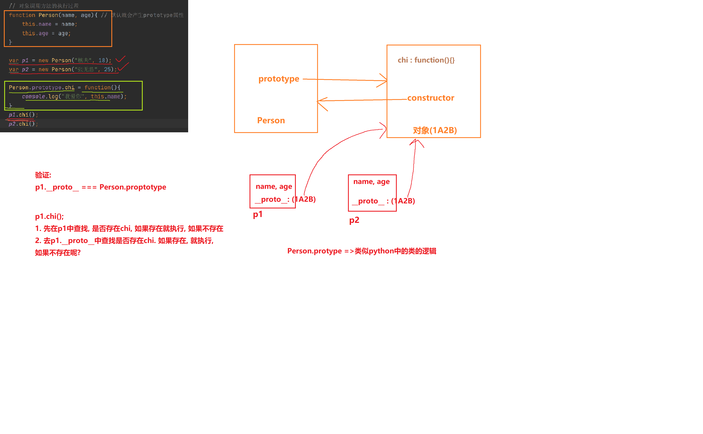
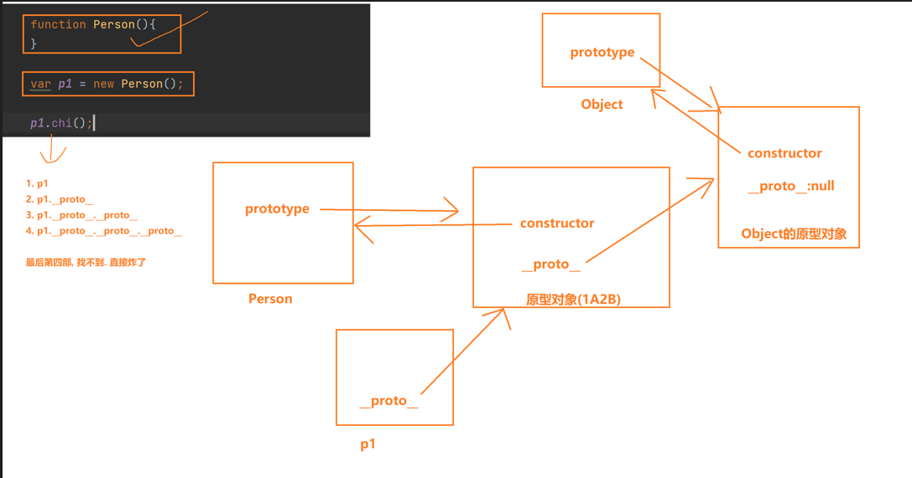
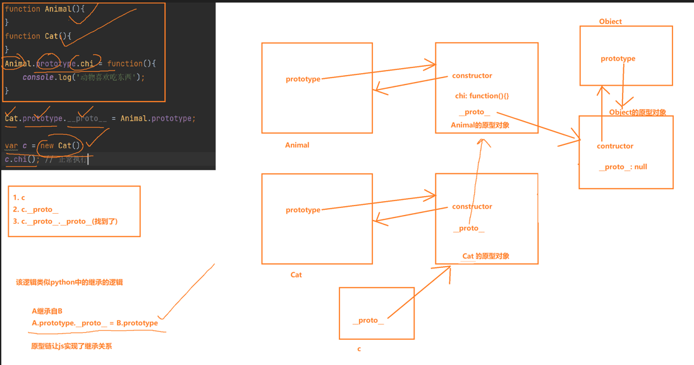
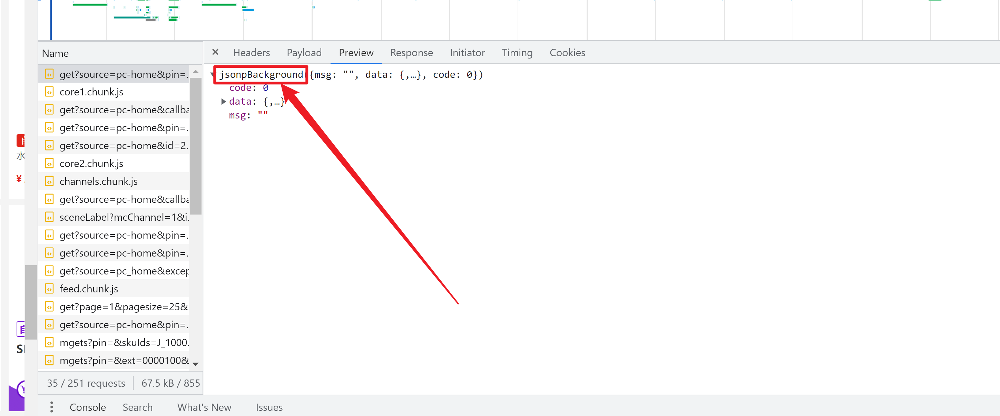
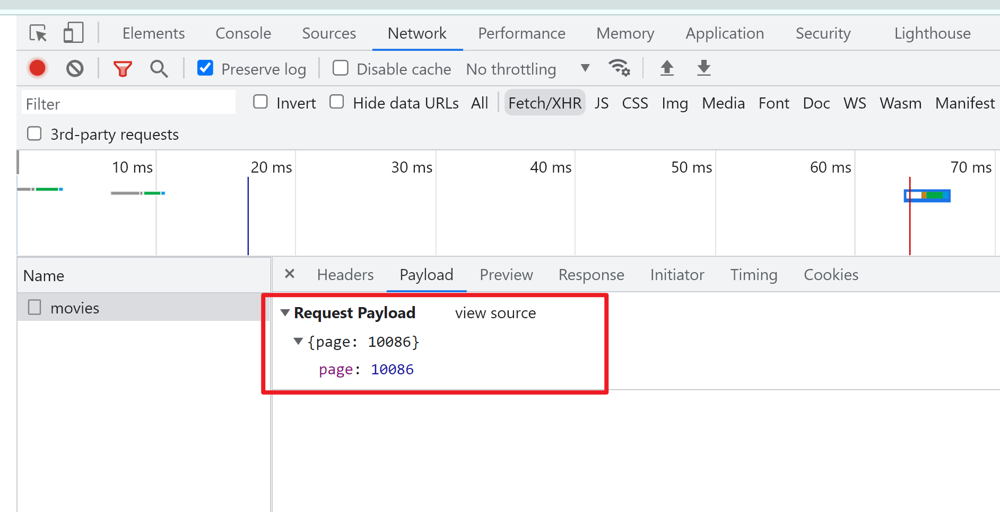
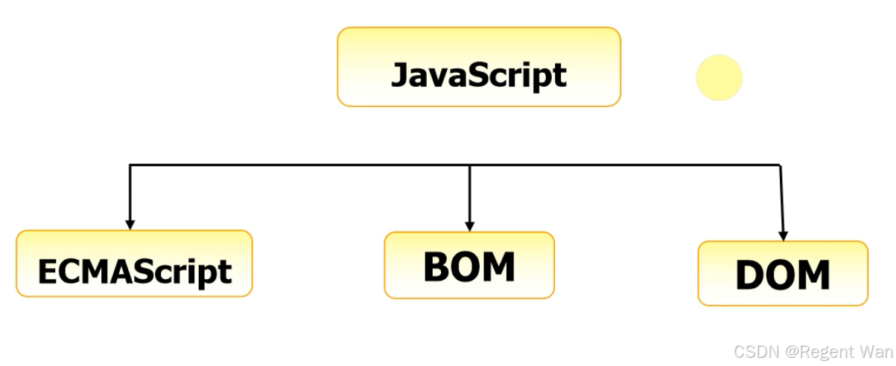

## 第20章：JavaScript - 下

---

JavaScript 中常用功能介绍（非交互）

### 20.1	定时器

定时器就是过多长时间，做什么事情。在JS中，有两种设置定时器的方案：

```javascript
// 第一种：语法规则，经过xx时间后，执行xx任务函数，时间是毫秒。仅执行一次。
t = setTimeout(任务函数，时间，函数参数) 

// 5秒后打印仙逆快更新
t = setTimeout(function(){
  console.log("仙逆快更新")
},5000);

//停止一个定时器
window.clearTimeout(t) 

//第二种：语法规则，每隔xx时间，执行一次xx任务函数，执行无限次
t = setInterval(函数，时间) 
// 每隔5秒钟，打印我爱你
t = setInterval(function(){
  console.log("我爱你")}，5000);
//停止一个定时器
window.clearInterval(t) 

// 清理掉所有定时器，临时处理的方法
for (let i = 0;i <= 9999; i++)
  window.clearInterval(i);
```

`setInterval`在逆向中遇见最多的情况就是无限`debugger`。这个`debugger`关键字可以触发浏览器的暂停，可以观察到当前作用域下的所有变量和函数。如果不打开`devtools`是不会有任何效果的，因为它不能影响正常用户的使用。

```javascript
setInterval(function(){
    debugger;
}, 1000)

// 如果是简单的无限debugger的情况下
// 在debugger前面打断点， 右键 never pause here (一律不再此处暂停)
// 或者使用clearInterval，但是如果这个debugger套上了while循环，就不管用了
// 置空方法，在执行setInterval之前，把这个定时器处理掉 setInterval = function(){}，但是如果定时器中有正常的业务逻辑，则会全部失效，所以，还要在后面还原之前的setInterval逻辑

var _setInterval = setInterval; // 先保留原来的定时器
setinterval = function(){}; // 把定时器置空
setInterval(function(){ //debugger定时器
    debugger;
}, 1000)
setInterval = _setInterval; // 还原会正常的定时器

// 这种就是Hook的逻辑
```

### 20.2	关于时间

在URL中很容易看到以 `?t=1563435243` 开头接一串数字，或者 `?_=1563435243`开头，这是时间戳，是为了在浏览器中做缓存。时间戳是不断变化的。

```javascript
var d = new Date();// 获取系统时间 Tue Jun 24 2025 04:53:20 GMT+0800 (中国标准时间)
var d = new Date("2018-12-01 15:32:48"); // 得到一个具体时问
// 时间格式化
year = d.getFullYear(); //拿到年份
month = d.getMonth() + 1; //拿到月份。注意月份从0开始
date = d.getDate(); //拿到日期
hour = d.getHours(); //拿到小时
minute = d.getMinutes(); //分钟
seconds = d.getseconds(); //秒
week = d.getDay() //星期几

// 拼接时间：年-月-日 时：分：秒
format_date = year + "_" + month + "_" + date + " " + hour + ":" + minute + ":" + seconds;
console.log(format_date)

// 格式化一个字符串，模板字符串，类似Python中的f-string，使用反引号包裹
var format_data = `${year}-${month}-${date} ${hour}:${min}:${sec}`;

// 在编程的世界里，可以用一个数字来表示时间，就是时间戳：从1970年-01-01 00:00:00 开始为 0 ，每过1秒，就计数 +1000，单位是毫米
// 获取时问戳：表示从1970-1-1 00:00:00 到现在一共经过了多少毫秒
let d = new Date().getTime(); //获取时间戳
console.log(d);

// 在Python中 获取时间戳，单位是秒，后面的四舍五入
t = int(time.time() * 1000)
print(t)
```

### 20.3	eval函数

`eval`函数本身在`JavaScript`里正常情况下使用的并不多，但是很多网站会利用`eval`的特性来完成反爬操作。

从功能上讲，`eval`非常简单，它和Python里面的`eval`是一样的。它可以动态的把字符串当成`JavaScript`代码进行运行。

```javascript
s = "console.log('hello，javascript')"
eval(s);
// 在控制台输出 hello javascript
```

也就是说，`eval`里面传递的字符串应该就是即将要执行的代码。那么在页面中如果看到了`eval`加密，只要记住`eval`里面的函数不论多复杂，一定是一个字符串。

解决方案：将`eval()`里面的内容复制后，打开浏览器，找到`Console`，粘贴复制的字符串。找到`function`函数体的结束位置的 `}` 。查看`function`函数内有多少参数，结束位置` } `后面 `（）`内一定有对应的实际参数出现。

### 20.4	箭头函数

在ES6中简化了函数的声明语法：

```javascript
// 箭头函数就是把function 换成了 =>
// 没有参数，必须写括号
var fn = function(){};
var fn = () => {};
// 当参数只有一个的时候，可以省略括号
var fn = function(name){};
var fn = name => {};
var fn = (name) => {};
// 一个以上就不能省略括号了
var fn = function(name, age){};
var fn = (name,age) => {};
// 所以箭头函数的关键点就是找箭头，箭头前面是参数，箭头后面是函数体
```

箭头函数的常见用途

```javascript
// 回调函数，作为参数传递
array.map(x => x*2)

// 通过变量名引用，赋值给变量
const myFunc = ()=>{}

// 如果是自执行的箭头函数，就需要用括号包裹起来，这样表明它是一个表达式
(()=>{
    console.log("立即执行");
})();
```


### 20.5 window对象

`window`对象是一个很神奇的东西，可以把这东西理解成`javascript`的全局。如果我们默认不用任何东西访问一个标识符，那么默认是在用`window`对象。

```javascript
//例如:
eval === window.eval // true
setInterval === window.setInterval //true
var a = 10;
a === window.a // true
function fn(){};
fn === window.fn // true
window.mm= "爱你";
console.log(mm); //"爱你"

// 综上,可以得出一个结论:全局变量可以用window.xxx来表示
(function(){
    let chi = function(){
        console.log("仙逆快更新！");
  };
	window.chi = chi
})();
chi(); // 输出：仙逆快更新！

// 换一种写法，你还认识么?
(function(w){
    let chi = function(){
        console.log("你是吃货吗？");
  };
  w.chi = chi
})(window);
chi(); // 输出：你是吃货吗？

// 在复杂一点
(function(w){
    let tools = {
        b64:function(){
            console.log("我是计算B64");
            return "b64"
    },
    md5:function(){
        console.log("我是计算MD5");
        return "MD5";
     }
 };
  w.jiami = {
      AES:function(msg){
            return tools.b64(),tools.md5(),'god like';
},
	DES:function(){
			console.log("我是DES");
  },
	RSA: function(){
			console.log("我是RSA");
  }
};
})(window);
jiami.AES("吃了么");
```

在`javascript`中所有的方法都会被封装在`window`对象中，比如：`document`和`location`。

```javascript
// 想要看到当前页面的url地址
console.log(location.href);
// 页面跳转：location.href = "http://www.baidu.com";
console.log(window.location.href);
```

在逆向中涉及的补环境，基本上就只值得如下内容

```javascript
// 在逆向过程中，我们是通过node.js抠代码的，但是很多内容都是在浏览器完成的，node.js中并没有相关的内容，所以需要补充浏览器的环境，缺什么补什么
console.log(window.location);
console.log(window.navigator);
console.log(window.document);
console.log(document.cookie);
```

### 20.6	逗号运算符

```javascript
function s(){
    // 从前向后执行 1,2,3
	console.log(1),console.log(2),console.log(3); 
  	let s = (1, 2, 3); // 整体进行赋值的时候,取的是最后一个值3
  	console.log(s);
		//注意，这个括号可以在返川值时省略
		var a;
		return a=10,
		a++,
		a += 100,
		{name:"alex", "a":a};
}

let r = s();
console.log(r); //{name:'alex',a: 111}
```


### 20.7	三元运算符

```javascript
let a= 10;
let b = 20;
// ? 左边的条件是否成立，成立，a赋值给d，不成立，b赋值给d
let d = a > b ? a: b 
console.log(d); //20

//看一个恶心的:
let a = 10;
let b = 20;
let d = 17;
let c = 5;
let e;
let m;

e =(e=a>3?b:c, m=e<b++?c--:a%3>b%d?27:37, m++); // 拆解的步骤
// e = a > 3 ? b:c  --> e=20
// m = e < b++ ? c-- : a % 3 > b % d ? 27:37 --> m=37
// e = m++  这里需要注意的是 m++ 是m本身，但是m还要自增1
console.log(e);37
console.log(c);5
console.log(m);38
```


### 20.8 关于Storage

`Storage`指的是在本地浏览器中存储的数据，可以理解成一个小型的非关系型数据库。主要功能包括：存储、获取和删除。`Storage`分为`localStorage`和`SessionStorage`，它们两个在使用上是一样的，区别在于，`localStorage`是永久存储，而`SessionStorage`是临时存储，当浏览器关闭后，数据就会被删除。另外，`document.cookie`也是本地存储，但是`cookie`是有时效时间的。

`Storage`常见的操作：例如`localStorage.setItem(key, value)`或者`SessionStorage.setItem(key, value)`

```javascript
setItem(key, value); // 设置key=value，如果是相同的key，会把数据覆盖
removeItem(key); // 根据key删除数据
getItem(key); // 根据key来获取数据
```

有时，在逆向中会看到这样的代码：把加密后内容放在storage中，每次发送请求时在Storage中取出来即可，但是这种逻辑有时会阻碍我们逆向的过程

```javascript
var r = LocalStorage.getItem("encrypt")
if(!r){
    var r = jiami(明文);
    LocalStorage.setItem("encrypt", r);
}
发送请求(r)

```

所以，我们的做法是需要清空浏览器本地的存储，查看他是如何加密后存入本地的，以下是清空本地存储的方法：

```javascript
找到浏览器中的application -> localStorage -> url -> 右键 -> clear
找到浏览器中的application -> sessionStorage -> url -> 右键 -> clear
找到浏览器中的application -> cookie -> url -> 右键 -> clear
```

### 20.9	promise（重点掌握）

在学习`promise`之前，感受一下死亡回调的逻辑。ES6新版出现之前，必须在执行完第一个任务之后，才能开始下一个任务；而下一个任务往往都写在回调函数中，这样以此类推，一层一层的套娃，如果超出20层，那代码就不知道成什么样了……出bug必炸，所以叫做死亡回调，例如下面的伪代码：

```javascript
// 比如：用户登陆，我现在的需求，先保证用户输入的验证码得是对的. 我才去验证用户名和密码
// 先发送验证码是否正确的请求
console.log('1. 先发送验证码是否正确的请求');
setTimeout(function(){ // 用setTimeout来模拟 网络请求的等待过程
    var verify_code = true; // 服务器返回的结果
    console.log("2, 服务器返回了验证码结果", verify_code);
    // 服务器给结果了. 并且正确
    if(verify_code){
        console.log("3. 发送用户名和密码给服务器.....");
        setTimeout(function(){
            var login_result = true;
            console.log("4. 接收到服务器返回的登陆结果", login_result);
            if (login_result){
                console.log("5. 加载菜单....");
                setTimeout(function(){
                    console.log("6. 菜单加载完毕");
                    console.log("7. 发送心情求. 去加载用户待办事情");
                    setTimeout(function(){
                        // 88个逻辑
                    }, 5000);
                }, 2000);
            }
        }, 2000);
    }
}, 2000);
```

ES6之后，设计了`promise.then`的逻辑，由原来的回调函数从外到内一层套一层，优化成从上到下一层一层的结构。理解执行过程：`promise`对象在创建的时候需要传递`function(resolve，reject){}`函数，函数中第一个参数`resolve`在当前本次操作中，问题被解决的情况下去调用；第二个参数`reject`会在当前本次操作中，问题被拒绝的情况去调用，`promise()`对象在使用的时候，通过`then`给对象传递`resolve`的实际回调函数；`promise()`对象在使用的时候，通过`catch`给对象传递`reject`的实际回调函数。

```javascript
// 例子：
// 当发送请求的时候，无法确定这个请求是否成功或者何时返回响应，这种情况下就适合使用promise，因为是异步的，所以会异步等待
function send(url){
    // 在创建了promise后，会自动给出两个参数，这两个参数是两个函数
    // resolve：解决了
    // reject: 没解决，被拒绝了
		return new Promise(function(resolve, reject){ 
        // promise在创建的时候，自动运行这个function
        // 如果要查看请求是如何发送的，就在发送请求的一刻打断点，查看到底有哪些参数
      		console.log("我要发送ajax请求了",url) // 发出请求
      		setTimeout(function(){
            	console.log("我发送ajax回来了") 
            	// 请求成功，返回响应，表明问题解决了，所以要去处理返回值
              if "sucessful":{
						     resolve("数据"，url);
             } else {
                  reject("拒绝了"，url);
             }
           }, 3000);
	});
}
```

也就是`promise()`会100%给你一个结果，结果传递给`then()`，根据`promise()`中执行的`resolve`还是`reject`决定`then()`中执行哪一个函数。如果报错就执行`catch()`，最终形成了链式结构`promise().then().catch()`

```javascript
send("www.baidu.com").then(function(data){
  	console.log("我要处埋数据了啊"，data);
  	// 返回promise没有问题，继续处理下一个任务，发送一个新的请求
  	return send("www.google.com"); // 如果then中return回的内容不是promise，依然会自动传递给下一个then
}).then(function(data, url){ // 在这里继续处理新的请求返回的任务
		console.log("我乂来处理数据了"，data);
}).catch(function(){ // 如果出现错误，自动运行catch
  	console.log("有问题，统一走这里");
});
// 在promise的send执行后，没有问题就执行第一个then，对应上面的resolve
// 可以理解为then就是resolve的回调函数
// 想查看返回的内容是如何处理的，应该在send调用回调函数后，也就是23行处打断点
```

总结一下：

- 问题已经解决，执行`resolve`参数，问题被拒绝，执行`reject`参数

- `then`给`resolve`传递回调函数，`catch`给`reject`传递回调函数


但是，重点在于我们在网页中看到的代码并不是规规矩矩的写`resolve`或者`reject`这样的参数，而是给你这样的代码：

```javascript
function sen(){
    return new Promise(function(r, t){
        if (xxx){
            r()
        } else {
            t()
        }
    });
}
```

为了节省带宽，代码都会经过压缩处理，把程序员写的代码进行替换或者混淆，但是我们只要掌握结构，就能看明白是什么意思

### 20.10 原型链

**Prototype Chain** 原型链总共有以下几部分组成

#### 20.10.1 构造器函数

构造器函数（Constructor Function）是一种特殊的函数，用于创建和初始化对象。它的主要目的是通过`new`关键字生成很多个具有相同属性和方法的对象实例。构造函数本质上是一个普通的函数，但它的命名通常遵循首字母大写的约定，以区别于普通函数

```javascript
function Person(name, age){
    this.name = name; // 定义属性
    this.age = age;
}
```

当通过`new Person()`创建对象时，构造函数会自动执行，并为新对象初始化属性，例如：`name`和`age`

```javascript
// 创建实例对象
const p1 = new Person("林志玲", 18); 
const p2  = new Person("李慕婉", 20);
// p1 是 Person 构造函数的实例化对象
```

原理：使用`new`创建对象的时候，会在内存中开辟一块空间，内存地址就会传递给了`this`，后面做什么内容都是在这个内存地址中取数据。

#### 20.10.2 原型对象

`prototype`的意思是原型对象，每个构造函数都有一个`prototype`属性，它也是一个对象。所有通过该构造函数创建的实例对象都会共享这个`prototype`上的属性和方法。

```javascript
Person.prototype.greet = function(){
  console.log('hello, my name is', this.name);  
};
```

此时，`greet`方法会被所有`Person`实例共享，节省内存，通过调用该方法验证：

```javascript
p1.greet();// hello, my name is  林志玲
p2.greet();// hello, my name is  李慕婉
```

#### 20.10.3 隐式原型

而`__proto__`则是指隐式原型，每个实例对象都有一个隐藏的`__proto__`属性（可以通过`Object.getPrototypeof()`访问），它指向该对象的原型对象，即构造函数的`prototype`，我们来验证一下

```javascript
console.log(p1.__proto__ === Person.prototype) // true
console.log(p2.__proto__ === Person.prototype) // true
```

`p1`和`p2`的`__proto__`都指向`Person.prototype`，因为它们是通过`new Person();`创建的。



#### 20.10.4 constructor

`constructor(构造函数引用)`是原型对象`prototype`上的一个属性，它指向创建该对象的构造函数。通过它可以知道对象是由哪个构造函数生成的。我们来验证一下：

```javascript
console.log(Person.prototype.constructor === Person) // true
console.log(p1.constructor === Person) // true
```

`Person.prototype.constructor`指向`Person`构造函数

`p1.__proto__` 指向 `Person.prototype`，而 `Person.prototype.constructor` 指向 `Person`，所以通过原型链查找，`p1.constructor` 最终也指向 `Person`。

#### 20.10.5 原型链（Prototype Chain）

当访问一个对象的属性时，如果对象本身没有这个属性，`JavaScript`会沿着`__proto__`向上查找，直到找到属性或到达原型链的顶端`Object.prototype === null`。此时，程序就会报错。例如：属性的查找过程

```javascript
// p1 自身有 name 和 age 属性
console.log(p1.name) // 林志玲

// p1 没有 greet 方法，但是通过__proto__找到了 Person.prototype.greet，继承了这个方法
p1.greet(); // hello, my name is 林志玲

// Object.prototype 是原型链的顶端
console.log(p1.toString()); //[object Object]

// 如果找到Object还没有属性或者方法，则会报错
console.log(p1.chi()); //Uncaught TypeError: p1.chi is not a function
```

所以，我们在执行`p1.toString()`的时候不会报错，反而可以正常运行，原因是先找`p1对象`中是否有`toString()`方法，如果没有，找它的`原型对象`，`原型对象`中没有，继续找`原型对象的原型对象`，直至找到`Object`的原型为止，而`Object`中存在`toString()`方法，所以不会报错。而`p1.chi()`在`Object`中是没有的`null`，就报错了。

#### 20.10.6 综合案例

通过一个小案例，串联起所有的概念

```javascript
// 1. 定义构造函数
function Person(name, age) {
  this.name = name;
  this.age = age;
}

// 2. 在 prototype 上添加共享方法
Person.prototype.greet = function() {
  console.log(`Hello, I'm ${this.name}, ${this.age} years old.`);
};

// 3. 创建实例
const person1 = new Person("Alice", 25);
const person2 = new Person("Bob", 30);

// 4. 验证 __proto__ 和 prototype 的关系
console.log(person1.__proto__ === Person.prototype); // true
console.log(Person.prototype.constructor === Person); // true

// 5. 调用共享方法
person1.greet(); // Hello, I'm Alice, 25 years old.
person2.greet(); // Hello, I'm Bob, 30 years old.

// 6. 原型链查找
console.log(person1.toString()); // [object Object]（来自 Object.prototype.toString）
```

案例图解

```tex
person1
  ├── name: "Alice"
  ├── age: 25
  └── __proto__: Person.prototype
        ├── greet: function()
        └── __proto__: Object.prototype
              ├── toString: function()
              └── constructor: Object
```

- **`person1`** 的 `__proto__` 指向 `Person.prototype`
- **`Person.prototype`** 的 `__proto__` 指向 `Object.prototype`（因为 `prototype` 是对象）
- **`Object.prototype`** 的 `__proto__` 为 `null`，表示原型链的终点

#### 20.10.7**总结**

| 概念              | 作用                                                         |
| ----------------- | ------------------------------------------------------------ |
| **构造函数**      | 用于创建对象，通过 `new` 调用。                              |
| **`prototype`**   | 构造函数的属性，所有实例共享其上的属性和方法。               |
| **`__proto__`**   | 实例对象的属性，指向构造函数的 `prototype`，用于实现原型链查找。 |
| **`constructor`** | 原型对象的属性，指向创建该对象的构造函数。                   |

原型链就是`javascript`查找`方法`的路径指示标。在`JavaScript`中所有的`对象`中都会有`__proto__`属性，在对象执行方法或者访问属性的时候，都会先找到当前对象自身。如果该对象拥有该属性或者方法，就直接执行；如果该对象没有该方法或者属性，就会默认的去找到`__proto__`原型对象，如果原型对象中找到了该属性或者方法，就会自动执行，否则，会继续查找该原型对象的原型对象……直到找到最后的`Object`对象，如果还是没有该属性或者方法，就会报错

```javascript
// obj 表示对象
// 查找路径如下：
obj -> obj.__proto__ -> obj.__proto__.__proto__ -> …… -> Object.prototype

// 而Object.prototype.__proto__ 是特殊的，它的值是 null
```



原型链对比Python，有点继承的逻辑



#### 20.10.8 大Function

既然在`JavaScript`中所有的内容都是对象，然后所有的对象都有`__proto__`属性

```javascript
var func = function(){

}
// 函数也是对象
console.log(func.__proto__.constructor === Function);
```

那么函数就应该也是对象，而我们平时写的函数本身就是`Function()`的对象。而我们平时看到的函数主要分为：

- 函数
  - 普通函数
  - 构造函数
- 正常的对象

```javascript
var func = new Function("console.log('我爱你123213213');"); // 相当于构建了一个函数
func();
// 我们所有的函数都属于Function的对象
console.log((function(){}).__proto__ === Function.prototype);

// Function()  <=> new Function()
var m = (function(){}).constructor("console.log('iloveyou')");
var m1 = Function("console.log('iloveyou')");
m();
m1();
```

所以，由此可以延伸出，对象的各种各样的用法


### 20.11 call和apply

在`javascript`中`call()`和`apply()`是函数对象的两个方法，它们的主要作用是改变函数执行时的`this`指向，并允许在调用函数时传递参数。

#### 20.11.1 共同点

- 改变`this`指向，它们可以手动指定函数执行时的`this`值（即函数内部`this`指向的对象）
- 立即执行函数，函数调用`call()`或者`apply()`会直接执行函数，并返回结果

#### 20.11.2 不同点

- `call()`传递参数时，逐个传递，参数间使用逗号分隔，例如：`func.call(thisArg, arg1, arg2, arg3……)`
- `apply()`传递参数时，以数组形式传递，例如：`func.apply(thisArg, [arg1, arg2, arg3……])`

当函数正常调用时，`this`的指向由调用函数的上下文决定，谁调用函数，`this`就指向谁

```javascript
const person = {
  name: "Alice",
  greet: function() {
    console.log(`Hello, ${this.name}!`);
  }
};
person.greet(); // 输出：Hello, Alice! （this 指向 person）
```

使用`call()`和`apply()`调用函数时，手动指定`this`的指向，可以将函数`借用`到其他对象上

```javascript
const person1 = {name:"alice"};
const person2 = {name:"Bob"};

function greet(greeting){
    console.log(`${greeting}, ${this.name}`);
}

// 使用 call()
greet.call(person1, "hello"); //输出 hello alice
// 使用 apply()
greet.apply(person2, ["Hi"]); //输出 Hi Bob
```

#### 20.11.3 典型的应用场景

改变`this`指向：当函数需要在不同的对象上下文中执行时

```javascript
const car = {
    brand:"Tesla",
    startEngine:function(){
        console.log(`${this.brand} is starting...`);
    }
}

const car1 = {brand:"BMW"}

car.startEngine.call(car1);// BMW is starting...
```

借用方法：复用其他对象的方法

```javascript
const arr = [1, 2, 3];
const max = Math.max.apply(null, arr); // 输出：3
// 等价于 Math.max.call(null, 1, 2, 3)
```

绑定参数：将数组或类数组对象转换为参数传递

```javascript
function sum(a, b, c) {
  return a + b + c;
}
const numbers = [1, 2, 3];
const result = sum.apply(null, numbers); // 输出：6
```


### 20.12	网页交互

#### 20.12.1 事件绑定

在鼠标点击时，通过事件绑定，可以自动触发函数，实现让`HTML`和`JavaScript`产生交互的效果。

```javascript
<input type="button" onclick="fn()" value="按钮"> 
// javascript:要运行js代码，void(0);啥也不干
<a href="javascrip:void(0)" onclick="fn()">我要去百度</a>
```

在前端的事件是非常多的，不用全部记住，对于爬虫而言记住以下常见事件即可

| 事件名称    | 事件作用   |
| ----------- | ---------- |
| onclick     | 点击事件   |
| onfocus     | 获取焦点   |
| onblur      | 失去焦点   |
| onsubmit    | 提交表单   |
| onchange    | 更换选项   |
| onscroll    | 滚动条滚动 |
| onmouseover | 鼠标滑过   |
| onmouseout  | 鼠标滑出   |

`JavaScript`代码有可能出现在`HTML`的`head`中，也有可能出现在`body`下面，解释性语言都是自上而下运行代码的，如果先加载`JavaScript`，在页面没有完全加载完成时，`js`去找一些标签的时候会找不到。所以通过 `Window.onload = function(){}` 这种方式可以等待页面完全加载完成后监听事件。

```javascript
window.onload = function(){
    let btn = document.querySelector('#btn')
    btn.onclick = function(){
        let input = document.querySelector('#uname')
        input.value = "胡辣汤";
    }
}
```

在`HTML`中可以触发`js`事件，`JS`也可以通过事件，修改HTML内容

```html
<script>
    window.onload = function(){
        let btn = document.querySelector('#btn')
        btn.onclick = function(){
            let input = document.querySelector('#uname')
            input.value = "胡辣汤";
        }
    }
</script>
</head>
<body>
      <input type="button" id="btn" value="呵呵哒"> <!--按钮-->
      <input type="text" id="uname" value="马大哈"> <!--文本框-->
</body>
```

`document.querySelector() `给出一个`css`选择器，就可以得到一个`html`页面上标签元素的句柄(控制该标签)。获取句柄的方案有好多，常见的有：

```javascript
document.getElementById();  // 根据id的值获取句柄
document.getElementsByClassName(); // 根据class的值获取句柄

// <form name='myform'><input type="myusername"/></form>
document.form的name.表单元素的name;  //  document.myform.myusername;
```

通过`JavaScript`向`HTML`输出内容

```javascript
// innerText表示给两个标签中间的文本
document.querySelector("div").innerText = "你好, 你喜欢樵夫么?"


// innerHTML: 把两个标签中间的内容当成html标签来使用
// 有了它, 我们就可以在html页面中的任何位置中插入任何一段html代码
document.querySelector("div").innerHTML = "<input type='text'/>";
console.log(document.querySelector("div").innerHTML); // 拿到的是html代码
console.log(document.querySelector("div").innerText); // 拿到的是纯文本
```


#### 20.12.2 表单验证

我们现在相当于可以从`html`转到`JS`中了，并且在`js`中可以捕获到`html`中的内容，此时，对应的表单验证也可以完成了

HTML表单

```html
<form action="服务器地址" id="login_from">
    <labe for="username">用户名：<REDACTED_CREDENTIAL> type="text" name="username" id="username"><span id="username_info"></span><br/>
    <labe for="password">密&nbsp;&nbsp;&nbsp;码：</labe><input type="text" name="password" id="password"><span id="password_info"></span><br/>
    <input type="button" id="btn" value="点我登录">
</form>
```

javascript 脚本

```javascript
<script>
    window.onload = function(){
        document.getElementById('btn').addEventListener("click", function(){
            // 清空提示信息
            document.getElementById('username_info').innerText = "";
            document.getElementById('password_info').innerText = "";
            // 获取username标签中的value属性值
            let username = document.getElementById('username').value;
            // 获取password标签中value属性值
            let password = <REDACTED_CREDENTIAL>).value;
            // 判断是否可以提交表单
            let flag = true
            if(!username){
                document.getElementById('username_info').innerText = "用户名不能为空";
                flag = false;
            }
            if(!password){
                document.getElementById('password_info').innerText = "密码不能为空"
                flag = false
            }
            if(flag){
                document.getElementById('login_from').submit();
            }

        });
    }

</script>
```

最终实现效果，当用户名和密码的输入框内容为空时，点击提交按钮，出现条件验证。如果都不为空，点击提交按钮，成功提交表单。

### 20.13	Ajax 和 jQuery

#### 20.13.1 jQuery

`jquery` 是`javascript`的第三方库，是一个封装了原生`JavaScript`的产物。`jQuery`的理念是`write less do more`。源码可以在网站 `cdn.bytedance.com` 找`jquery`。关于`jQuery`的版本这里有必要说一下，`jQuery`一共提出过3个大版本，分别是`1.x`, `2.x`和`3.x`。这里注意，虽然目前最新的是`3.x`，但各个公司都不约而同的选择了`1.x`，说明`jQuery 1.x`版本在编程界的地位是非常高的，从其执行效率, 代码兼容性以及代码可靠性上讲`1.x`确实做到了极致。所以，我们学习的版本自然也是`1.x`了。我们选择`1.9.1`即可。

使用方法：下载`jquery.min.js`，`ctrl+s` 即可保存到本地。复制到项目中，引入即可。

下载地址字节cdn:  https://cdn.bytedance.com/

目标：分别使用`jQuery`和原生的`javascript`来完成一个按钮的基本点击效果，点击按钮. 更改`mydiv`中的内容。`html`页面结构如下：

```html
<!DOCTYPE html>
<html lang="en">
<head>
    <meta charset="UTF-8">
    <title>Title</title>
</head>
<body>
    <div class="div-out">
        <input type="button" class="btn" value="我是按钮. 你怕不怕">
        <div class="mydiv">我怕死了...</div>
    </div>
</body>
</html>
```

原生`JavaScript`写法

```javascript
// 方法1
window.addEventListener('load', function(){ // 页面加载后找到按钮，执行函数
    document.getElementsByClassName('btn').addEventListener('click', function(){
        // 找到mydiv,向里面写入文本
        document.getElementsByClassName('mydiv').innerText = '行啊，不错哦~';
    });
})

// 方法2
window.onload = function(){
    document.querySelector('.btn').onclick = function(){
        document.querySelector('.mydiv').innerText = '还可以！！';
    };
}
```

使用`jQuery`的写法

```javascript
$(function(){
    $('.btn').click(function(){
        $('.mydiv').text('我要上天');
    })
})
```

所以，在`jQuery`中，`$`可以认为是`jQuery`最明显的一个标志了，`$()`可以把一个普通的`js`对象转化成`jQuery`对象，所以，`$`的含义就是`jQuery` 。

`jQuery`的逻辑和`css`选择器的逻辑是一样的，所以可以使用`jQuery`选择器快速的对页面结构进行操作

语法

```javascript
//语法
$(选择器).方法
```

案例

```html
<!DOCTYPE html>
<html lang="en">
<head>
    <meta charset="UTF-8">
    <title>Title</title>
    <script src="jquery.min.js"></script>
    <script>

        $(function(){
            $(".btn").on('click', function(){
                $(".info").text("");
                let username = $("#username").val();
                let password = <REDACTED_CREDENTIAL>).val();
                let gender = $("input:radio[name='gender']:checked").val();  // input标签中radio 并且name是gender的. 并且被选择的.
                let city = $("#city").val();

                let flag = true;
                if(!username){
                    $("#username_info").text('用户名不能为空!');
                    flag = false;
                }

                if(!password){
                    $("#password_info").text('密码不能为空!');
                    flag = false;
                }

                if(!gender){
                    $("#gender_info").text('请选择性别!');
                    flag = false;
                }

                if(!city){
                    $("#city_info").text('请选择城市!');
                    flag = false;
                }

                if(flag){
                    $("#login_form").submit();
                } else {
                    return;
                }
            })
        })

    </script>
</head>
<body>
    <form id="login_form">
        <label for="username">用户名: <REDACTED_CREDENTIAL> type="text" id="username" name="username"><span class="info" id="username_info"></span><br/>
        <label for="password">密码: <REDACTED_CREDENTIAL> type="password" id="password" name="password"><span class="info" id="password_info"></span><br/>
        <label>性别: </label>
            <input type="radio" id="gender_men" name="gender" value="men"><label for="gender_men">男</label>
            <input type="radio" id="gender_women" name="gender" value="women"><label for="gender_women">女</label>
            <span class="info" id="gender_info"></span>
        <br/>

        <label for="city">城市: </label>
            <select id="city" name="city">
                <option value="">请选择</option>
                <option value="bj">北京</option>
                <option value="sh">上海</option>
                <option value="gz">广州</option>
                <option value="sz">深圳</option>
            </select>
            <span class="info" id="city_info"></span>
        <br/>

        <input type="button" class="btn" value="登录">
    </form>
</body>
</html>
```

属性相关的控制主要有以下几个功能

```javascript
value的逻辑：val(参数)，有参数，向HTML放东西，没有参数，从HTML中拿东西。
arrt的逻辑：attr(属性，值) 如果给值了，就是赋值，没给值，就是拿属性值。
html的逻辑：html(参数) 操纵HTML中的片段，如果给参数了，塞入片段，如果没有参数，就是取片段
text的逻辑：text(参数) 与HTML相同，但是text处理的是文本，即使给的是HTML，也当成文本处理
```

案例

```html
<!DOCTYPE html>
<html lang="en">
<head>
    <meta charset="UTF-8">
    <title>Title</title>
    <script src="jquery.min.js"></script>
    <script>
        $(function(){
            // 如果给参数, 就是设置值, 如果没参数, 就是获取值
            $("#text_1").val("我是谁?");
            console.log($("#text_1").val());
            // attr() 如果给一个参数. 就是获取值. 如果给2个参数就是设置属性值
            $("#text_2").attr("type", "button").val("god");
            console.log($("#text_2").attr("type"));
            // css() 如果一个参数, 取值, 如果2个参数, 设置值
            $("#mydiv").css("background", "#eee");
            console.log($("#mydiv").css("background"))
            
            // text()和html()很像. 
            console.log($("#mydiv_2").text())  // 拿到纯文本
            console.log($("#mydiv_2").html())  // 拿到html标签
            // 如果传参. 则text(xxx)把xxx作为文本放入标签内.  
            //          则html(xxx)把xxx作为html放入标签.
        })
    </script>
</head>
<body>
    <input type="text" name="" id="text_1">
    <input type="text" name="" id="text_2">
    <div id="mydiv" style="width: 200px;height:100px; background:pink;"></div>
    <div id="mydiv_2" >
        <span>哈哈</span>
        <span>呵呵</span>
    </div>
</body>
</html>
```

#### 20.13.2  Ajax

`ajax` 是 `Asynchronous JavaScript and XML`的简写，`ajax`是一个前后台配合的技术，它可以让 `javascript` 发送异步的 `http` 请求，与后台通信进行数据的获取，当获取到后台数据的时候更新页面显示数据实现局部刷新。只需要记住，当前端页面想和后台服务器进行数据交互时，可以使用`ajax`就可以了。

```javascript
// 发送请求的代码样例，以后在逆向的时候需要经常看
// jquery将它封装成了一个方法$.ajax()，我们可以直接用这个方法来执行ajax请求。

<script>
    $.ajax({
    // 1.url 请求地址
    url:'https://image.baidu.com/search/acjson?tn=resultjson_com&logid=9427531757301067696&ipn=',
    // 2.type 请求方式，默认是'GET'，常用的还有'POST'
    type:'GET',
    // 3.dataType 设置返回的数据格式，常用的是'json'格式
    dataType:'JSON',
    // 4.data 设置发送给服务器的数据, 没有参数不需要设置
    data:{
        name:"alex",
        age:18
    }
    // 5.success 设置请求成功后的回调函数
    success:function (response) {
        console.log(response);    
    },
    // 6.error 设置请求失败后的回调函数
    error:function () {
        alert("请求失败,请稍后再试!");
    },
    // 7.async 设置是否异步，默认值是'true'，表示异步，一般不用写
    async:true
});
</script>

```

> `ajax`方法的参数说明:
>
> - `url`	请求地址
>
> - `type` 请求方式，默认是`GET`，常用的还有`POST`
> - `dataType` 设置返回的数据格式，常用的是`json`格式
> - `data` 设置发送给服务器的数据，没有参数不需要设置
> - `success` 设置请求成功后的回调函数
> - `error` 设置请求失败后的回调函数
> - `async` 设置是否异步，默认值是`true`，表示异步，一般不用写
> - 同步和异步说明
>   - 同步是一个`ajax`请求完成后，另外一个才可以请求，需要等待上一个`ajax`请求完成，好比线程同步。
>   - 异步是多个`ajax`同时请求，不需要等待其它`ajax`请求完成， 好比线程异步。
>
> **注意：** 由于版本的不同回调方法有一定的差异，请求成功也有可能是done/then，请求失败是faile

使用`ajax`发送请求的完整过程，后面在逆向中，经常会看到如下的内容，需要理解变更掌握

```javascript
// 创建 XMLHttpRequest 对象
var xhr = new XMLHttpRequest();

// 定义请求方法和 URL（以 POST 为例）
var method = "POST"; // 可选：GET / POST / PUT / DELETE 等
var url = "https://api.example.com/data"; // 替换为目标接口地址

// 初始化请求（异步请求）
xhr.open(method, url, true); // 第三个参数 async 表示是否异步，默认 true

// 设置请求头（适用于 POST/PUT 请求）
if (method === "POST" || method === "PUT") {
    xhr.setRequestHeader("Content-Type", "application/json;charset=UTF-8");
    // 其他自定义请求头可在此添加
}

// 定义 onreadystatechange 事件处理函数
xhr.onreadystatechange = function () {
    // readyState 为 4 表示请求完成（无论成功与否）
    if (xhr.readyState === 4) {
        // 检查 HTTP 状态码是否为 2xx（200-299）
        if (xhr.status >= 200 && xhr.status < 300) {
            // 响应成功
            try {
                // 根据响应内容类型解析数据
                if (xhr.getResponseHeader("Content-Type").indexOf("application/json") !== -1) {
                    var responseData = JSON.parse(xhr.responseText);
                    console.log("响应数据（JSON）:", responseData);
                } else {
                    console.log("响应数据（文本）:", xhr.responseText);
                }
            } catch (e) {
                console.error("解析响应数据失败:", e);
            }
        } else {
            // 响应失败（如 404/500 错误）
            console.error("请求失败，状态码:", xhr.status);
            console.error("响应内容:", xhr.responseText);
        }
    }
};

// 处理网络错误（如超时、无网络）
xhr.onerror = function () {
    console.error("网络请求失败，请检查网络连接或服务器状态");
};

// 设置超时时间（单位：毫秒）
xhr.timeout = 5000; // 5 秒
// 处理超时事件
xhr.ontimeout = function () {
    console.error("请求超时，请重试");
};

// 构造请求体数据（POST/PUT 请求专用）
var data = {
    username: "<REDACTED_CREDENTIAL>",
    password: "<REDACTED_CREDENTIAL>"
};

// 发送请求
if (method === "POST" || method === "PUT") {
    xhr.send(JSON.stringify(data)); // 发送 JSON 格式数据
} else {
    xhr.send(); // GET/DELETE 等请求无需请求体
}
```

### 关键点说明

1. **初始化请求**：
   - `xhr.open(method, url, async)`：初始化请求配置。`async` 为 `true` 表示异步请求（默认值）。
   - `setRequestHeader()`：设置请求头，例如 `Content-Type` 表示发送的数据格式。
2. **事件监听**：
   - `onreadystatechange`：监控请求状态变化，`readyState === 4` 表示请求完成。
   - `onerror`：处理网络层面的错误（如 DNS 失败、无网络）。
   - `ontimeout`：处理请求超时。
3. **响应处理**：
   - 根据 HTTP 状态码判断请求是否成功（200-299）。
   - 解析响应数据：如果是 JSON 格式，使用 `JSON.parse()` 转换为对象；否则直接读取文本。
4. **请求体数据**：
   - POST/PUT 请求需要构造请求体，通常使用 `JSON.stringify()` 将对象转换为 JSON 字符串。
   - GET 请求的参数应放在 URL 查询字符串中（如 `url + "?key=value"`）。
5. **错误处理**：
   - 捕获响应数据解析异常。
   - 处理网络错误和超时情况。


### 20.14	JSONP

为了解决浏览器跨域的问题，`jQuery`提供了`jsonp`请求。当访问一个网站，你非常确定页面加载数据了。但是在浏览器抓包工具中点击`Fetch/XHR`，获取数据的列表`Name`中是空的。点击`JS`，进入`Preview`，查看数据。如果看到了这样的数据格式：

`jsonpYuYueYuShouStatus13193602659579162({"code" :0 "msq" :"Success" "data"……})`

那么这就是`jsonp`格式的数据。但是它的本质依然是`ajax`请求

```javascript
// jsonp 数据
jsonpBackground({msg:"",data:{,……}，code:0})
```

`jsonp`的逻辑是：在发送请求的时候，会增加一个`dataType:jsonp` ，并且带上一个`callback`字符串。该字符串自动发送给服务器，服务器返回数据的时候，会带上。

```javascript
$.ajax({
  ……
  dataType:jsonp,
  ……
});
```

在浏览器抓包中看到这样的效果：



但是作为爬虫来讲，不需要掌握`jsonp`在前后端到底是如何运行的，我们只要知道这种请求方式，并且直到如何找到目标数据即可。遇到`jsonp`情况时，处理的步骤如下：

```javascript
//step1:拿到URL，看到有callback字符串，callback=后面随便写，有没有都可以
//step2:发送请求
//step3:返回的响应内容是一个jsonp的字符串，用以下方法处理这个字符串，取出真正的字典数据

jsonp_str = 'jsonpCallback({"status": "success", "data": {"user": {"id": 12345, "name": "张三", "email": "zhangsan@example.com"}, "preferences": [{"language": "zh-CN"}, {"theme": "dark"}]}, "timestamp": "2025-06-24T08:30:00Z"})''

//step4:jsonp 通用解决方案
import json
pattern = re.compile(r"/((?P<code>.*)/)")  // ()包裹的就是目标数据
result = pattern.search(jsonp_str) // 处理后得到字符串
dic = json.loads(result.group("code")) // 把字符串转成字典
print(dic)

//5. 方案二(开头和结尾不能有过多的()
dic = jsonp_str.strip("jsonpCallback").strip("(").strip(")") // 先去除两边的callback，再去除两边的小括号，提取json字符串
result = json.loads(txt) // 转成字典
print(result)
```


### 20.15	axios

由于`jQuery`有严重的地狱回调逻辑，在加上`jQuery`的性能跟不上市场，所以很多前端工程师采用`axios`来发送`Ajax`。`axios`更加灵活，且容易使用。`axios`本质使用`promise`搞的。所以，更加贴合大前端的项目需求。

```javascript
<script src="/static/axios.min.js"></script>
<script>
		window.onload = function(){
		    axios.post("/movies",{"page":10086}).then(function(resp){
      	    console.log(resp);// 这里获得的是响应对象，响应对象里面包括：响应头、状态码、数据……
      	    console.log(resp.data);// 获取影响数据
    })
}
</script>
```

`axios`为了更加适应大前端，它默认发送和接收的数据就是`json`，所以，我们在浏览器抓包时，看到的内容直接就是`Request Payload`



### 20.16  axios拦截器

所谓的拦截器，就是在请求发送给服务器之前，将请求拦截下来，执行一些功能，例如加密，在响应返回之后，将响应拦截下来，再执行一些功能，例如解密，这就是拦截器的作用。拦截器的加密与解密可能同时出现，也可能单独出现，请求时加密，体现在`URL`上。返回响应时加密，体现在响应数据上。拦截器不一定会用在加密和解密上，也有可能用在用户登录、cookie等等。

拦截请求，处理加密

```javascript
axios.interceptors.request.use(function(request){
  	console.log(request);//此处拦截了请求对象，在抓包中并不会看到请求内容
  	// 在请求对象中可以看到所有的内容，所以在这里会进行加密操作
  	let url = request.url;
  	let data = request.data;
  	url += "lsjdfljsdljfslj" //这里进行了加密
  	
  	return request //把请求对象返回，向后传递，在抓包中才能看到
},function(error){ 
  return Promise.reject(error) // reject -> 自动运行后面的catch
})
```

拦截响应，处理解密

```javascript
axios.interceptors.response.use(function(response){
  	let data = response.data; // 此处拦截了响应对象，拿到数据
  	// 对数据进行解密
  	return data; // 返回的数据是json
},function(error){ 
  return Promise.reject(error) 
})
```

所以，在逆向过程中一定要牢记这个单词`interceptors`!!


### 20.17 JSON数据

`json`是 `JavaScript Object Notation` 的首字母缩写，翻译过来就是`javascript`对象表示法，这里说的`json`就是类似于`javascript`对象的字符串，它同时是一种数据格式，目前这种数据格式比较流行，逐渐替换掉了传统的`xml`数据格式。

`json`有两种格式：

**对象格式** ，`json`中的`key`属性名称和字符串值需要用双引号引起来，用单引号或者不用引号会导致读取数据错误。

```javascript
{
    "name":"tom",
    "age":18
}
```

**数组格式**，数组格式的`json`数据，使用一对中括号`([])`，中括号里面的数据使用逗号分隔。

```javascript
["tom",18,"programmer"]
```

实际开发的`json`格式比较复杂，例如:

```javascript
{
    "name":"jack",
    "age":29,
    "hobby":["reading","travel","photography"]
    "school":{
        "name":"Merrimack College",
        "location":"North Andover, MA"
    }
}
```

`json`本质上是字符串，如果在`js`中操作`json`数据，可以将`json`字符串转化为`JavaScript`对象。

```javascript
var sJson = '{"name":"tom","age":18}';
var oPerson = JSON.parse(sJson);

// 操作属性
alert(oPerson.name);
alert(oPerson.age);
```

### 20.18 window对象

`JavaScript`的组成可以分为三个部分：`ECMAScript标准`、`DOM`、`BOM`。



ECMAScript标准：即JS的基本语法，JavaScript的核心，描述了语言的基本语法和数据类型，ECMAScript是一套标准，定义了一种语言的标准与具体实现无关。

DOM：即文档对象模型，Document Object Model，用于操作页面元素，DOM可以把HTML看做是文档树，通过DOM提供的API可以对树上的节点进行操作。


BOM：即浏览器对象模型，Browser Object Model，用于操作浏览器，比如：弹出框、控制浏览器跳转、获取分辨率等。


`docment`常见属性对象

`document`对象其实是`window`对象下的一个子对象，它操作的是HTML文档里所有的内容。事实上，浏览器每次打开一个窗口，就会为这个窗口生成一个`window`对象，并且会为这个窗口内部的页面（即`HTML`文档）自动生成一个`document`对象，然后我们就可以通过`document`对象来操作页面中所有的元素。

| 属性                              | **说明**                               |
| --------------------------------- | -------------------------------------- |
| document.forms                    | 获取所有form元素                       |
| document.title                    | 获取文档的title                        |
| document.images                   | 获取所有`img`元素                      |
| document.links                    | 获取所有a元素                          |
| document.cookie                   | 文档的cookie                           |
| document.URL                      | 当前文档的URL                          |
| document.referrer                 | 返回使浏览者到达当前文档的URL          |
| document.write                    | 页面载入过程中，用脚本加入新的页面内容 |
| document.getElementById()         | 通过id获取元素                         |
| document.getElementsByTagName()   | 通过标签名获取元素                     |
| document.getElementsByClassName() | 通过class获取元素                      |
| document.getElementsByName()      | 通过name获取元素                       |
| document.querySelector()          | 通过选择器获取元素，只获取第1个        |
| document.querySelectorAll()       | 通过选择器获取元素，获取所有           |
| document.createElement()          | 创建元素节点                           |
| document.createTextNode()         | 创建文本节点                           |
| document.write()                  | 输出内容                               |
| document.writeln()                | 输出内容并换行                         |
|                                   |                                        |

```javascript
<Script>
  console.log(document.forms);
  console.log(document.body);
  console.log(document.links);
  console.log(document.images);
  document.write('你的网址是' + document.URL);
  document.write('12342345345')
</Script>

<form action="">
    <lable>你好</lable>
    <input type="text">

</form>
123123423
<div>21334</div>
<a href="">数据</a>
<a href="">新浪</a>
<a href="">百度</a>


```

`window`对象的`navigator`属性

`window.navigator`返回一个`navigator`对象的引用,可以用它来查询一些关于运行当前脚本的应用程序的相关信息.

| **方法**                | **说明**     |
| ----------------------- | ------------ |
| navigator.appCodeName   | 浏览器代号   |
| navigator.appName       | 浏览器名称   |
| navigator.appVersion    | 浏览器版本   |
| navigator.cookieEnabled | 启用Cookies  |
| navigator.platform      | 硬件平台     |
| navigator.userAgent     | 用户代理     |
| navigator.language      | 用户代理语言 |

```javascript
<Script>

    txt = "<p>浏览器代号: " + navigator.appCodeName + "</p>";
    txt+= "<p>浏览器名称: " + navigator.appName + "</p>";
    txt+= "<p>浏览器版本: " + navigator.appVersion + "</p>";
    txt+= "<p>启用Cookies: " + navigator.cookieEnabled + "</p>";
    txt+= "<p>硬件平台: " + navigator.platform + "</p>";
    txt+= "<p>用户代理: " + navigator.userAgent + "</p>";
    txt+= "<p>用户代理语言: " + navigator.language + "</p>";
    document.write(txt);

</Script>

```

`Window`对象的`Location`属性

window.location 对象用于获得当前页面的地址 (URL)，并把浏览器重定向到新的页面。

window.location 对象在编写时可不使用 window 这个前缀

- location.hostname 返回 web 主机的域名
- location.pathname 返回当前页面的路径和文件名
- location.port 返回 web 主机的端口 （80 或 443）
- location.protocol 返回所使用的 web 协议（http: 或 https:）
- window.location.href=‘http://www.baidu.com’ 重定向到百度

Window.frames 属性 frames 属性返回窗口中所有命名的框架。

window.history 属性 BOM中的window对象通过window.history方法提供了对浏览器历史记录的读取，让你可以在用户的访问记录中前进和后退。

使用back(), forward(), 和 go() 方法可以在用户的历史记录中前进和后退

Window Screen属性 window.screen 对象包含有关用户屏幕的信息。

**window.screen**对象在编写时可以不使用 window 这个前缀。

一些属性：screen.availWidth - 可用的屏幕宽度  screen.availHeight - 可用的屏幕高度 


