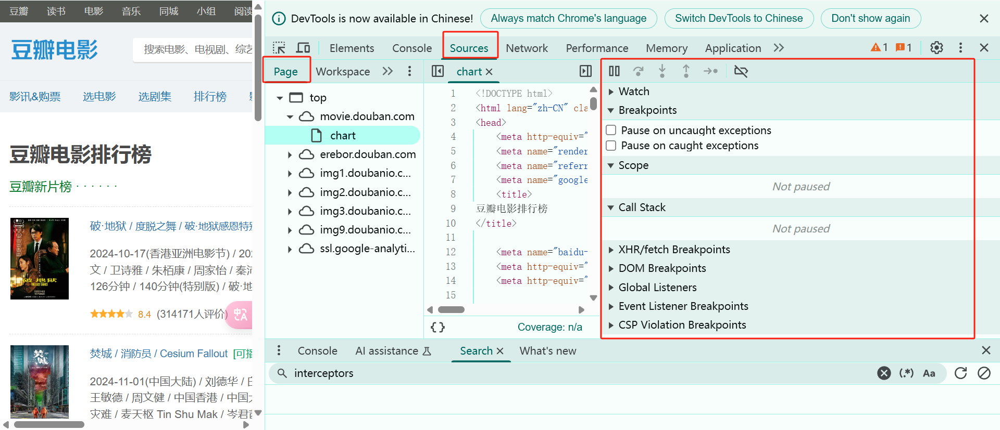
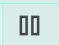

## 第21章：逆向之浏览器调试

---

### 21.1 逆向概念

网站是不希望自动化脚本或者爬虫随便访问的，所以会对页面的代码进行 **加密** 或者 **混淆**，我们已经见过的防护工作如：

- 比较简单的：UA、cookie、referer
- 在请求头中存入一些特殊的值：token校验，sign签名（专门用来做校验的）
- 请求参数加密
- 响应内容加密
- 服务器返回的数据藏入`html`中，例如：`<form><input type="hidden" token="<REDACTED_SECRET>"></form>`

但是，不管它如何加密或者混淆，为了让浏览器上的正常用户可以正常访问。那么，在浏览器上一定有一个东西把加密的内容还原成正常的内容。所以，逆向的概念就是 **看着别人的加密或者解密的逻辑**，用我们的程序把这个过程**还原出来**！最终，让我们的程序完成与浏览器一样的操作。

切记！爬虫的目的是为了还原正常的请求参数或者返回内容的解密！不要钻牛角尖！达到目的即可！

### 21.2	逆向中涉及的名词及解释

#### 21.2.1  逆向工程概念

| 术语                        | 定义                                                         |
| --------------------------- | ------------------------------------------------------------ |
| **JS逆向工程**              | 对已编译或混淆的JavaScript代码进行逆向分析，恢复其原始逻辑、数据结构或算法的过程，用于安全研究、抓取动态数据、破解防护机制等场景。 |
| **解混淆（Deobfuscation）** | 去除代码混淆技术（如变量名替换、控制流扁平化），使代码更易阅读和分析。常用工具包括UglifyJS、js-beautify。 |
| **反编译（Decompilation）** | 将编译后的JS代码转换为可读性更高的源代码形式，便于理解代码逻辑和数据流。 |
| **动态调试**                | 在代码运行时通过断点、单步执行等手段观察变量变化和调用栈，分析实际执行流程。常用工具：Chrome DevTools。 |
| **静态分析**                | 在不执行代码的情况下分析代码结构，如通过AST（抽象语法树）解析代码逻辑。常用工具：ESLint、JSHint。 |
| **Hook技术**                | 在函数执行时插入自定义代码，拦截或修改原函数行为，用于动态获取关键参数或绕过验证。 |
|                             |                                                              |

#### 21.2.2  混淆与反混淆技术

| **变量混淆**     | 将变量名替换为无意义的随机字符串，例如将`username`改为`_0x3a8f`。 |
| ---------------- | ------------------------------------------------------------ |
| **控制流扁平化** | 打乱代码执行顺序，插入大量条件分支和跳转语句，使逻辑难以追踪。 |
| **僵尸代码注入** | 插入无实际功能的代码片段，干扰分析者对核心逻辑的判断。       |
| **反调试技术**   | 检测调试环境并阻止调试，例如使用`debugger`语句或置空`console.log`。 |
| **多态变异**     | 代码在每次执行时自动变形（功能不变），避免被动态分析工具捕获固定模式。 |
| **JSFuck编码**   | 仅用`[]()!+`六个字符编写JS代码，使代码呈现为难以理解的符号组合。 |
|                  |                                                              |

#### 21.2.3  加密算法与逆向特征

| 算法            | 逆向特征                                                     | 应用场景           |
| --------------- | ------------------------------------------------------------ | ------------------ |
| **Base64**      | 字符串长度是4的倍数，包含`A-Za-z0-9+/=`字符。常用于URL参数或简单数据编码。 | 解码隐藏的敏感信息 |
| **MD5/SHA系列** | 输出固定长度十六进制字符串（MD5为32位，SHA256为64位）。用于密码哈希或数据完整性校验。 | 验证参数是否被篡改 |
| **AES**         | 加密结果长度是8的倍数，代码中常见`CryptoJS.AES.encrypt`关键字。适用于高安全性数据传输。 | 接口参数加密       |
| **RSA**         | 加密后长度不固定，代码中涉及`setPublicKey`或`JSEncrypt`库。用于非对称加密场景（如登录凭证）。 | 公钥加密敏感数据   |
|                 |                                                              |                    |

#### 21.2.4  反爬机制与应对策略

| 反爬技术                 | 应对方法                                                     |
| ------------------------ | ------------------------------------------------------------ |
| **动态加载内容**         | 分析AJAX请求，模拟浏览器行为（如Selenium）或直接调用JS生成数据的接口。 |
| **验证码/滑块验证**      | 使用OCR识别或机器学习模型破解简单验证码；复杂验证码需结合行为模拟或第三方打码平台。 |
| **参数签名（如`sign`）** | 逆向JS生成签名的逻辑，本地复现加密算法（如HMAC-SHA256）。    |
| **环境检测**             | 补全浏览器指纹（如WebGL、Canvas），使用无头浏览器（Puppeteer）模拟真实环境。 |


### 21.3	重新认识浏览器

在逆向过程中可能涉及的浏览器内容：

- `Elements`选项卡中显示的内容为前端渲染后的页面代码，作为参考，可以快速找到元素位置
  - `Styles` 网页的样式
  - `Event Listeners` 网站的监听事件
  - `DOM Breakpoints` 设置断点，在一个标签元素右键`brake on`设置断点
  - `Properties` 记录状况

- `Console` 控制台，可以编写调试代码
  - console.log()	在控制台输出内容

  - console.clear()  清空控制台内容

- `Sources`当前网站加载了哪些资源，在`page`选项卡下面会罗列出所有的内容，包括真正的页面源代码
  - 当查看页面源代码时，左下角的 `{}`可以对代码进行格式化，展示的更加清晰
  - 看代码的右侧的控制面板，针对逆向非常关键



- 面板中操作按钮（从左到右的前三个必须记住 ）: 
  - 释放断点：如果后续有断点，运行到下一断点位置，如果没有，就运行到最后
  - 向后运行一步：一步一行，范围是当前整个代码页面，一行一行，函数被收起算一行
  - 进入里面运行一步：当前行如果是函数，则进入函数内运行一步
  - `Breakpoints`: 设置断点
  - `Scope` 可以看到每一个作用域中的变量
  - `Call Stack` 当前函数的调用栈
  - `Event Listener Breakpoints` 一系列浏览器事件，监听页面发生事件时产生断点

- `Network` 抓包工具
  - 请求时间线，需要注意如果点击了，则只展示点击这一时间所发生的请求内容，如果这一时间没有发出请求，可能会不理解为什么下面的请求内容是空，双击后展示所有时间的请求。
  - 请求的分类，如：`ALL`,`Fetch/XHR`,`Doc`,`JS`,`Font`等等
  - `Name` 请求的详细内容
    - `Headers` 请求头，可以获取`requests-url`、`requests-match`、`requests-Referer`、`requests-UA`、`requests-Cookies`等等
    - `Preview` 返回参数的预览，在爬虫生涯中总共会看到三种参数：
      - `Qurey String` ：`get`请求，参数会通过`?`拼接到`url`中
      - `From Data`：`post`请求，通过 `requests.post(data=data)`方式提交
      - `Request Payload`：`post`请求，需要把参数字典转换成字符串提交，`requests.post(data=json.dumps(dict)`，并且在请求头中必须加入`"contentType":"Application/json"`，并且需要处理在转换过程中出现的空格问题，在参数中需要加入`separators=(',', ':')`
    - `Response` 响应内容
    - `Initiator` 请求栈：记录发送请求的执行过程，排列顺序是倒序的，从下往上走，最上面的，是最后执行的，所以找加密时，从上往下找。如果看到`send/ajax`函数不用理会，这是Ajax的源码，不会有人在源码中做混淆的，所以看下一个及以后面的，找到为止。
    - `cookies` 当前请求使用过哪些 `cookie`
    - 搜索图标（放大镜）当无法找到具体的请求内容时，可以复制要找的页面内容，点击搜索，根据搜索出的内容查看对应的响应、请求。

### 21.4  网站加载逻辑

```javascript
加载Hmtl -> 加载JS -> 运行JS初始化 -> 用户触发某个事件 -> 调用某段JS -> 加密函数 -> 给服务器发信息（XHR-SEND） ->  接收到服务器数据 -> 解密函数(如果数据加密的话) -> 刷新网页渲染
```

### 21.5 调试方法

网站的`js`代码一般都是几万行代码甚至几十万行，如果直接阅读是非常困难的，所以，我们需要一些技巧来找到加密的入口

#### 21.5.1 断点

在源代码中设置断点来控制程序执行流程。一旦程序执行到设置断点的位置，程序就会在那里暂停，使得开发人员可以逐步执行代码、观察变量的值，并进行其他调试操作。他的作用是可以帮助我们去定位数据加密的位置。

- `DOM`事件断点定位加密
  - `DOM`事件断点是在浏览器的开发者工具中提供的一种调试工具，用于暂停 `JavaScript` 执行当特定类型的 `DOM` 事件被触发时。
  - 使用 `DOM`事件断点，你可以指定在哪些 `DOM` 事件上设置断点，比如点击（click）、改变（change）、加载（load）等。
  - 一旦设置了 `DOM` 事件断点，当相应的事件被触发时，浏览器会自动在触发事件的 `JavaScript` 代码行上暂停执行，从而允许你检查当前的程序状态、变量值，以及执行堆栈信息等。执行的比较靠前，距离加密函数比较远。
  - 比如登录的时候密码会被加密，通过DOM断点寻找加密位置，点击登录按钮时会出发事件，下断点后通过一步步执行，找到加密位置。
  
- `XHR`断点定位加密
  - `XHR`断点是在浏览器的开发者工具中设置的一种调试工具，用于在进行`XMLHttpRequest（XHR也就是我们说的ajax请求）`请求时暂停`JavaScript`执行。执行比较靠后，距离加密函数相对较近，可以根据栈快速定位。
  - 断点的位置是`send`发送数据的位置，如果参数做了加密，就需要往回溯源，去找发送之前的函数是在哪里处理的参数。
  - 如果是响应的内容加密了，就需要在发送成功后回调函数内找解密的方法
  - **注意**：非`XHR`发送的就断不住
- 断点只能断未执行的程序。有时候下断点后，释放断点，程序没有执行，是因为当前下断点的位置是在上一次断点位置的前面。需要刷新页面或者出发请求的事件。
- Dom和XHR的区别是，Dom向后一步步执行，看下一步干什么；而XHR是溯源，看看上一步干了什么。

#### 21.5.2 方法栈

**栈是一种先进后出的特殊线性表结构**。调用栈是[解析器](https://so.csdn.net/so/search?q=解析器&spm=1001.2101.3001.7020)的一种机制，可以在脚本调用多个函数时，通过这种机制，我们能够追踪到哪个函数正在执行，执行的函数体又调用了哪个函数。

- 当脚本要调用一个函数时，解析器把该函数添加到栈中并且执行这个函数。
- 任何被这个函数调用的函数会进一步添加到调用栈中，并且运行到它们被上个程序调用的位置。
- 当函数运行结束后，解释器将它从堆栈中取出，并在主代码列表中继续执行代码。

当然，这种跟栈的方法是比较费时间的，比较笨重的，但却是练习调试的基本功，要重点掌握。

#### 21.5.3 全局搜索

有时可以通过全局搜索的方式定位具体的位置，会比一步一步跟栈效率高很多，比如搜索特征参数、请求的`url`等比较有代表性的字段，再比如，如果是通过`ajax`发送的请求，可以搜索`onreadystatechange`关键字，如果是通过`axios`发送的请求，那么可以直接寻找拦截器`interceptors`，可以非常快速的定位到目标位置。找到位置后，观察参数都是正常的，但是执行了函数之后就变成了密文，所以调用这个参数的函数一定有问题，找到这个函数名，然后鼠标划上去，点击函数位置链接，定位到函数位置，下断点，释放……重复此步骤

代码说明

```javascript
function cc(a, b) {
    console.log(a + b)
    console.log('调用的cc函数')
}


function bb(a, b){
    console.log(a + b)
    cc()
    console.log('调用的bb函数')
}

function aa(a, b) {
    bb(a, b)
    console.log('调用的aa函数')
}

aa(1, 2)

```


### 21.6 浏览器调试案例

找数据加密的位置：

- 第一步：确定自己要找的加密参数是什么
- 第二步：找到起始的位置
- 第三步：通过调用栈往前跟，看数据在哪里变成密文的
- 第四步：确定加密的位置在哪里

案例地址：https://music.163.com/#/song?id=1325905146，通过网易云音乐这个网站，我们练习一下浏览器调试的使用方法。

- 进入网站后，`F12`打开`devtools`，选择`Network`选项卡，此时网络请求列表是空的。点击`播放`按钮，查看网络请求情况；


- 我们查看请求的内容，在`Preview`中看到的是`json`数据，里面的`id`就是页面`url`后的`id`，所以这个请求就是我们要找的歌曲的真实请求，同时在返回的数据中我们也看到了歌曲的`url`；


- 确定了请求地址，接下来我们查看一下请求的参数发现，参数是经过加密的。`csrf_token`还好，通过观察是固定的，但是`params`和`encSeckey`时动态的，那么我们就需要找到参数加密的方法，使用`python`进行还原；


- 点击`Initiator`选项卡，通过调用栈找到发送请求的位置，由于栈的特性是先进后出，所以在调用上，最后执行的函数在最上发，所以我们由上至下去观察参数的变化情况，点击最上面一行位置信息，进入源代码文件；


- 进入文件后，定位在`i.apply(this, arguments)`这一行，在行号上下断点，然后释放断点，把鼠标移动到参数`arguemnts`上方，显示当前内存中变量值的变化情况，很明显，此时数据已经完成了加密，那么就需要通过调用栈往前溯源；


- 当跟栈跟到这一步的时候发现，数据里面的内容能看得懂了，虽然有些内容被编码了，但是部分内容已经可以正常阅读，所以在这之后进行了加密，也就是说当调用`tix.be1x(X1x, Bv7o)`时，传递的参数是明文，在执行完`be1x`函数后，参数变成了密文，那么就是`be1x`这个函数执行了加密逻辑。


- 就需要定位到`be1x`这个函数调用的地方，上面的函数体就是加密的方法。**总结来说就是当跟栈到参数是非加密的调用函数时，那么在它上方的函数就是加密函数，在页面源代码中函数行上方的函数体就是加密的方法**。


- 我们找到参数加密的函数，然后释放掉之前设置的所有断点，在函数体第一行处设置新的断点，点击页面上的播放按钮，程序重新暂停在设置断点的文职，此时可以看到此时此刻内存中所有变量的变化情况。


- 在函数体内通过执行下一步，一步一步的执行每一行代码，观察变量的变化情况。发现在执行到`bYE6y`的时候参数已经加密了，所以加密的方法就是`window.asrsea`。


- 鼠标悬停在加密方法上，显示的弹窗中点击方法位置的链接，即可跳转到函数的位置，此时这个`function d(){}`就是加密的方法。同时会发现`window.asrsea = d`，做了函数的赋值。至此，就通过跟栈的方式找到了加密的位置，接下来就可以通过本地程序模拟这个加密函数的功能即可


- 找到加密位置后，把这段代码抠出来，在`pycharm`中新建一个`music_163.js`文件，我们进行本地复刻

```javascript
// 下面是setMaxDigits相关的内容全部抠出来
// 抠这段内容的时候有个技巧，就是在定位到内容后，上下都是闭包函数
// 只是这些内容都是顶格定义的闲散函数，所以至少他们之间是有关联的
// 就把他们全部抠出来
function RSAKeyPair(a, b, c) {
    this.e = biFromHex(a),
    this.d = biFromHex(b),
    this.m = biFromHex(c),
    this.chunkSize = 2 * biHighIndex(this.m),
    this.radix = 16,
    this.barrett = new BarrettMu(this.m)
}
function twoDigit(a) {
    return (10 > a ? "0" : "") + String(a)
}
function encryptedString(a, b) {
    for (var f, g, h, i, j, k, l, c = new Array, d = b.length, e = 0; d > e; )
        c[e] = b.charCodeAt(e),
        e++;
    for (; 0 != c.length % a.chunkSize; )
        c[e++] = 0;
    for (f = c.length,
    g = "",
    e = 0; f > e; e += a.chunkSize) {
        for (j = new BigInt,
        h = 0,
        i = e; i < e + a.chunkSize; ++h)
            j.digits[h] = c[i++],
            j.digits[h] += c[i++] << 8;
        k = a.barrett.powMod(j, a.e),
        l = 16 == a.radix ? biToHex(k) : biToString(k, a.radix),
        g += l + " "
    }
    return g.substring(0, g.length - 1)
}
function decryptedString(a, b) {
    var e, f, g, h, c = b.split(" "), d = "";
    for (e = 0; e < c.length; ++e)
        for (h = 16 == a.radix ? biFromHex(c[e]) : biFromString(c[e], a.radix),
        g = a.barrett.powMod(h, a.d),
        f = 0; f <= biHighIndex(g); ++f)
            d += String.fromCharCode(255 & g.digits[f], g.digits[f] >> 8);
    return 0 == d.charCodeAt(d.length - 1) && (d = d.substring(0, d.length - 1)),
    d
}
function setMaxDigits(a) {
    maxDigits = a,
    ZERO_ARRAY = new Array(maxDigits);
    for (var b = 0; b < ZERO_ARRAY.length; b++)
        ZERO_ARRAY[b] = 0;
    bigZero = new BigInt,
    bigOne = new BigInt,
    bigOne.digits[0] = 1
}
function BigInt(a) {
    this.digits = "boolean" == typeof a && 1 == a ? null : ZERO_ARRAY.slice(0),
    this.isNeg = !1
}
function biFromDecimal(a) {
    for (var d, e, f, b = "-" == a.charAt(0), c = b ? 1 : 0; c < a.length && "0" == a.charAt(c); )
        ++c;
    if (c == a.length)
        d = new BigInt;
    else {
        for (e = a.length - c,
        f = e % dpl10,
        0 == f && (f = dpl10),
        d = biFromNumber(Number(a.substr(c, f))),
        c += f; c < a.length; )
            d = biAdd(biMultiply(d, lr10), biFromNumber(Number(a.substr(c, dpl10)))),
            c += dpl10;
        d.isNeg = b
    }
    return d
}
function biCopy(a) {
    var b = new BigInt(!0);
    return b.digits = a.digits.slice(0),
    b.isNeg = a.isNeg,
    b
}
function biFromNumber(a) {
    var c, b = new BigInt;
    for (b.isNeg = 0 > a,
    a = Math.abs(a),
    c = 0; a > 0; )
        b.digits[c++] = a & maxDigitVal,
        a >>= biRadixBits;
    return b
}
function reverseStr(a) {
    var c, b = "";
    for (c = a.length - 1; c > -1; --c)
        b += a.charAt(c);
    return b
}
function biToString(a, b) {
    var d, e, c = new BigInt;
    for (c.digits[0] = b,
    d = biDivideModulo(a, c),
    e = hexatrigesimalToChar[d[1].digits[0]]; 1 == biCompare(d[0], bigZero); )
        d = biDivideModulo(d[0], c),
        digit = d[1].digits[0],
        e += hexatrigesimalToChar[d[1].digits[0]];
    return (a.isNeg ? "-" : "") + reverseStr(e)
}
function biToDecimal(a) {
    var c, d, b = new BigInt;
    for (b.digits[0] = 10,
    c = biDivideModulo(a, b),
    d = String(c[1].digits[0]); 1 == biCompare(c[0], bigZero); )
        c = biDivideModulo(c[0], b),
        d += String(c[1].digits[0]);
    return (a.isNeg ? "-" : "") + reverseStr(d)
}
function digitToHex(a) {
    var b = 15
      , c = "";
    for (i = 0; 4 > i; ++i)
        c += hexToChar[a & b],
        a >>>= 4;
    return reverseStr(c)
}
function biToHex(a) {
    var d, b = "";
    for (biHighIndex(a),
    d = biHighIndex(a); d > -1; --d)
        b += digitToHex(a.digits[d]);
    return b
}
function charToHex(a) {
    var h, b = 48, c = b + 9, d = 97, e = d + 25, f = 65, g = 90;
    return h = a >= b && c >= a ? a - b : a >= f && g >= a ? 10 + a - f : a >= d && e >= a ? 10 + a - d : 0
}
function hexToDigit(a) {
    var d, b = 0, c = Math.min(a.length, 4);
    for (d = 0; c > d; ++d)
        b <<= 4,
        b |= charToHex(a.charCodeAt(d));
    return b
}
function biFromHex(a) {
    var d, e, b = new BigInt, c = a.length;
    for (d = c,
    e = 0; d > 0; d -= 4,
    ++e)
        b.digits[e] = hexToDigit(a.substr(Math.max(d - 4, 0), Math.min(d, 4)));
    return b
}
function biFromString(a, b) {
    var g, h, i, j, c = "-" == a.charAt(0), d = c ? 1 : 0, e = new BigInt, f = new BigInt;
    for (f.digits[0] = 1,
    g = a.length - 1; g >= d; g--)
        h = a.charCodeAt(g),
        i = charToHex(h),
        j = biMultiplyDigit(f, i),
        e = biAdd(e, j),
        f = biMultiplyDigit(f, b);
    return e.isNeg = c,
    e
}
function biDump(a) {
    return (a.isNeg ? "-" : "") + a.digits.join(" ")
}
function biAdd(a, b) {
    var c, d, e, f;
    if (a.isNeg != b.isNeg)
        b.isNeg = !b.isNeg,
        c = biSubtract(a, b),
        b.isNeg = !b.isNeg;
    else {
        for (c = new BigInt,
        d = 0,
        f = 0; f < a.digits.length; ++f)
            e = a.digits[f] + b.digits[f] + d,
            c.digits[f] = 65535 & e,
            d = Number(e >= biRadix);
        c.isNeg = a.isNeg
    }
    return c
}
function biSubtract(a, b) {
    var c, d, e, f;
    if (a.isNeg != b.isNeg)
        b.isNeg = !b.isNeg,
        c = biAdd(a, b),
        b.isNeg = !b.isNeg;
    else {
        for (c = new BigInt,
        e = 0,
        f = 0; f < a.digits.length; ++f)
            d = a.digits[f] - b.digits[f] + e,
            c.digits[f] = 65535 & d,
            c.digits[f] < 0 && (c.digits[f] += biRadix),
            e = 0 - Number(0 > d);
        if (-1 == e) {
            for (e = 0,
            f = 0; f < a.digits.length; ++f)
                d = 0 - c.digits[f] + e,
                c.digits[f] = 65535 & d,
                c.digits[f] < 0 && (c.digits[f] += biRadix),
                e = 0 - Number(0 > d);
            c.isNeg = !a.isNeg
        } else
            c.isNeg = a.isNeg
    }
    return c
}
function biHighIndex(a) {
    for (var b = a.digits.length - 1; b > 0 && 0 == a.digits[b]; )
        --b;
    return b
}
function biNumBits(a) {
    var e, b = biHighIndex(a), c = a.digits[b], d = (b + 1) * bitsPerDigit;
    for (e = d; e > d - bitsPerDigit && 0 == (32768 & c); --e)
        c <<= 1;
    return e
}
function biMultiply(a, b) {
    var d, h, i, k, c = new BigInt, e = biHighIndex(a), f = biHighIndex(b);
    for (k = 0; f >= k; ++k) {
        for (d = 0,
        i = k,
        j = 0; e >= j; ++j,
        ++i)
            h = c.digits[i] + a.digits[j] * b.digits[k] + d,
            c.digits[i] = h & maxDigitVal,
            d = h >>> biRadixBits;
        c.digits[k + e + 1] = d
    }
    return c.isNeg = a.isNeg != b.isNeg,
    c
}
function biMultiplyDigit(a, b) {
    var c, d, e, f;
    for (result = new BigInt,
    c = biHighIndex(a),
    d = 0,
    f = 0; c >= f; ++f)
        e = result.digits[f] + a.digits[f] * b + d,
        result.digits[f] = e & maxDigitVal,
        d = e >>> biRadixBits;
    return result.digits[1 + c] = d,
    result
}
function arrayCopy(a, b, c, d, e) {
    var g, h, f = Math.min(b + e, a.length);
    for (g = b,
    h = d; f > g; ++g,
    ++h)
        c[h] = a[g]
}
function biShiftLeft(a, b) {
    var e, f, g, h, c = Math.floor(b / bitsPerDigit), d = new BigInt;
    for (arrayCopy(a.digits, 0, d.digits, c, d.digits.length - c),
    e = b % bitsPerDigit,
    f = bitsPerDigit - e,
    g = d.digits.length - 1,
    h = g - 1; g > 0; --g,
    --h)
        d.digits[g] = d.digits[g] << e & maxDigitVal | (d.digits[h] & highBitMasks[e]) >>> f;
    return d.digits[0] = d.digits[g] << e & maxDigitVal,
    d.isNeg = a.isNeg,
    d
}
function biShiftRight(a, b) {
    var e, f, g, h, c = Math.floor(b / bitsPerDigit), d = new BigInt;
    for (arrayCopy(a.digits, c, d.digits, 0, a.digits.length - c),
    e = b % bitsPerDigit,
    f = bitsPerDigit - e,
    g = 0,
    h = g + 1; g < d.digits.length - 1; ++g,
    ++h)
        d.digits[g] = d.digits[g] >>> e | (d.digits[h] & lowBitMasks[e]) << f;
    return d.digits[d.digits.length - 1] >>>= e,
    d.isNeg = a.isNeg,
    d
}
function biMultiplyByRadixPower(a, b) {
    var c = new BigInt;
    return arrayCopy(a.digits, 0, c.digits, b, c.digits.length - b),
    c
}
function biDivideByRadixPower(a, b) {
    var c = new BigInt;
    return arrayCopy(a.digits, b, c.digits, 0, c.digits.length - b),
    c
}
function biModuloByRadixPower(a, b) {
    var c = new BigInt;
    return arrayCopy(a.digits, 0, c.digits, 0, b),
    c
}
function biCompare(a, b) {
    if (a.isNeg != b.isNeg)
        return 1 - 2 * Number(a.isNeg);
    for (var c = a.digits.length - 1; c >= 0; --c)
        if (a.digits[c] != b.digits[c])
            return a.isNeg ? 1 - 2 * Number(a.digits[c] > b.digits[c]) : 1 - 2 * Number(a.digits[c] < b.digits[c]);
    return 0
}
function biDivideModulo(a, b) {
    var f, g, h, i, j, k, l, m, n, o, p, q, r, s, c = biNumBits(a), d = biNumBits(b), e = b.isNeg;
    if (d > c)
        return a.isNeg ? (f = biCopy(bigOne),
        f.isNeg = !b.isNeg,
        a.isNeg = !1,
        b.isNeg = !1,
        g = biSubtract(b, a),
        a.isNeg = !0,
        b.isNeg = e) : (f = new BigInt,
        g = biCopy(a)),
        new Array(f,g);
    for (f = new BigInt,
    g = a,
    h = Math.ceil(d / bitsPerDigit) - 1,
    i = 0; b.digits[h] < biHalfRadix; )
        b = biShiftLeft(b, 1),
        ++i,
        ++d,
        h = Math.ceil(d / bitsPerDigit) - 1;
    for (g = biShiftLeft(g, i),
    c += i,
    j = Math.ceil(c / bitsPerDigit) - 1,
    k = biMultiplyByRadixPower(b, j - h); -1 != biCompare(g, k); )
        ++f.digits[j - h],
        g = biSubtract(g, k);
    for (l = j; l > h; --l) {
        for (m = l >= g.digits.length ? 0 : g.digits[l],
        n = l - 1 >= g.digits.length ? 0 : g.digits[l - 1],
        o = l - 2 >= g.digits.length ? 0 : g.digits[l - 2],
        p = h >= b.digits.length ? 0 : b.digits[h],
        q = h - 1 >= b.digits.length ? 0 : b.digits[h - 1],
        f.digits[l - h - 1] = m == p ? maxDigitVal : Math.floor((m * biRadix + n) / p),
        r = f.digits[l - h - 1] * (p * biRadix + q),
        s = m * biRadixSquared + (n * biRadix + o); r > s; )
            --f.digits[l - h - 1],
            r = f.digits[l - h - 1] * (p * biRadix | q),
            s = m * biRadix * biRadix + (n * biRadix + o);
        k = biMultiplyByRadixPower(b, l - h - 1),
        g = biSubtract(g, biMultiplyDigit(k, f.digits[l - h - 1])),
        g.isNeg && (g = biAdd(g, k),
        --f.digits[l - h - 1])
    }
    return g = biShiftRight(g, i),
    f.isNeg = a.isNeg != e,
    a.isNeg && (f = e ? biAdd(f, bigOne) : biSubtract(f, bigOne),
    b = biShiftRight(b, i),
    g = biSubtract(b, g)),
    0 == g.digits[0] && 0 == biHighIndex(g) && (g.isNeg = !1),
    new Array(f,g)
}
function biDivide(a, b) {
    return biDivideModulo(a, b)[0]
}
function biModulo(a, b) {
    return biDivideModulo(a, b)[1]
}
function biMultiplyMod(a, b, c) {
    return biModulo(biMultiply(a, b), c)
}
function biPow(a, b) {
    for (var c = bigOne, d = a; ; ) {
        if (0 != (1 & b) && (c = biMultiply(c, d)),
        b >>= 1,
        0 == b)
            break;
        d = biMultiply(d, d)
    }
    return c
}
function biPowMod(a, b, c) {
    for (var d = bigOne, e = a, f = b; ; ) {
        if (0 != (1 & f.digits[0]) && (d = biMultiplyMod(d, e, c)),
        f = biShiftRight(f, 1),
        0 == f.digits[0] && 0 == biHighIndex(f))
            break;
        e = biMultiplyMod(e, e, c)
    }
    return d
}
function BarrettMu(a) {
    this.modulus = biCopy(a),
    this.k = biHighIndex(this.modulus) + 1;
    var b = new BigInt;
    b.digits[2 * this.k] = 1,
    this.mu = biDivide(b, this.modulus),
    this.bkplus1 = new BigInt,
    this.bkplus1.digits[this.k + 1] = 1,
    this.modulo = BarrettMu_modulo,
    this.multiplyMod = BarrettMu_multiplyMod,
    this.powMod = BarrettMu_powMod
}
function BarrettMu_modulo(a) {
    var i, b = biDivideByRadixPower(a, this.k - 1), c = biMultiply(b, this.mu), d = biDivideByRadixPower(c, this.k + 1), e = biModuloByRadixPower(a, this.k + 1), f = biMultiply(d, this.modulus), g = biModuloByRadixPower(f, this.k + 1), h = biSubtract(e, g);
    for (h.isNeg && (h = biAdd(h, this.bkplus1)),
    i = biCompare(h, this.modulus) >= 0; i; )
        h = biSubtract(h, this.modulus),
        i = biCompare(h, this.modulus) >= 0;
    return h
}
function BarrettMu_multiplyMod(a, b) {
    var c = biMultiply(a, b);
    return this.modulo(c)
}
function BarrettMu_powMod(a, b) {
    var d, e, c = new BigInt;
    for (c.digits[0] = 1,
    d = a,
    e = b; ; ) {
        if (0 != (1 & e.digits[0]) && (c = this.multiplyMod(c, d)),
        e = biShiftRight(e, 1),
        0 == e.digits[0] && 0 == biHighIndex(e))
            break;
        d = this.multiplyMod(d, d)
    }
    return c
}
var maxDigits, ZERO_ARRAY, bigZero, bigOne, dpl10, lr10, hexatrigesimalToChar, hexToChar, highBitMasks, lowBitMasks, biRadixBase = 2, biRadixBits = 16, bitsPerDigit = biRadixBits, biRadix = 65536, biHalfRadix = biRadix >>> 1, biRadixSquared = biRadix * biRadix, maxDigitVal = biRadix - 1, maxInteger = 9999999999999998;
setMaxDigits(20),
dpl10 = 15,
lr10 = biFromNumber(1e15),
hexatrigesimalToChar = new Array("0","1","2","3","4","5","6","7","8","9","a","b","c","d","e","f","g","h","i","j","k","l","m","n","o","p","q","r","s","t","u","v","w","x","y","z"),
hexToChar = new Array("0","1","2","3","4","5","6","7","8","9","a","b","c","d","e","f"),
highBitMasks = new Array(0,32768,49152,57344,61440,63488,64512,65024,65280,65408,65472,65504,65520,65528,65532,65534,65535),
lowBitMasks = new Array(0,1,3,7,15,31,63,127,255,511,1023,2047,4095,8191,16383,32767,65535);


//-----------------
function c(a, b, c) {
        var d, e;
        return setMaxDigits(131),
        d = new RSAKeyPair(b,"",c),
        e = encryptedString(d, a)
    }

// CryptoJS是一个三方库 库名 crypto-js，通过npm install crypto-js安装
var CryptoJS = require("crypto-js");
function b(a, b) {
    var c = CryptoJS.enc.Utf8.parse(b)
      , d = CryptoJS.enc.Utf8.parse("0102030405060708")
      , e = CryptoJS.enc.Utf8.parse(a)
      , f = CryptoJS.AES.encrypt(e, c, {
        iv: d,
        mode: CryptoJS.mode.CBC
    });
    return f.toString()
}

function a(a) {
    var d, e, b = "abcdefghijklmnopqrstuvwxyzABCDEFGHIJKLMNOPQRSTUVWXYZ0123456789", c = "";
    for (d = 0; a > d; d += 1)
        e = Math.random() * b.length,
        e = Math.floor(e),
        c += b.charAt(e);
    return c
}

// 执行执行的加密方法
function d(d, e, f, g) {
    var h = {}
      , i = a(16);
    return h.encText = b(d, g),
    h.encText = b(h.encText, i),
    h.encSecKey = c(i, e, f),
    h
}

// 这是调用加密函数的方法，传递的是明文

function asrsea(plaintext){
    let arg1 = '010001';
    let arg2 = '00e0b509f6259df8642dbc35662901477df22677ec152b5ff68ace615bb7b725152b3ab17a876aea8a5aa76d2e417629ec4ee341f56135fccf695280104e0312ecbda92557c93870114af6c9d05c4f7f0c3685b7a46bee255932575cce10b424d813cfe4875d3e82047b97ddef52741d546b8e289dc6935b3ece0462db0a22b8e7';
    let arg3 = '0CoJUm6Qyw8W8jud';
    return d(plaintext, arg1, arg2, arg3)

}

// 用于输出测试，测试完成后，记得要注释掉，否则在Python中调用会报错
var ret = asrsea("测试文本");
console.log(ret)
```

用`python`程序复刻发送请求

```python
import requests
import json
import execjs

url = "https://music.163.com/weapi/song/enhance/player/url/v1?csrf_token=<REDACTED_SECRET>"
my_headers = {
    "accept": "*/*",
    "accept-encoding": "gzip, deflate, br, zstd",
    "accept-language": "zh-CN,zh;q=0.9",
    "cache-control": "no-cache",
    "content-length": "506",
    "content-type": "application/x-www-form-urlencoded",
    "cookie": "<REDACTED_SECRET>",
    "origin": "https://music.163.com",
    "pragma": "no-cache",
    "priority": "u=1, i",
    "referer": "https://music.163.com/",
    "sec-ch-ua": "/"Chromium/";v=/"136/", /"Google Chrome/";v=/"136/", /"Not.A/Brand/";v=/"99/"",
    "sec-ch-ua-mobile": "?0",
    "sec-ch-ua-platform": "/"Windows/"",
    "sec-fetch-dest": "empty",
    "sec-fetch-mode": "cors",
    "sec-fetch-site": "same-origin",
    "user-agent": "Mozilla/5.0 (Windows NT 10.0; Win64; x64) AppleWebKit/537.36 (KHTML, like Gecko) Chrome/136.0.0.0 Safari/537.36"
}
# 要加密的密文，一定要在源代码中获取
plaintext = {
    "csrf_token": "<REDACTED_SECRET>",
    "encodeType": "aac",
    "ids": "[1325905146]",
    "level": "exhigh"
}
# 把明文字典转换成明文字符串
plaintext_str = json.dumps(plaintext, separators=(',', ':')) # 记得处理转换过程中的空格问题
# print(plaintext_str)

# 读取js代码
f = open("music_163.js", "r", encoding="utf-8")
js_code = f.read()
f.close()

# 加载js代码
pattern = execjs.compile(js_code)
# 调用js代码中的加密函数，执行加密，返回的结果就是密文
ret = pattern.call("asrsea", plaintext_str)
# print(ret)

# 组装请求数据
form_data = { # 参数名能赋值的千万不要手写
    "params": ret["encText"],
    "encSecKey": ret["encSecKey"],
}

# 发请求
resp = requests.post(url, data=form_data, headers=my_headers)
print(resp.text)# 先验证响应的内容是不是字典
data = resp.json()
# print(data)
music_url = data['data'][0]['url']
# print(music_url)
music_resp = requests.get(music_url) # 请求音乐地址，下载音乐
# print(music_resp.status_code)
with open("胡广生.mp3", "wb") as f:
    print("开始下载")
    f.write(music_resp.content)
print("下载完毕！")
```

到此为止，一个完整的逆向案例演示完毕！


