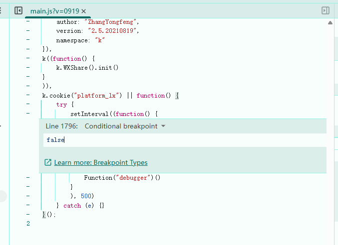

## 第24章：逆向之 - 无限debugger

---

`debugger` 是 `JavaScript` 中定义的一个专门用于断点调试的关键字。只要遇到它，`JavaScript` 的执行便会在此处中断，进入调试模式。所以，有的网站会利用 `debugger`的原理进行反爬虫。例如网址：https://www.17k.com/ ，访问页面后一旦打开开发者工具，网站就会立即进入断点模式。无论如何点击释放断点按钮都没有作用，它仍然一次次的进行断点模式，这种情况就称为无限 `debugger`。

常见的实现原理如下：

```javascript
// 定时器方案
<script>
    var ss = document.getElementById('box')
    function ff() {
        debugger;
    }
    setInterval(ff,100);
    ss.innerHTML = "大家晚上好";
</script>


// 网络抓包方案 在浏览器中通过innerHeight检测浏览器高度、innerWeight检测浏览器宽度
<script>
	function resize(){
		var threshold =200; //设置的检测阈值
    	var widthThreshold =window.outerWidth - window.innerwidth > threshold;// 小于设置的阈值
    	var heightThreshold = window,outerHeight - window.innerHeight > threshold;
    	if(widthThreshold || heightThreshold){
			debugger
			window.close() // 关闭浏览器
			console.log('控制台打开了')
        }
}
setInterval(resize，100) // 间隔100毫秒执行一次
</script>


// 构造器方案一
<script>
    function check(){
        function doCheck(a){
            // 初始化方法：创建一个debugger函数，把debugger放入构造函数里面
            (function(){}["constructor"]("debugger")()); //debugger
            doCheck(++a);
        }
        try {
            doCheck(0)
        }catch(err){
                console.log(err)
            }
        };
check()
</script>


// 构造器方案二
variable = Function("debugger;");
variable();

```

在`Sources`面板中可以看到，`debugger`关键字出现在`JavaScript`文件里。显示通过`setInterval`执行定时任务，每间隔`0.5`秒钟执行一次。


### 24.1 全局禁用

因为`debugger`其实就是对应一个断点，相当于用代码显示声明了一个断点，禁用就可以了。在`Scources`面板的右上角，有个叫做`Deactivate breakpoints`的按钮，这个按钮是断点的全局禁用开关。


开启全局禁用断点的按钮后，点击释放按钮，跳过当前断点，就不会再进入无限`debugger`了。但是这种全局的禁用也有问题，当我们想要设断点调试的时候，也是无法设置断点的。

### 24.2 局部禁用

关闭全局禁用的开关后，在`debugger`关键字所在的行号上单机鼠标右键，在显示的快捷菜单中选择`Never pause here`选项，意思是一律不在此处暂停。此时当前断点显示为橙色，并且断点前面多了一个`?`符号，此时点击释放断点按钮，就会跳过此处代码，不再进入`debugger`循环。这种方式适应定时器`debugger`或者单次`debugger`。不适应每一次释放后都生成`vm`虚拟文件的形式。

### 24.3 添加条件断点

在 `JS` 代码 `debugger` 行数位置，鼠标右键添加 条件断点（`add conditional breakpoints`），其中条件 设为 `false`



### 24.4 替换`JavaScript`文件

使用`Overrides`面板将远程`JavaScript`文件替换成本地文件。在本地文件中删除`debugger`关键字。在本地磁盘中创建`ChromeOverrides`文件夹，在`Scources`面板中点击`Overrides`，添加刚才创建的文件夹，此时浏览器会询问，点击确定即可。

找到无限`debugger`代码所处的文件以及对应的行号，注释掉此功能后`Ctrl+S`保存文件即可。刷新页面，一般情况下会禁用掉无限`debugger`功能。

如果是不断生成`vm`虚拟文件方式的无限`debugger`，需要替换的是生成`vm`文件的源头替换。只是替换`vm`是不管用的。

### 24.5 方法置空过debugger

无限`debugger`产生的原因是第七行代码`ff`这个函数造成的，所以我们可以重写这个函数，使无限`debugger`失效，在控制台中输入`function ff(){}`即可。注意：一定要在`debugger`进入之前


```javascript
setInterval = function(){}
```


### 24.6 注入代码过debugger

在控制台注入代码

```javascript
var _constructor = constructor;
Function.prototype.constructor = function(s) {
    
    if ( s== "debugger") {
        console.log(s);
        return null;
    }
    return _constructor(s);
}
```

- 有调用constructor方法我们判断他传递的参数是不是debugger，要是debugger的话就把这个方法改写，要不是的话就是用源方法返回

这个网址记录了目前能见到的所有无限`debugger`的绕过方式：

https://www.cnblogs.com/liyuanhong/articles/18210072


