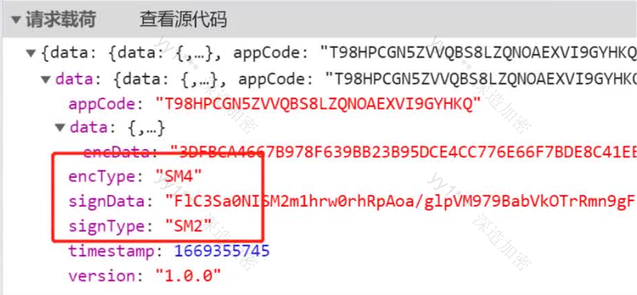

## 第29章：逆向之SM国密系列

---

### 29.1 算法简介

事实上从2010年开始，我国国家密码管理局就已经开始陆续发布了一系列国产加密算法，这其中就包括`SM1/SM2/SM3/SM4/SM7/SM9/ZUC`(祖冲之加密算法)等，`SM`代表商密，即商业密码，是指用于商业的、不涉及国家秘密的密码技术。`SM1`和`SM7`的算法不公开，其余算法都已成为`ISO/IEC`国际标准。

在这些国产加密算法中，`SM2/SM3/SM4`三种加密算法是比较常见的，在爬取部分网站时，也可能会遇到这些算法，所以是有必要了解一下这些算法的。如下图所以某网站就使用了`SM2`和`SM4`加密算法



### 29.2 算法分类

| 算法名称 | 算法类别                            | 应用领域             | 特点                                                      |
| -------- | ----------------------------------- | -------------------- | --------------------------------------------------------- |
| `SM1`    | 对称（分组）加密算法                | 芯片                 | 分组长度，密钥长度均为128比特                             |
| `SM2`    | 非对称（基于椭圆曲线`ECC`）加密算法 | 数据加密             | `ECC`椭圆曲线密码机制256位，相比`RSA`处理速度快，消耗更少 |
| `SM3`    | 散列（`hash`）函数算法              | 完整性校验           | 安全性及效率与`SHA-256`相当，压缩函数更复杂               |
| `SM4`    | 对称（分组）加密算法                | 数据加密和局域网产品 | 分组长度、密钥长度均为128比特，计算轮数多                 |
| `SM7`    | 对称（分组）加密算法                | 非接触式`IC`卡       | 分组长度、密钥长度均为128比特                             |
| `SM9`    | 标识加密算法（`IBE`）               | 端对端离线安全通信   | 加密强度等同于3072位密钥的`RSA`加密算法                   |
| `ZUC`    | 对称（序列）加密算法                | 移动通信`4G`网络     | 密码流                                                    |

### 29.3 实现方式

#### 29.3.1 JavaScript实现

在`javascript`中已经有了比较成熟的实现库，这里推荐`sm-crypto`，目前支持`SM2/3/4`，需要注意的是，`SM2`非对称加密的结果由`C1/C2/C3`三部分组成，其中`C1`是生成随机数的计算出的椭圆曲线点，`C2`是密文数据，`C3`是`SM3`的摘要值，最开始的国密标准的结果是按`C1C2C3`顺序的，新标准是按`C1C3C2`顺序存放的。`sm-crypto`支持设置`cipherMode`，也就是`C1C2C3`的排列顺序。

1. `SM2`

```javascript
//npm install sm-crypto --save

const sm2 = require('sm-crypto').sm2

// 1 - C1C3C2，0 - C1C2C3，默认为1
const cipherMode = 1

// 获取密钥对
let keypair = sm2.generateKeyPairHex()
let publicKey = keypair.publicKey //公钥
let privateKey = keypair.privateKey // 私钥

let msgString = "this is the data to be encrypted" 
let encryptData = sm2.doEncrypt(msgstring, publicKey, cipherMode) // 加密结果
let decryptData= sm2.doDecrypt(encryptData, privateKey, cipherMode) // 解密结果

console.log("encryptData:"encryptData)
console.log("decryptData:"decryptData)
```

2. `SM3`

```javascript
const sm3 = require("sm-crypto").sm3;

const data = "Hello, SM3!";
const hash = sm3(data); // 不需要转换字节，可以直接得到加密结果

console.log('SM3 hash:', hash);
```

3. `SM4`

```javascript
const sm4 = require('sm-crypto').sm4;

// 设置SM4密钥(128位，16字节)
const key = '0123456789ABCDEF0123456789ABCDEF';

//设置SM4加解密模式(ecb、cbc、ctr等)
const mode = 'ecb'

//加密数据
const plaintext = 'Hello,SM4!';
const ciphentext = sm4.encrypt(plaintext, key, { mode });
console.log('Encrypted:',ciphertext);

//解密数据
const decryptedText = sm4.decrypt(ciphertext, key, { mode });
console.log('Decrypted:'decryptedText);
```


#### 29.3.2 Python实现

1. `SM2`

   ```python
   from gmssl import sm2
   # 16 进制的公钥和私钥
   private_key = '00B9AB0B828FF68872F21A837FC303668428DEA11DCD1B24429D0C99E24EED83D5'
   public_key = 'B9C9A6E4E9C91F7A880429273747D7EF5DDE0BB2F6317E0EF331A83081A6998893F3F5D6EADDDB818726C87CB18FB4162F5AF347B83E24620207'
   
   sm2_crypt = sm2.CryptSM2(public _key=public_key, private_ key=private_key)
   
   # 待加密数据和加密后数据为bvtes:类型
   data = b"this is the data to be encrypted"
   enc_data = sm2_crypt.encrypt(data)
   dec_data = sm2_crypt.decrypt(enc_data)
   
   print('enc_data:', enc data.hex())
   print('dec_data:', dec_data)
   ```

2. `SM3`

   `bytes`类型的对象，它表示一个包含字节数据的序列。当使用`for`循环遍历`message`时，实际上遍历的是`message`中的每个字节。每个字节都是一个整数，对应与`ascii`编码中的字符。所以，在打印每个字节时，您看到的是对应`ascii`的值

   ```python
   from gmssl import sm3,func
   
   def sm3_hash(message):
       # python实现需要把编码数据转换成列表
       hash_hex = sm3.sm3_hash(func.bytes_to_list(message))
       print(hash_hes)
       
   if __name__ == "__main__":
       message = b'123' # bytes类型
       sm3_hash(message)
   ```

3. `SM4`

   ```python
   # 创建SM4加密对象
   sm4_crypt = sm4.CryptSM4()
   
   key = b'0123456789ABCDEF0123456789ABCDEF'
   
   # 设置密钥
   sm4_crypt.set_key(key, sm4.SM4_ENCRYPT)
   
   # 要加密的数据
   data = b"Hello, SM4!"
   
   # 加密数据
   ciphertext = sm4_crypt.crypt_ecb(func.bytes to list(data))
   
   # 将加密后的数据转换为字节串
   encrypted data = bytes(func list to bytes(ciphertext))
   
   # 解密数据(如果需要)
   sm4_crypt.set_key(key,sm4.SM4_DECRYPT)
   decrypted_data = sm4_crypt.crypt_ecb(ciphertext)
   decrypted_data = bytes(func.list to bytes(decrypted data))
   print("原始数据:"，data.decode("utf-8"))
   print("加密后的数据:"，encrypted_data.hex())
   print("解密后的数据:"decrypted data.decode("utf-8"))
   ```


### 29.4 逆向案例

- 医保服务：https://fuwu.nhsa.gov.cn/nationalHallSt/#/search/medical?code=90000&flag=false&gbFlag=true
- 接口：`https:/fuwu.nhsa.gov.cn/ebus/fuwu/api/nthl/api/CommQuery/gqueryFixedHospital`
- 逆向参数：正常请求,正常获取数据
- 请求头
  - `X-Tif-Nonce`
  - `xif-signature`
  - `X-Tif-Timestamp`
  - `XTingyun`
- 载荷数据
  - `encData`
  - `signData`
- 响应数据解密
  - `encData`


