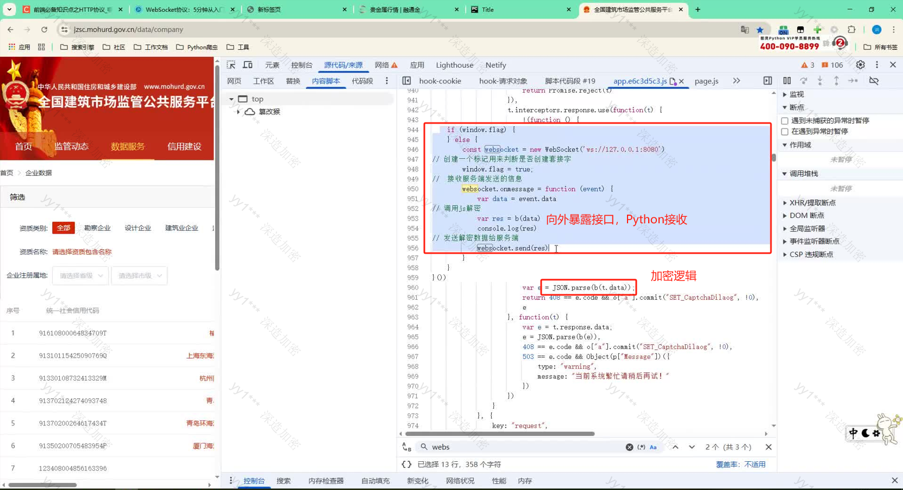
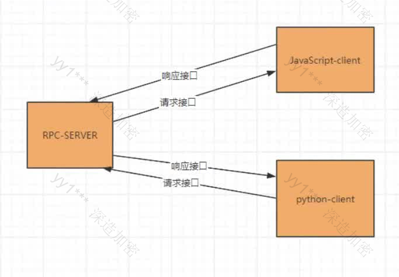

## 第31章：逆向之RPC技术

---

RPC是英文RangPaCong的简介，意思是“让爬虫”，旨在为爬虫开路，秒杀一切，让爬虫畅通无阻。学习RPC首先要学习websocket的原理与实现方式。

### 31.1 websocket

#### 31.1.1 简介

websocket是HTML5下一种新的协议（websocket协议本质上是一个基于TCP的协议），它实现了浏览器与服务器全双工通信，能更好的节省服务器资源和贷款并达到实时通讯的目的，websocket是一个持久化的协议。

HTTP协议参考:https://blog.csdn.net/zyym9009/article/details/104203995
Websocket协议参考:https://www.cnblogs.com/chyingp/p/websocket-deep-in.html

#### 31.1.2 原理

websocket约定了一个通信的规范，通过一个握手机制，客户端和服务器之间能建立一个类似TCP的链接，从而方便他们之间的通信。在websocket出现之前，web交互一般是基于http协议的短链接或者长链接。websocket是一种全新的协议，不属于http无状态协议，协议名为“ws”。

**过程总结：**首先，客户端发起http请求，经过3次握手后，建立起TCP链接；http请求里存放websocket支持的版本号等信息，如upgrade、connection、websocket-version等；然后，服务器收到客户端的握手请求后，同样采用http协议回馈数据；最后，客户端收到链接成功的消息后，开始借助于TCP传输信息通道进行全双工通信。

#### 31.1.3 实现方式

**客户端**

```html
<input type='text' id='box'>
<button onclock="ws()">发送</button> <!--点击触发函数事件-->

<script>
	// 与服务器约定的连接以及端口，本机的hosts文件，localhost
    const websocket = new WebSocket('ws://127.0.0.1:8080/');
    
    // 链接发生错误的回调方法
    websocket.onerror = () => {
        console.log('WebSocket连接发生错误');
    };
    
    // 连接成功建立的回调方法
    websocket.onopen = () => {
        console.log('WebSocket连接成功');
    }
    
    // 接收到消息的回调方法，接收服务器的数据
    websocket.onmessage = (event) => {
        console.log(event.data);
    }
    
    // 关闭链接
    websocket.onclose = () => {
        console.log('关闭websocket连接');
    }
    
    // 点击触发函数发送数据
    function ws(){
        var text = document.getElementById('box').value;
        // 客户端发信息给服务器
        websocket.send(text);
    }
    

</script>
```

**服务器端**

```python
# encoding:utf-8
import asyncio
import websockets

# 发送数据
async def echo(websocket):
    # 使用websocket在客户端和服务器之间建立全双工双向连接，就可以在连接打开时调用send()方法
    message = "hello world"
    # 发送数据
    await websocket.send(message)
    return True

# 接收数据
async def recv_msg(websocket):
    while 1：
        # 接收数据
        recv_text = await websocket.recv()
        print(recv_text)

async def main_logic(websocket, path):
    await echo(websocket)
    await recv_msg(websocket)

start_server = websocket.serve(main_logic, '127.0.0.1', 8080)
loop = asyncio.get_event_loop()
loop.run_until_complete(start_server)
# 创建了一个连接对象，需要不断监听返回的数据，则调用run_forever方法，要保持长连接即可
loop.run_forever()
```

> 完成服务器与客户端的连接后，就实现了实时数据更新，在Network中找到ws就可以观察数据的变化，红色箭头代码服务器返回的数据，绿色箭头代表客户端发送的数据。

#### 31.1.4 实际案例

网址：https://jzsc.mohurd.gov.cn/data/company

需求：通过websocket解析加密数据

实际注入网站代码

```javascript
!(function(){
    if(window.flag){
        
    } else {
        const websocket = new WebSocket('ws://127.0.0.1:8080');
        // 创建一个标记用来判断是否创建套接字
        window.flag = true;
        // 接收服务器端发送的信息
        websocket.onmessage = function(evert){
            var data = event.data
            // 调用js解密
            var res = b(data)
            console.log(res);
            // 发送解密数据给服务端
            websocket.send(res);
        }
    }
}());
```

**服务端代码**

```python
# encoding:utf-8
import asyncio
import websockets

# 请求网站,获取加密数据
def get_data(page):
    headers = {
        "v":"231012",
        "Referer":"https://jzsc.mohurd.gov.cn/data/company",
        "User-Agent":"Mozilla/5.0 (Windows NT 10.0; Win64; x64) AppleWebKit/537.36 (KHTML, like Gecko) chrome/118.0.0.0 safari/537.36",
    }
    
    url = "https://jzsc.mohurd.gov.cn/APi/webApi/dataservice/query/comp/list"
    
    params = {
        "pg":page,
        "pgsz":"15",
        "total":"450"
    }
    
    resp = requests.get(url, headers=headers, params=params)
    print(resp.text)
    return resp.text

# 发送数据
async def echo(websocket):
    for i in range(i):
        data = get_data(i) # 将数据通过websocket发送给前端，通过前端暴露的解密接口，进行解密
        # 发送数据
        await websocket.send(data)
        time.sleep(1)
        return True

# 接收数据
async def recv_msg(websocket):
    while 1：
        # 接收数据
        recv_text = await websocket.recv() # 解密后的数据返回给服务端
        print(json.loads(recv_text))

async def main_logic(websocket, path):
    await echo(websocket)
    await recv_msg(websocket)

start_server = websocket.serve(main_logic, '127.0.0.1', 8080)
loop = asyncio.get_event_loop()
loop.run_until_complete(start_server)
# 创建了一个连接对象，需要不断监听返回的数据，则调用run_forever方法，要保持长连接即可
loop.run_forever()
```

其实，这个过程或者逻辑就是RPC

**解析思路**

在网页中定位到核心加密位置，在同一个作用域中，将我们写的websocket命令注入到代码当中（通过替换的方式实现），把加密或解密的接口向外暴露。在网页中请求数据，解密后的数据会返回给Python的服务端，这样就不需要抠解密的代码。



这种方式的优点是不需要解密，但是缺点是需要打开网页，速度相对较慢，适合的场景是急需数据，但一时半会无法解密。

### 31.2 RPC

#### 32.2.1 简介

为什么要使用RPC技术呢？我们在使用websocket时候可以发现，python在操作的时候，需要创建连接，还需要不断去接收传递数据，非常的麻烦。那这个时候rpc技术可以帮助到我们，简单来说就是网页直接和rpc服务器进行交互，我们python可以直接调用rpc暴露的接口，不需要关心创建连接这一块的问题。

RPC技术是非常复杂的，叫做远程调用方法。简而言之就是我在一个进程当中想调用另外一个进程的方法，就可以通过网络通讯方式。也被称为rpc(应用场景包括微服务、分布式、远程调用等)。对于我们搞爬虫、逆向的来说，不需要完全了解，只需要知道这项技术如何在逆向中应用就行了。

RPC在逆向中，简单来说就是将本地和浏览器，看做是服务端和客户端，二者之间通过 websocket 协议进行RPC 通信，在浏览器中将加密函数暴露出来，在本地直接调用浏览器中对应的加密函数，从而得到加密结果，不必去在意函数具体的执行逻辑，也省去了扣代码、补环境等操作，可以省去大量的逆向调试时间。

下图是市面上封装好的RPC应用的执行流程



#### 32.2.2 Sekiro-RPC

官方文档：https://sekiro.iinti.cn/sekiro-doc/

**使用方法**

- 执行方式

  - 在本地开启服务端，需要有Java 环境，配置参考:https://baijiahao.baidu.com/s?id=1762153534119669123&wfr=spider&for=pc
  - 下载地址:https://repo.huaweicloud.com/java/jdk/8u201-b09/
  - Linux& Mac：bin/sekiro.sh 双击打开服务端
  - Windows：bin/sekiro.bat 双击打开服务端

- 客户端环境

  - 地址：file.virjar.com/sekiro_web_client.js?_=123 这个地址是在前端创建客户端的时候需要用到的代码Sekiro-RPc 把他封装在一个地址里面了

- 使用参数说明

  - 使用原理:客户端注入到浏览器环境，然后通过 sekiroclient和 sekiro 服务器通信，即可直接 RPC 调用浏览器内部方法，官方提供的 sekiroclient 代码样例如下

    ```javascript
    // 生成唯一标记uuid编号
    function guid(){
        function s4(){
            return(((1+Math.random())*0x10000)0).tostring(16).substring(1);
        }
        return(s4()+s4()+"-"+S4()+"-"+S4()+"-"+S4()+"-"+S4()+S4()+S4());
    }
    // 连接服务端
    var client = new Sekiroclient("ws://127.0.0.1:5620/business-demo/register?group=ws-group&clientId="+guid());
    //业务接口
    client.registerAction("登陆",function(request, resolve, reject){
        resolve(""+new Date());
    })
    ```

    - group:业务类型(接口组)，每个业务一个group，group下面可以注册多个终端(sekiroclient )，同时 group 可以挂载多个 Action;
    - clientld:指代设备，多个设备使用多个机器提供 API服务，提供群控能力和负载均衡能力;
    - SekiroClient:服务提供者客户端，主要场景为手机/浏览器等。最终的 sekiro 调用会转发到Sekiroclient。每个client 需要有一个惟一的 clientId;
    - registerAction:接口，同一个 group 下面可以有多个接口，分别做不同的功能;
    - resolve:将内容传回给服务端的方法;
    - request:服务端传过来的请求，如果请求里有多个参数，可以以键值对的方式从里面提取参数然后再做处理。


