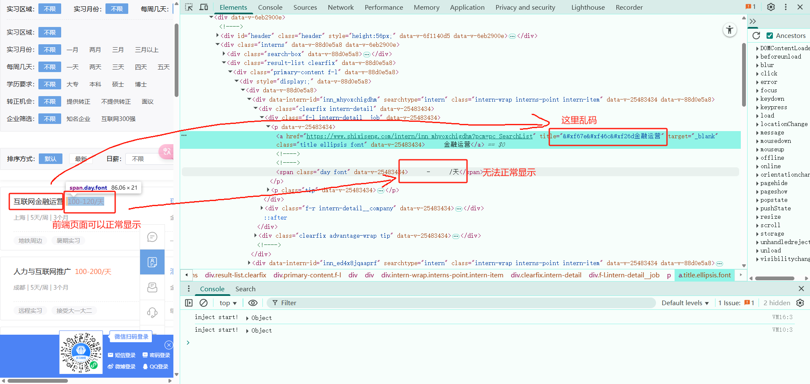

## 第32章：逆向之字体反爬

---

###  32.1 字体加密原理

简单而言就是利用前端技术进行干扰，页面可以正常显示，而使用爬虫下载后无法提取正常的数据。在`css3`之前，web开发者必须使用用户计算机上已有的字体。而目前的技术开发者可以使用`@font-face`为网页指定字体，开发者可将心仪的字体文件放在web服务器上，并在`css`样式中使用它。用户使用浏览器访问web应用时，对应的字体会被浏览器下载到用户的计算机上。

> 注意：字体反爬，即使使用自动化Selenium也无法获取正常的数据

字体加密的步骤：

- 网页使用`css`加载字体标签`@font-face`
- 读取字体文件
- 服务器返回的文件信息（有加密的数据）
- 加密的字体，通过映射编号在字体文件找到匹配的文字，叫做字体映射

### 32.2 字体文件的处理方式

#### 32.2.1 字体加密的特点

实例：https://www.shixiseng.com/interns?keyword=互联网IT&city=全国&type=intern&from=menu

在网页上显示正常，但是在源码中看到的是乱码、#x的形式、空数据、[X]等形式，就是字体进行了加密



**定位字体加密的位置：**使用`@font-face`搜索定位字体文件

**字体的种类：**

- `ttf` window操作系统
- `otf` 开放字体
- `fon` `win95`之前的字体
- `ttc`
- `shx`  cad系统
- `eot`  早起网页的字体
- `woff` 目前的网页字体

#### 32.2.2 字体处理方法

1. 字体不变，且数据量比较小：找到字体的映射关系，进行手写映射关系，以字典的方式存储键值对进行替换内容；

2. 如果字体的数据是变化的，通过AI找出变化的逻辑，提供5-8组相同的数据对应的不同映射关系，让AI找出变化的逻辑；

3. 坐标`ocr`识别

   ```python
   # 需要使用的工具库
   from fontTools.ttLib import TTFont
   
   # 加载字体文件
   font = TTFont("file.woff")
   
   # 转换成xml文件--原始文件
   font.saveXML("file.woff")
   
   # 获取所有键值对key
   font.key
   ```

   `<camp></camp>`标签中存放的是字符到字型的映射，字型的编号对应`unicode`的编码

   `<glyf></glyf>`标签中存放的是字型的数据，有文字数据的坐标，横坐标和纵坐标，还有线条类型`on=1 or on=0`，1是直线，0是曲线

### 32.3 处理字体反爬的思路

1. 先请求接口，获取字体文件的地址
2. 通过正则表达式解析出地址内容，在拼接成`https`请求地址
3. 保存文件，是字节的形式，使用wb模式
4. 使用`TTFont`工具库加载字体文件，并转换成xml文件
5. 根据 xml 文件中的字体坐标，画出字体数据，并保存成图片
6. 然后使用ocr识别出图片上的字体


