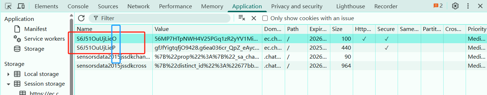
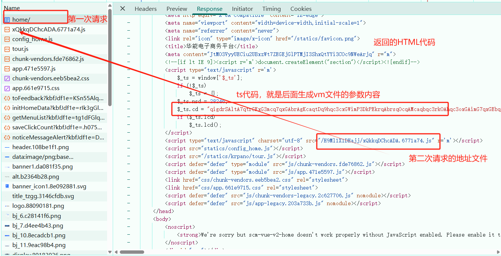
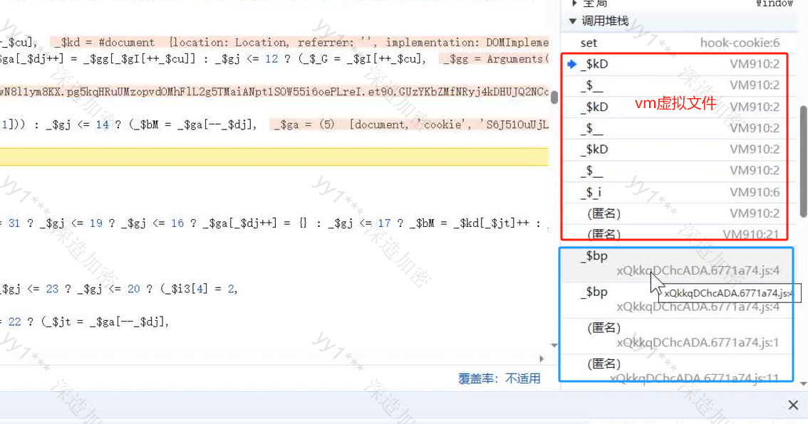

## 第34章：逆向之安全产品

---

安全产品一般都是通过cookie进行加密的。在逆向网站的时候，先通过请求验证cookie中的参数是否需要逆向。分析的方法是：

- 一般情况在会搜索cookie的值，看是否出现在set-cookie中，如果有则表明是服务器返回的，请求对应的接口即可获取该cookie值。
- 如果没有出现在set-cookie中或者这个cookie的值是不断变化的，表明这个cookie值是通过JavaScript生成的，就需要逆向

### 34.1 加速乐

| 产品名称 | cookie开头字母 | 请求次数 | 特征                                                |
| -------- | -------------- | -------- | --------------------------------------------------- |
| 加速乐   | `_jsl`         | 3次      | 第一次 状态码 521 第二次 状态码 521 第三次 返回数据 |

处理逻辑：

### 34.2 瑞数系列

瑞数动态安全`Botgate`(机器人防火墙)以“动态安全”技术为核心，通过动态封装、动态验证、动态混淆、动态令牌等技术对服务器网页底层代码持续动态变换，增加服务器行为的"不可预测性”，实现了从用户端到服务器端的全方位“主动防护"，为各类`Web`、`HTML5`提供强大的安全保护。

**瑞数网站特点：**

- 瑞数产品cookie的特点，cookie的key，只有最后一个字母是不一样的

  

- 瑞数的版本：一般情况下通过cookie的value的首位数字定义瑞数的版本，目前市面上有瑞数4、瑞数5、瑞数6这三个版本

- 有无限debugger；

- 请求次数：一般会请求两次，第一次请求返回的数据是html代码，里面会有Ts代码和一个外链地址，外链地址就是第二次请求的地址。第二次请求生成cookie值。TS代码的作用是生成核心代码，外链文件的作用是编译TS生成的核心代码，生成cookie值。相当于解释器。

  

- HTML页面中的特点：`content`、`$_ts = window['$_ts']`、外链地址`src="......js"`

- 定位cookie的方式：Hook，程序停住后，查看调用栈，上一次调用的函数一般是生成cookie的位置

- 生成cookie的位置一般会在vm虚拟文件中，要么通过eval实现，要么通过setInterval实现，而在调用栈中定位虚拟文件生成的位置就要找不是vm开头的文件名，一定会执行代码生成vm文件，一般情况下是第一次请求返回的HTML页面中外链的JS地址对应的文件。而通过call调用函数生成vm文件的参数，是通过第一次请求返回的TS代码生成。

  

- 直接抠解释器文件代码，通过补环境方式最终得到cookie值
- 请求的过程是：在HTML页面拿到TS代码和外链解释器的文件地址

### 34.3 `reese84`系列

`reese84`是一种用于保护网站防止自动化爬虫抓取的防护机制，尤其是在航空公司网站等需要严格保护数据的平台上广泛应用。这种机制通过复杂的指纹识别和行为分析来检测和阻止非人类的互动。例如，`reese84`可以通过分析访问者的浏览器指纹、点击行为、页面加载方式等来判断访问是否是爬虫程序进行的。

**`reese84`特点：**

- cookie中直接出现`reese84`的名称，并且`reese84`是典型的服务器返回的值；
- 搜索`reese84`的值发现并不是`set-cookie`方式生成的，而是在响应中返回的，一般情况下会以`token`的方式出现；
- 请求逻辑：会请求`JS`接口4次
  - 第1次请求接口，`get`方式，返回`JS`代码
  - 第2次请求接口，`post`方式，返回`token`信息
  - 第3次请求接口，`get`方式，返回`JS`代码
  - 第4次请求接口，`post`方式，请求的`payload`参数，换成了第二次请求返回的`token`信息，本次返回的cookie信息才是可用的。
- 逆向逻辑：
  - 在第2次请求时，响应返回`token`信息，但是在请求参数中有个`p`的值是需要计算的；
  - `xhr`断点，定位计算位置，确定加密位置是异步之前还是异步之后生成的，首先看`Promise.then`后面最近的第一次调用，是否存在`p`参数。如果存在，那么就是异步之前生成的，需要点击`Promise.then`下面的调用，下断点从新请求接口；如果不存在，则是在异步之后生成的，如果异步前后都没有，则是在异步过程中生成的；
  - `p`生成的位置是在`JS`文件中，距离解密函数上面最近的`btoa`的位置

### 34.4 `AKAMAI`系列

`AKAMAI`是一家提供内容传递网络`（CDN）`和云服务的公司。`CDN`通过将内容分发到全球各地的服务器，以减少网络延迟并提高用户访问网站的速度和性能。在其服务中，`Akamai`使用一种称为`Akamai Cookie`加密的技术来增强安全性和保护用户的隐私。`Akamai`常见的是`v1.75`、`v2`和`v3`的版本，`v1.75`版本传递的数据是明文，`v2`和`v3`的版本数据是进行编码的。基本上国外的网站比较多，而国内用的比较多的是瑞数。

**`Akamai`特点：**

- 在`cookie`信息中看到键名是`_abck / ak_`的，大概率是`Akamai`的产品；
- 区分`cookie`是否可用，在`value`中有个数值`~0~`或者是`~-1~`，`~0~`表示可用的，`~-1~`错误的；但是也有特例；
- 明确`cookie`的生成方式，清空`cookie`信息刷新网页，使用新生成的`cookie`值进行搜索，如果是`set-cookie`方式或者响应回来的，则是服务器生成并返回的，请求接口获取即可；如果搜索不到内容则是`JS`代码生成的，需要使用`Hook`定位生成位置；
- 请求逻辑分析：
  - 第一次，请求首页，获取外链`JS`，向外链`JS`发送`get`请求，返回`cookie`信息，是`~-1~`不可用；
  - 第二次，携带加密参数，向外链`JS`发送post请求，返回`cookie`信息，是`~0~`可用的；
  - 所以，关键点是第二次请求携带的加密参数是如何生成的
  - 通过`xhr`断点定位加密位置
  - 需要注意Akamai的首页会变化，所以在分析加密参数时，先要固定第一次访问的HTML页面，第二次要固定由HTML页面外链JS生成的JS文件
  - 加密参数需要经过4次赋值操作，最后一次赋值才是可使用的结果。第一次计算的参数是浏览器需要检测的环境内容。就是浏览器的风控内容。
  - Akamai的补环境很多，也可以通过扣代码的方式

- 初级风控：UA、屏幕大小、插件信息
- 中级风控：显卡配置、canvas指纹、权限指纹
- 高级风控：鼠标轨迹、函数执行次数
- 如果 执行了 20次、30次之后突然不能正确执行了，则证明出发了风控系统，可能检测的内容低于一条线，则对当前用户行为减分 -1 ，当分数低于比如80分，则证明当前用户不是正常用户，就会出发风控。

