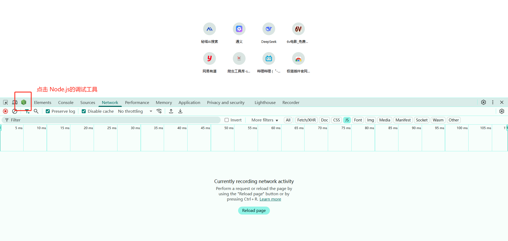

## 第35章：逆向之补环境 - 1

---

### 35.1 补环境的定义

**补环境** 是指在`Node.js`环境中模拟浏览器运行环境（包括`V8`引擎、`DOM/BOM`对象等），使浏览器端的`javascript`加密代码能在`Node.js`中正确执行的技术。

浏览器是给正常普通用户使用的一种图形化界面(GUI)工具，使用`V8`引擎(`c++`编写的)执行`Javascript`代码，浏览器中还包含了页面渲染等一些内置模块；而`Node.js`是做后端服务器计算的，它没有界面，同样也是使用`V8`引擎(`c++`编写的)执行`Javascript`代码，其中包含了一些`Node.js`自己的模块。所以就可以通过编写`JavaScript`代码来检测当前的运行环境是浏览器还是`Node.js`，以此来判断你是正常用户还是网络爬虫。

所以，补环境的核心是 **补充`Node.js`缺失的浏览器环境属性（如`window`、`navigator`），并移出`Node.js`中特有的但是浏览器中没有的属性（如`module`、`Buffer`），同时处理原型链差异（如浏览器中`document.body`存在，但`document.hasOwnProperty('body')为False`）**。

### 35.2 为什么要补环境

1. 环境差异导致执行结果不一致
   - 浏览器环境包含`V8`引擎、`BOM/DOM`对象（如`window`、`document`），而`Node.js`虽然也是基于`V8`引擎，但是没有`DOM/BOM`对象，导致同一段`JS`代码在两者中运行结果不同。例如，在`Node.js`中函数`toString()`返回`function(){[native code]}`，浏览器中可能返回完整的函数定义；
   - 加密算法依赖浏览器环境属性（如`Navigator.userAgent`），在`Node.js`中直接运行会报错`window is not defined`
2. 确保逆向结果的准确性
   - 逆向目标（如破解加密参数`cookie_t`）需要在本地复现浏览器的加密逻辑。若环境不一致，生成的参数无效，逆向成果无法使用
3. 对抗环境检测机制
   - 反爬系统（如瑞数）会检测代码执行环境。通过补环境可绕过`Object.getOwnPropertyDescriptor`等环境检测方法，使代码“伪装”在浏览器中运行

### 35.3 补环境与扣代码的差异

| 纬度     | 补环境                           | 扣代码                       |
| -------- | -------------------------------- | ---------------------------- |
| 核心思路 | 模拟浏览器环境，原样执行`JS`代码 | 抽取加密逻辑，重写为独立函数 |
| 技术重点 | 原型链模拟、环境属性一致性       | 代码逻辑分析、语法重写       |
| 通用性   | 高（环境补全后通杀同类网站）     | 低（每站需要单独抠代码）     |
| 执行效率 | 低（需要模拟大量环境）           | 高（仅运行核心逻辑）         |
| 开发效率 | 前期慢（需调试环境），后期复用快 | 每站均需人工分析，效率低     |
| 使用场景 | 环境检测复杂（如瑞数、极验）     | 逻辑简单、无环境依赖的加密   |

> 典型对比：
>
> - 补环境：瑞数反爬依赖`window`、`document`等200+属性，补环境后可直接执行原始代码生成加密参数；
> - 扣代码：简单加密逻辑（如`Base64`），可直接抽取`encrypt()`函数，无需模拟环境

### 35.4 补环境流程

1. 分析准备阶段

   - 定位关键代码：通过`Hook`的方式，定位加密参数生成的位置，拦截赋值点；
   - 对定位后的代码进行本地替换，固定代码便于调试；

2. 环境模拟与调试

   - 搭建基础框架：在`Node.js`中创建`window`、`document`等空对象，通过`Proxy`代理监听属性访问，动态补充缺失属性

     ```javascript
     // proxy 代理示例代码
     const window = new Proxy({}, {
       get(target, key) {
         if (!target[key]) {
           console.log(`补全window.${key}`);
           target[key] = {}; // 模拟属性
         }
         return target[key];
       }
     });
     ```

   - 逐步补全环境：若代码报错`xxx is not defined`，补充对应属性；若加密结果不一致，检查原型链（如`__proto__`）和对象描述符（如`Object.getOwnPropertyDescriptor`）

   - 处理特殊检测：反爬可能检测`CanvasRenderingContext2D`、`Function.toString()`等，需模拟浏览器返回值

3. 验证结果

   - 对比本地生成的参数（如`cookie_t`）与浏览器生成的值是否一致，若不一致则返回阶段2重新定位。


### 35.5 代理

#### 35.5.1 代理的定义

`Proxy`是`ES6`引入的元编程工具，用于创建目标对象的代理，拦截并自定义其底层操作（如属性读取`get`、赋值`set`、函数调用`apply`等）。其核心逻辑是 **拦截 - 处理 - 转发** ，而不是直接操作原对象。

代理分正向代理和反向代理，正向代理是指代表客户端访问服务器（如`Charles`抓包工具）。反向代理是指代表服务器接收客户端的请求（如`Nginx`负载均衡）。而`Proxy`对象，是语言层面的拦截机制，作用于`javascript`运行时的环境，与网络代理无关。

#### 35.5.2 代理的作用

在补环境中，`Proxy`通过以下方式解决环境检测：

- 环境自吐：拦截对环境变量（`window`、`navigator`、`document`）的访问，输出检测点；
- 动态补全：按需返回伪造的环境属性值，绕过检测；
- 调试加速：替代手动断点，快速定位缺失或异常的检测项

#### 35.5.3 使用技巧

本机全局安装`Node.js`调试工具

```javascript
npm install -g nodemon
```



启动`JS`调试的时候，那个六边形的绿色图标就是`Node.js`的`Devtools`调试工具。在项目文件下运行以下命令，`-brk`的意思是在程序运行的第一行自动断点

```javascript
nodemon --inspect-brk xxx.js

// 在终端显示以下内容表明运行成功
E:/PythonCodes/01-完整案例/补环境/爱问财>nodemon --inspect-brk test.js
[nodemon] 3.1.10
[nodemon] to restart at any time, enter `rs`
[nodemon] watching path(s): *.*
[nodemon] watching extensions: js,mjs,cjs,json
[nodemon] starting `node --inspect-brk test.js`
Debugger listening on ws://127.0.0.1:9229/44d7376d-914e-492e-9580-a2321ba62cf4
For help, see: https://nodejs.org/en/docs/inspector

// ctrl + c 停止程序运行
```

使用这样方式，以后只要在本地修改了代码，程序会自动更新并重新启动浏览器调试工具。


**深度代理（`Deep Proxy`）机制**，用于监控`JS`环境中的对象/函数访问行为，主要包括：

- `obj_proxy()`：对象深度代理
- `func_proxy()`：函数调用代理
- 创建代理函数：伪造`window`和`Navigator`对象

**自吐环境脚本**

```javascript
// 深度代理对象
function obj_proxy(obj, name){
    return new Proxy(obj, {
        get(target, pro, receiver){
            var val = Reflect.get(target, pro, receiver);
            console.log(`从对象[${name}] --> 获取了属性[${pro}] --> 属性[${pro}]的值是 -->${val}`);  // 打印访问日志
            
            // 递归代理：核心深度代理逻辑
            if (typeof val == 'object'){
                return obj_proxy(val, pro); // 深度代理嵌套对象
            } else if(typeof val == 'function'){
                return func_proxy(val, pro); // 代理函数类型属性
            }
            return val;
        },
        set(target, pro, value, rece){
            console.log(`向对象：[${name}] --> 设置属性[${pro}] --> 属性[${pro}]的值是[${val}]`);  // 打印设置日志
            Reflect.set(target, pro, value, rece);  // 执行原始设置操作
        }
    });
}

// 深度代理函数
function func_proxy(func, name){
    return new Proxy(func, {
        apply(target, thisArg, arg_list){
             var ret = Reflect.apply(target, thisArg, argArray);
             console.log("调用了"+name+"函数", "函数的返回值是", ret);  // 打印调用日志
             
             // 代理返回值：核心链式代理逻辑
             if (typeof ret == 'object'){
                return obj_proxy(ret, name+"的返回值"); // 代理返回对象
             } else if(typeof ret == 'function'){
                return func_proxy(ret, name+"的返回值"); // 代理返回函数
             }
             return ret;
        }
    })
}

// 给对象挂代理
var window = obj_proxy(globalThis, "window");
var window = obj_proxy({
    // 程序运行后，提示缺少的内容，直接在代理对象中补充
    head:{},
    getElementByTagName:function getElementByTagName(){
        return [];
    }
}, "document");
window.document = document
```

**核心点分析**

1. 递归代理：自动代理嵌套对象，实现无限层级监控

   ```javascript
   if (typeof val == 'object'){
       return obj_proxy(val, pro); // 关键递归点
   }
   ```

2. 函数返回值代理：捕获函数返回对象并代理，解决链式调用监控

   ```javascript
   apply(target, thisArg, arg_list){
       if (typeof ret == 'object'){
           return obj_proxy(ret, name+"的返回值");
       }
   }
   ```

3. 环境访问自吐机制：记录所有环境访问行为，识别检测点

   ```javascript
   console.log("从", name, "获取", pro, "该属性的值是", val);
   
   // 输出示例
   从 window 获取 navigator
   从 navigator 获取 plugins
   从 plugins 获取 chi
   调用了chi函数 函数的返回值是 {hehe: "嘿嘿", miao: {...}}
   从 chi的返回值 获取 miao
   从 miao 获取 duomiao
   ```

4. 动态环境补全：拦截环境修改操作，动态补全缺失属性

   ```javascript
   set(target, pro, val, rece){
       console.log("向", name, "设置", pro, "该属性的值是", val);
       Reflect.set(...); // 保留原始功能
   }
   ```

5. 类型区分处理：避免代理污染原始行为

   ```javascript
   if (typeof val == 'object'){...} 
   else if(typeof val == 'function'){...}
   ```

**执行流程分析（以示例代码为例）**

1. `window.navigator` → 触发`get`打印 *从window获取navigator*
2. `.plugins` → 触发`get`打印 *从navigator获取plugins*
3. `.chi` → 识别为函数 → 返回代理函数
4. `chi()` → 触发`apply`：
   - 执行原函数 → 返回对象
   - 打印 *调用了chi函数...*
   - 代理返回对象 → 命名为`chi的返回值`
5. `['miao']` → 触发代理对象的`get` → 打印 *从chi的返回值获取miao*
6. `['duomiao']` → 触发`get` → 打印 *从miao获取duomiao*


