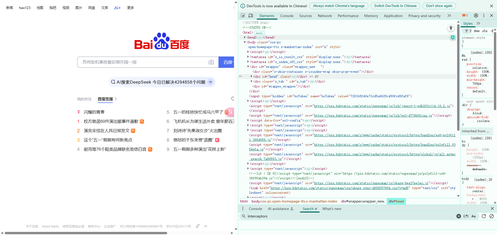
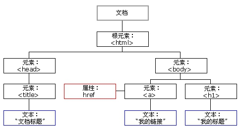
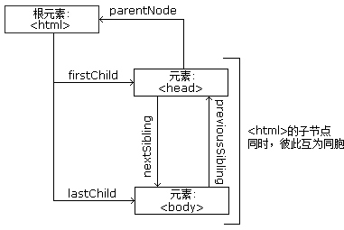

## 第4章：Web网页基础

---

用浏览器访问网站时，页面各不相同，你有没有想过它为何会呈现这个样子呢？本节中，我们就来了解一下网页的基本组成、结构和节点等内容。

### 4.1  网页的组成

网页可以分为三大部分 —— HTML、CSS 和 JavaScript。如果把网页比作一个人的话，HTML 相当于骨架，JavaScript 相当于肌肉，CSS 相当于皮肤，三者结合起来才能形成一个完善的网页。下面我们分别来介绍一下这三部分的功能。

HTML 是用来描述网页的一种语言，其全称叫作 Hyper Text Markup Language，即超文本标记语言。网页包括文字、按钮、图片和视频等各种复杂的元素，其基础架构就是 HTML。不同类型的元素通过不同类型的标签来表示，如图片用 img 标签表示，视频用 video 标签表示，段落用 p 标签表示，它们之间的布局又常通过布局标签 div 嵌套组合而成，各种标签通过不同的排列和嵌套才形成了网页的框架。

在 Chrome 浏览器中打开百度，右击并选择 “检查” 项（或按 F12 键），打开开发者模式，这时在 Elements 选项卡中即可看到网页的源代码



这就是 HTML，整个网页就是由各种标签嵌套组合而成的。这些标签定义的节点元素相互嵌套和组合形成了复杂的层次关系，就形成了网页的架构。

(1) 标签 也叫做 标记	(2) html是由标签/标记 和内容组成的	(3) 标签 是由 标签名称 和属性组成的

> 实例：
>
> <人 肤色=“黄色” 眼镜="很大"></人>
>
> 扩展：使用协议为  http超文本传输协议，普通文本：文字内容，超文本：视频、音频、图片、文字...
>


### 4.2 HTML

#### 4.2.1  HTML结构

实例

```html
<!DOCTYPE html>  #H5的头   声明文档类型 为html
<!DOCTYPE html PUBLIC "-//W3C//DTD XHTML 1.0 Strict//EN" "http://www.w3.org/TR/xhtml1/TDT/xhtml1-strit.dtd">  之前的头文件 现在不用
<html>
<head>
	<title>标题内容</title>
  	<meta charset="UTF-8"> #设置字符集
</head>
<body>
  	放html的主体标签
</body>
</html>
```

- html:文件是网页，浏览器加载网页，就可以浏览 
- head:头部分，网页总体信息 
  + title:网页标题
  + meta：网页主体信息，会根据name(author/description/keywords)
  + link:引入外部文件
  + style：写入CSS
  + script：写入JS
- body:身体部分，网页内容

#### 4.2.2  HTML的标签

**标签分为：**单标签/单标记 ，如：/<br /> //<br >  

**双标签/双标记**  ，如: /<p>/</p>

**文本标签**

1. `<div></div>`  块标签  作用是设定字、画、表格等的摆放位置

2. `<p></p>   `段落标签  自成一段  会将上下的文字 和它保持一定的距离
3. `<h1>-</h6> `标题标签 字体加粗 自占一行

**图片标签**：`` 在网页中插入一张图片

**属性：**

+ src： 图片名及url地址 (必须属性)
+ alt: 图片加载失败时的提示信息
+ title：文字提示属性
+ width：图片宽度
+ height：图片高度

实例:

```html

```

> 注意：如果宽和高 只给一个 那么为等比缩放  如果俩个都给 那么会按照 你所给的宽和高来显示

**路径**

1. 相对路径
   + ./	当前
   + ../     上一级
2. 绝对路径(了解)
   + 一个固定得链接地址(如域名)
   + 从根磁盘 一直到你的文件得路径

**超链接**：<a href="链接地址" title="提示信息" target="打开方式">点击显示得内容/</a>

**属性：**

- href必须，指的是链接跳转地址


- target: 


​	   _blank：新建窗口得形式来打开

​	   _self：本窗口来打开(默认)

- title：文字提示属性（详情）


**列表**

无序列表

```html
<ul>
	<li></li>  
</ul>
```

有序列表

```html
<ol>
 	<li></li>
</ol>
```

自定义列表

```html
<dl>
  	<dt>列表头</dt>
  	<dd>列表内容</dd>
</dl>
```

HTML注释

多行注释：<!--注释的内容-->

注释的作用：代码的调试，解释说明

#### 4.2.3 iframe

**定义和用法：**iframe 元素会创建包含另外一个文档的内联框架（即行内框架）。

**使用**

```html
<!DOCTYPE html>
<html lang="en">
<head>
    <meta charset="UTF-8">
</head>
<body>

<iframe src="http://mediaplay.kksmg.com/2022/07/25/h264_720p_600k_39038-DFTVHD-20220725175000-4800-310117-600k_mp4.mp4"></iframe>

<p>一些老的浏览器不支持 iframe。</p>
<p>如果得不到支持，iframe 是不可见的。</p>

</body>
</html>
```

   #### 4.2.4 TABLE表格

**属性：**width 宽  height 高  border 边框

**标签：**tr 行标签  th 列头标签  td 列标签

实例：

```html
<table>
  <tr>
    <th>我是表头</th>
    <th>我是表头</th>
    <th>我是表头</th>
  </tr>
  <tr>
    <td>我是单元格</td>
    <td>我是单元格</td>
    <td>我是单元格</td>
  </tr>
</table>
```

> 在做解析的时候，经常会遇到一个问题，在页面源代码中中不存在tbody这个标签，但是在Elements中存在这个tbody，这是浏览器在渲染代码的时候自动添加的内容，所以，会导致解析的路径不对。

   #### 4.2.5 FORM表单

标签： `<form></form>`

```html
人与浏览器、服务器交互产生数据的工具，填入内容，提交数据，获取数据

action	提交的地址
method	提交的方式
	get
		(1) 默认不写 为get传参  url地址栏可见
		(2) 长度受限制 （IE浏览器2k火狐8k）
		(3) 相对不安全
	post
		(1) url地址栏不可见 长度默认不受限制
		(2) 相对安全
```

input 标签：`<input>` 表单项标签input定义输入字段，用户可在其中输入数据。如：`<input type="text" name="username">`

select 标签：创建下拉列表，属性：name  属性:定义名称，用于存储下拉值的，内嵌标签：`<option>`  下拉选择项标签,用于嵌入到`<select>`标签中使用的。属性：value  属性:下拉项的值

input 标签：type属性:表示表单项的类型。值如下:

+ text:单行文本框
+ password:密码输入框
+ submit:提交按钮

type="radio" 单选框 ，需要跟 name="gender" 连用，形成组，才可以单选

表单与服务器交互，提交数据时是根据 标签的 name  和 value 进行提交的，在Payload中看到的就是 name 和 value

隐藏域 <input type="hidden" name="mimi" value="什么">，作用是不方便给用户看的内容写在这里类型的标签中，但是提交数据的时候会存在，逆向时找不到内容，直接看源代码即可

表单收集数据后，打包统一传递给服务器，通过 <from action="url地址">传递给url地址，默认是get请求。

表单回填：就是动态改变input标签中value的值

表单这部分需要注意的内容;

1. 隐藏域，看不见，提交的时候有数据
2. action 是服务地址
3. 表单数据的收集逻辑  name的值 = value 的值


### 4.3 CSS层叠样式表

CSS，全称叫作 Cascading Style Sheets，即层叠样式表。“层叠” 是指当在 HTML 中引用了数个样式文件，并且样式发生冲突时，浏览器能依据层叠顺序处理。“样式” 指网页中文字大小、颜色、元素间距、排列等格式。

CSS 是目前唯一的网页页面排版样式标准，有了它的帮助，页面才会变得更为美观。

#### 4.3.1 CSS语法

使用字母、数字或下划线和减号构成，不要以数字开头

格式： 

选择器{属性:值;属性:值;属性:值;....}

其中选择器也叫选择符

例如：

```
#head_wrapper.s-ps-islite .s-p-top {  
    position: absolute;  
    bottom: 40px;  
    width: 100%;  
    height: 181px;  
}
```


#### 4.3.2 html中嵌入css的方式

内联方式（行内样式）就是在HTML的标签中使用style属性来设置css样式
 格式： `<html标签 style="属性:值;属性:值;....">被修饰的内容</html标签>`

 `<p style="color:blue;font-family:隶书">在HTML中如何使用css样式</p>`
 特点：仅作用于本标签

内部方式（内嵌样式）就是在head标签中使用`<style type="text/css">....</style>`标签来设置css样式
 格式：

```python
 <style type="text/css">
 	....css样式代码
 </style>
```

 **特点：**作用于当前整个页面

外部导入方式（外部链入）：就是在head标签中使用`<link/>`标签导入一个css文件，在作用于本页面，实现css样式设置（推荐）

+ 格式：

  ```Css
  <link href="文件名.css" type="text/css" rel="stylesheet"/>
  ```

  特点：作用于整个网站

#### 4.3.3 css的选择符

**html选择符（标签选择器）**： 就是把html标签作为选择符使用， 如 p{....}  网页中所有p标签采用此样式

```css
h2{....}  网页中所有h2标签采用此样式
```

class类选择符 (使用点.将自定义名（类名）来定义的选择符)（类选择器P）

```html
定义：
.类名{样式....}    匿名类

其他选择符名
.类名{样式....}
使用：`<html标签 class="类名">...</html标签>`

.mc{color:blue;} /* 凡是class属性值为mc的都采用此样式 */

注意：类选择符可以在网页中重复使用
```

**Id选择符(ID选择器)**：

```html
 定义： 
#id名{样式.....}

使用：`<html标签 id="id名">...</html标签>`

注意：id选择符只在网页中使用一次
```

**关联选择符（包含选择符）**


 	 格式： 
 	 选择符1 选择符2 选择符3 ...{样式....}
 	 
 	 例如： table a{....} //*table标签里的a标签才采用此样式*/
 	
 	h1 p{color:red} /*只有h1标签中的p标签才采用此样式*/

组合选择符（选择符组）

 	 格式： 选择符1,选择符2,选择符3 ...{样式....}
 	
 	h3,h4,h5{color:green;} /*h3、h4和h5都采用此样式*/


#### 4.3.4 CSS中的选择器

关系选择器：

```html
 div > p 选择所有作为div元素的子元素p
 div + p 选择紧贴在div元素之后p元素
 div ~ p 选择div元素后面的所有兄弟元素p
```

属性选择器：

```html
 [attribute]选择具有attribute属性的元素。
 [attribute=value]选择具有attribute属性且属性值等于value的元素。
```








语法规则

|  选　择　器           | 例　　子     | 例子描述                                   |
| ------------------- | ------------- | --------------------------------- |
|  .class                    | .intro          | 选择 class="intro" 的所有节点    |
|  #id                       | #firstname | 选择 id="firstname" 的所有节点 |
|  *                          | *                 | 选择所有节点                            |
|  element               | p                | 选择所有 p 节点                          |
|  element,element | div,p           | 选择所有 div 节点和所有 p 节点    |
|  element element      | div p                      | 选择 div 节点内部的所有 p 节点                          |
|  element&gt;element   | div&gt;p                  | 选择父节点为 div 节点的所有 p 节点                    |
|  element+element     | div+p                    | 选择紧接在 div 节点之后的所有 p 节点                |
|  [attribute]                 | [target]                  | 选择带有 target 属性的所有节点                        |
|  [attribute=value]      | [target=blank]      | 选择 target="blank" 的所有节点                       |
|  [attribute~=value]    | [title~=flower]      | 选择 title 属性包含单词 flower 的所有节点          |
|  :link                           | a:link                     | 选择所有未被访问的链接                                 |
|  :visited                      | a:visited                 | 选择所有已被访问的链接                                 |
|  :active                       | a:active                  | 选择活动链接                                                  |
|  :hover                        | a:hover                  | 选择鼠标指针位于其上的链接                           |
|  :focus                        | input:focus            | 选择获得焦点的 input 节点                                |
|  :first-letter                 | p:first-letter           | 选择每个 p 节点的首字母                                   |
|  :first-line                   | p:first-line             | 选择每个 p 节点的首行                                      |
|  :first-child                 | p:first-child           | 选择属于父节点的第一个子节点的所有 p 节点    |
|  :before                      | p:before                | 在每个 p 节点的内容之前插入内容                     |
|  :after                         | p:after                   | 在每个 p 节点的内容之后插入内容                     |
|  :lang(language)         | p:lang                    | 选择带有以 it 开头的 lang 属性值的所有 p 节点     |
|  element1~element2 | p~ul                      | 选择前面有 p 节点的所有 ul 节点                         |
|  [attribute^=value]    | a[src^="https"]     | 选择其 src 属性值以 https 开头的所有 a 节点         |
|  [attribute$=value]     | a[src$=".pdf"]       | 选择其 src 属性以.pdf 结尾的所有 a 节点              |
|  [attribute*=value]     | a[src*="abc"]        | 选择其 src 属性中包含 abc 子串的所有 a 节点        |
|  :first-of-type             | p:first-of-type       | 选择属于其父节点的首个 p 节点的所有 p 节点      |
|  :last-of-type              | p:last-of-type        | 选择属于其父节点的最后 p 节点的所有 p 节点      |
|  :only-of-type             | p:only-of-type       | 选择属于其父节点唯一的 p 节点的所有 p 节点      |
|  :only-child                 | p:only-child           | 选择属于其父节点的唯一子节点的所有 p 节点    |
|  :nth-child(n)              | p:nth-child            | 选择属于其父节点的第二个子节点的所有 p 节点 |
|  :nth-last-child(n)       | p:nth-last-child     | 同上，从最后一个子节点开始计数                    |
|  :nth-of-type(n)          | p:nth-of-type        | 选择属于其父节点第二个 p 节点的所有 p 节点      |
|  :nth-last-of-type(n)   | p:nth-last-of-type | 同上，但是从最后一个子节点开始计数             |
|  :last-child                  | p:last-child            | 选择属于其父节点最后一个子节点的所有 p 节点 |
|  :root                          | :root                      | 选择文档的根节点                                           |
|  :empty                       | p:empty                | 选择没有子节点的所有 p 节点（包括文本节点） |
|  :target                       | #news:target         | 选择当前活动的 #news 节点                              |
|  :enabled                    | input:enabled       | 选择每个启用的 input 节点                                |
|  :disabled                   | input:disabled       | 选择每个禁用的 input 节点                                |
|  :checked                    | input:checked       | 选择每个被选中的 input 节点                            |
|  :not(selector)             | :not                       | 选择非 p 节点的所有节点                                   |
|  ::selection                  | ::selection              | 选择被用户选取的节点部分                              |


### 4.4  JavaScript

JavaScript，简称 JS，是一种脚本语言。HTML 和 CSS 配合使用，提供给用户的只是一种静态信息，缺乏交互性。我们在网页里可能会看到一些交互和动画效果，如下载进度条、提示框、轮播图等，这通常就是 JavaScript 的功劳。它的出现使得用户与信息之间不只是一种浏览与显示的关系，而是实现了一种实时、动态、交互的页面功能。

JavaScript 通常也是以单独的文件形式加载的，后缀为 js，在 HTML 中通过 script 标签即可引入，例如：

```
<script src="jquery-2.1.0.js"></script>
```

综上所述，HTML 定义了网页的内容和结构，CSS 描述了网页的布局，JavaScript 定义了网页的行为。这里仅作简单介绍，后面会重点学习JavaScript内容，因为跟逆向有关。


