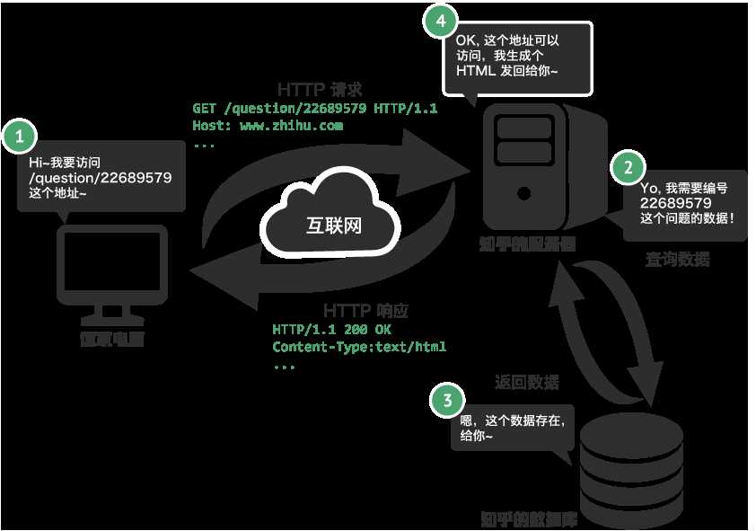

## 第5章：爬虫入门

---

### 5.1  爬虫概述

​		通过编写程序，获取网站数据，这个程序叫做爬虫。为什么选择Python编写爬虫程序？因为语法简单，三方库功能足够强大。爬虫是否合法？爬虫是一种技术，技术本身并不违法。但是爬虫具有法律风险，对他人产生了不利的影响，就是有风险的。爬虫也分善意的爬虫和恶意的爬虫，善意的爬虫是指不破坏被爬取网站的资源，可以正常访问，频率不高，不窃取用户隐私。恶意的爬虫，影响网站的正常运营，如抢票、秒杀等导致网站宕机的行为。一般情况下，网站都会有`robots.txt`君子协议，规定了网站中哪些数据可以被爬取，哪些数据不可以被爬取。

#### 5.1.1 获取网页

​		爬虫首先要做的工作就是获取网页，这里就是获取网页的源代码。源代码里包含了网页的部分有用信息，所以只要把源代码获取下来，就可以从中提取想要的信息了。那么这个怎样实现呢？总不能手工去截取网页源码吧？Python 提供了许多库来帮助我们实现这个操作，如 urllib、requests 等。可以用这些库来帮助我们实现 HTTP 请求操作，请求和响应都可以用类库提供的数据结构来表示，得到响应之后只需要解析数据结构中的 Body 部分即可，即得到网页的源代码，这样我们可以用程序来实现获取网页的过程了。

#### 5.1.2 提取信息

​		获取网页源代码后，接下来就是分析网页源代码，从中提取我们想要的数据。提取的方法有：正则表达式、XPath、Beautiful Soup、pyquery 等。使用这些库，可以高效快速地从中提取网页信息，如节点的属性、文本值等。获取信息的常见方式如下：

- 数据如果在页面源代码中，直接获取到页面源代码，通过xpath、BS4进行解析提取即可；
- 数据不再页面源代码中，就需要找到加载数据的url，再次发送请求；
- 有的网站比较特殊，页面是通过`iframe`或者`frameset`嵌套结构加载进来的，所以要找到`iframe`的`src`，通过这个`src`去请求网站，获取数据

#### 5.1.3 保存数据

​		提取信息后，我们一般会将提取到的数据保存到TXT文本或 JSON 文本，也可以保存到数据库，如 MySQL、Redis或者MongoDB 等，也可保存至远程服务器，如借助 SFTP 进行操作等。

#### 5.1.4 能提取什么样的数据

​		在网页中我们能看到各种各样的信息，最常抓取的便是 HTML 源代码。另外，可能有些网页返回的不是 HTML 代码，而是一个 `JSON` 字符串（其中 `API` 接口大多采用这样的形式），这种格式的数据方便传输和解析，它们同样可以抓取，而且数据提取更加方便。还可以看到各种二进制数据，如图片、视频和音频等。利用爬虫，我们可以将这些二进制数据抓取下来，然后保存成对应的文件名。只要是能在网页端见到的数据，爬虫都可以抓取。

### 5.2 HTTP基本原理

#### 5.2.1 定义

两个计算机之间为了能够顺畅的进行沟通而设定的一个君子协定，直白点儿，就是浏览器和服务器之间数据交互所遵守的协议就是HTTP协议。

#### 5.2.2 URL

`URL` 的全称为 `Universal Resource Locator`，即统一资源定位符。举例来说，`https://www.baidu.com/`，它就是一个 `URL`。通过这样一个链接，就可以从互联网上找到这个资源。

- 协议://域名/虚拟目录/虚拟目录/虚拟目录/资源?参数1=值1&参数2=值2....
- `http`协议默认的端口是 80
- `http+ssl`/`http+tls`  => `https`协议默认的端口是 443
- 域名背后是  `ip:port`  => 锁定互联网上某一台服务器上的某一个应用程序。端口可以理解成门牌号，找到固定的应用程序

### 5.3 Web请求过程剖析

1. 客户端(浏览器)请求目标网址：www.baidu.com，发送请求`requests` 到百度服务器；
2. 百度服务器接收到`requests`请求后检索内容，拼装成`HTML`页面返回响应`response`给客户端；
3. 客户端执行HTML文件，渲染内容，这里分两种情况：
   1. 你想获取的内容直接呈现在页面HTML代码中，直接解析提取即可；
   2. 数据不在页面源代码中，而是异步加载的（Ajax）：
      1. 服务器A返回的response不是数据，而是页面结构；
      2. 客户端展示页面结构，执行页面中隐含的脚本 `xxx.js`；
      3. 隐含的脚本会找到新的url地址，再次发送请求 requests2 到服务器B；
      4. 服务器B收到请求后会组织数据，返回响应response给客户端，此时这个响应中只有数据，没有结构；
      5. 客户端在收到数据后，结合页面结构，组合在一起渲染、呈现给用户。

### 5.4  Devtools使用

`devtools` 浏览器开发者工具，页面中鼠标右键后在弹窗中选择检查 或者 键盘按 `F12` 进入开发者模式

**重点菜单说明：**

1. **Elements**：在`Elements`中看到的是通过`JavaScript` 渲染之后的页面实时代码，与页面源代码可能会存在结构上的差别。

   **作用**：辅助查看页面结构；定位关键标签的位置；动态处理（直接删除代码）页面上的干扰内容

2. **Console**：控制台，主要用于做`js`脚本的调试 

3. **Sources**：用于显示页面所有的资源，显示的代码可以看作页面的源代码，样式`CSS`、图片`images`、脚本`js`等等
   1. 包含：`HTML`、`CSS`、`JS`、图片、视频等
   2. page：页面上的资源，页面源代码等
   3. workspace：写代码的
   4. overrides：本地替换
   5. content scripts：页面加载插件的资源
   6. snippets：测试用途

4. **Network**：网络，抓包工具，网站的所有请求都会在这里显示
   1. name：数据包，点击数据包显示如下内容
      1. Headers：请求头、cookies等内容
         1. general：请求的基本信息，可以看到请求的url和请求方式

      2. Preview：预览，没有样式，只是把基本的HTML格式展示出来，这里看的最多的是JSON数据
      3. Payload：参数，有三种类型
         1. Query String Parameters：查询字符串参数，url上面的请求参数
         2. form data：表单数据，数据是按照form表单的形式传递的
         3. request payload：JSON字符串参数，数据是直接挂在在请求体中的

      4. Response：响应内容
      5. 工具栏：用于筛选资源类型
         1. Preserve Log：勾选
         2. 保留过往的所有网络请求
         3. `Hide data URLs：勾选
         4. All：显示所有页面中的数据
         5. Fetch / XHR 加载请求数据
         6. Doc 页面源代码
         7. JS JavaScript脚本文件
         8. Font 字体文件
         9. Socket 

5. application：存储一些缓存的内容

### 5.5 请求和响应包含的内容

#### 5.5.1 请求

请求，由客户端向服务端发出，可以分为 5 部分内容：请求方法（Request Method）、请求的网址（Request URL）、请求头（Request Headers）、请求体（Request Body）。

#### 5.5.2. 请求方法

常见的请求方法有两种：GET 和 POST。

在浏览器中直接输入 URL 并回车，这便发起了一个 GET 请求，请求的参数会直接包含到 URL 里。例如，在百度中搜索 Python，这就是一个 GET 请求，链接为 [https://www.baidu.com/s?wd=Python](https://www.baidu.com/s?wd=Python)，其中 URL 中包含了请求的参数信息，这里参数 wd 表示要搜寻的关键字。POST 请求大多在表单提交时发起。比如，对于一个登录表单，输入用户名和密码后，点击 “登录” 按钮，这通常会发起一个 POST 请求，其数据通常以表单的形式传输，而不会体现在 URL 中。

- get

  主要的逻辑是要东西，不主动给服务器传递信息的。get请求是没有请求体的。所以，get请求的所有的参数, 都会被添加到url上面
  url上面的参数被称为 Query String Parameters  翻译: 查询字符串参数

- post
  post请求也是有url的，在url上面也可能会挂载数据，Query String Parameters可能也会出现。但post请求体里面是有信息的，参数一般通过请求体传递，请求体中的数据格式是根据 Content-Type 的不同给出不同的数据格式的，你能在浏览器中看到两种描述文字  
  - form data：此时, `content-type` 是 `application/x-www-form-urlencoded; charset=UTF-8` 数据格式是`year=2024&MethodName=BoxOffice_GetYearInfoData`
  - request payload：此时 content-type 不一定是什么玩意了，常规情况是json，此时request payload里面的东西是直接被挂载在请求体上。

我们平常遇到的绝大部分请求都是 GET 或 POST 请求，另外还有一些请求方法，如 GET、HEAD、POST、PUT、DELETE、OPTIONS、CONNECT、TRACE 等，我们简单将其总结为表 2-1。 

#### 5.5.3. 请求头

请求头，用来说明服务器要使用的附加信息，比较重要的信息有 Cookie、Referer、User-Agent 等：

* Accept：请求报头域，用于指定客户端可接受哪些类型的信息
* Accept-Language：指定客户端可接受的语言类型
* Accept-Encoding：指定客户端可接受的内容编码，数据在被传输的时候，使用何种方式来进行压缩，常规的是gzip，br，如果你遇到了请求之后拿到一堆字节，但是浏览器那边拿到的是html，很有可能你遇到br了，删掉br即可或者安装python的第三方库pip install brotli
* Content-Length: 传递的数据的长度
* Host：用于指定请求资源的主机 IP 和端口号，其内容为请求 URL 的原始服务器或网关的位置
* Cookies：网站为了辨别用户进行会话跟踪而存储在用户本地的数据。它的主要功能是维持当前访问会话。例如，我们输入用户名和密码成功登录某个网站后，服务器会用会话保存登录状态信息，后面我们每次刷新或请求该站点的其他页面时，会发现都是登录状态，这就是 Cookies 的功劳。Cookies 里有信息标识了我们所对应的服务器的会话，每次浏览器在请求该站点的页面时，都会在请求头中加上 Cookies 并将其发送给服务器，服务器通过 Cookies 识别出是我们自己，并且查出当前状态是登录状态，所以返回结果就是登录之后才能看到的网页内容。
* Referer：防盗链，用来标识这个请求是从哪个页面发过来的，服务器可以拿到这一信息并做相应的处理，如果在当前页面都OK，没问题，复制出去，在新窗口里打不开，这就是防盗链的效果。
* User-Agent：简称 UA，它是一个特殊的字符串头，可以使服务器识别客户使用的操作系统及版本、浏览器及版本等信息。在做爬虫时加上此信息，可以伪装为浏览器；如果不加，很可能会被识别出为爬虫。
* Content-Type：传递给服务器的数据格式。也叫互联网媒体类型（Internet Media Type）或者 MIME 类型，在 HTTP 协议消息头中，它用来表示具体请求中的媒体类型信息。例如，text/html 代表 HTML 格式，image/gif 代表 GIF 图片，application/json 代表 JSON 类型，更多对应关系可以查看此对照表：[http://tool.oschina.net/commons](http://tool.oschina.net/commons)。
  * `application/x-www-form-urlencoded; charset=UTF-8`：采用form表单的形式传递数据，类似我们看到的url的组成，例如: `year=2024&MethodName=BoxOffice_GetYearInfoData`
  * `application/json; charset=UTF-8`：例如: `{year: 2024, MethodName: BoxOffice_GetYearInfoData}`

* connection：keep-alive，保持高可用状态，会影响到我们爬虫，大量请求的时候服务器可能会因为保持了太多的这种状态，把你干掉，所以我们一般吧keep-alive关掉，把 keep-alive 改成 close 就OK了
* `X-Requested-With: XMLHttpRequest` 该信息并不是浏览器自带的，`jquery`库自动添加的，表示该请求由`Javascript`中的`XHR`发送的

因此，请求头是请求的重要组成部分，在写爬虫时，大部分情况下都需要设定请求头。

#### 5.5.4 响应

响应，由服务端返回给客户端，可以分为三部分：响应状态码（Response Status Code）、响应头（Response Headers）和响应体（Response Body）。

##### 5.5.4.1 响应状态码

响应状态码表示服务器的响应状态，如 200 代表服务器正常响应，505 代表页面未找到，500 代表服务器内部发生错误。在爬虫中，我们可以根据状态码来判断服务器响应状态，如状态码为 200，则证明成功返回数据，再进行进一步的处理，否则直接忽略。

| 状态码 | 说　　明       | 详　　情                                                     |
| ------ | -------------- | ------------------------------------------------------------ |
| 200    | 成功           | 服务器已成功处理了请求                                       |
| 302    | 重定向         | 一般表示重定向, 告诉浏览器. 你重新发一个请求到xxxx地址.. 该地址一般由响应头里面的Location返回 |
| 403    | 服务器权限不够 | 有可能是被反爬虫检测...还有可能是你访问的资源不对外的.. 请求节奏太快了... |
| 404    | 服务器权限不够 | 99.99%是你给的url不对..请检查你的url. 确保url和浏览器一致... |
| 500    | 服务器错误     | 代表服务器报错了. 此时, 请注意, 浏览器正常访问没问题. 你这边一访问500, 那么你的参数99%是给错了...导致服务器解析你的参数报错.你要去检查你的参数, url...是否正确. 以及请求头里面的Content-Type |

##### 5.5.4.2 响应头

响应头包含了服务器对请求的应答信息，如 Content-Type、Server、Set-Cookie 等。下面简要说明一些常用的头信息。

* Date：标识响应产生的时间。
* Last-Modified：指定资源的最后修改时间。
* Content-Encoding：指定响应内容的编码。
* Server：包含服务器的信息，比如名称、版本号等。
* Content-Type：文档类型，指定返回的数据类型是什么，如 text/html 代表返回 HTML 文档，application/x-javascript 则代表返回 JavaScript 文件，image/jpeg 则代表返回图片。
* Set-Cookie：设置 Cookies。响应头中的 Set-Cookie 告诉浏览器需要将此内容放在 Cookies 中，下次请求携带 Cookies 请求。
* Expires：指定响应的过期时间，可以使代理服务器或浏览器将加载的内容更新到缓存中。如果再次访问时，就可以直接从缓存中加载，降低服务器负载，缩短加载时间。
* Location: http://www.baidu.com  浏览器重定向到一个新的地址

##### 5.5.4.3 响应体

最重要的当属响应体的内容了。响应的正文数据都在响应体中，比如请求网页时，它的响应体就是网页的 HTML 代码；请求一张图片时，它的响应体就是图片的二进制数据。我们做爬虫请求网页后，要解析的内容就是响应体。在浏览器开发者工具中点击 Preview，就可以看到网页的源代码，也就是响应体的内容，它是解析的目标。在做爬虫时，我们主要通过响应体得到网页的源代码、JSON 数据等，然后从中做相应内容的提取。

