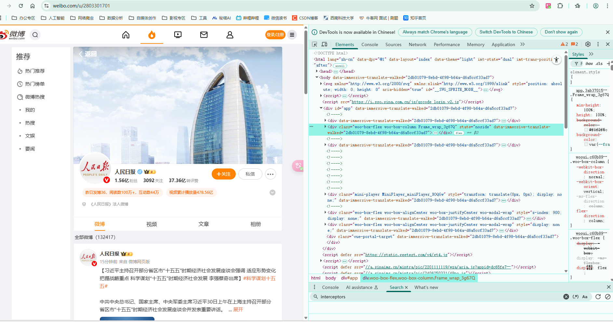
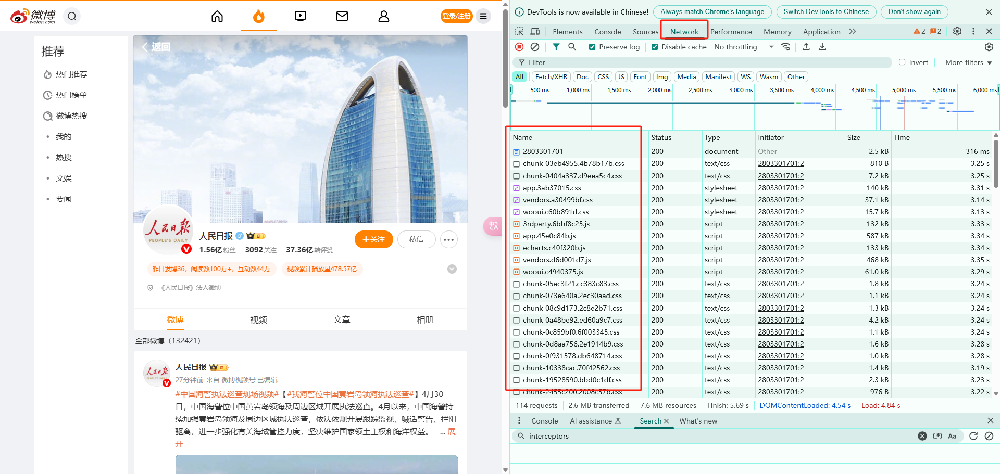
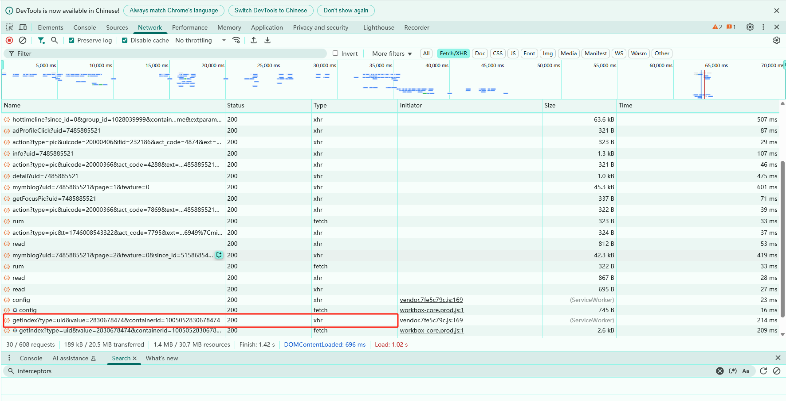
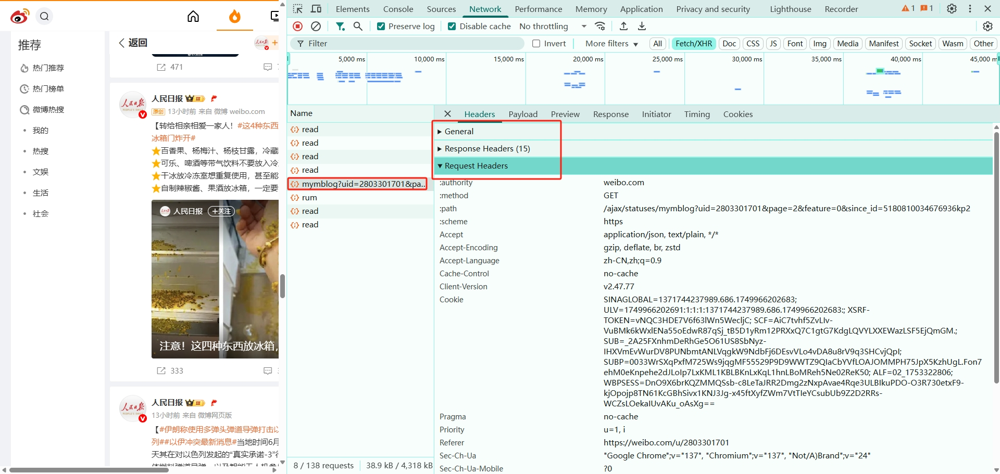
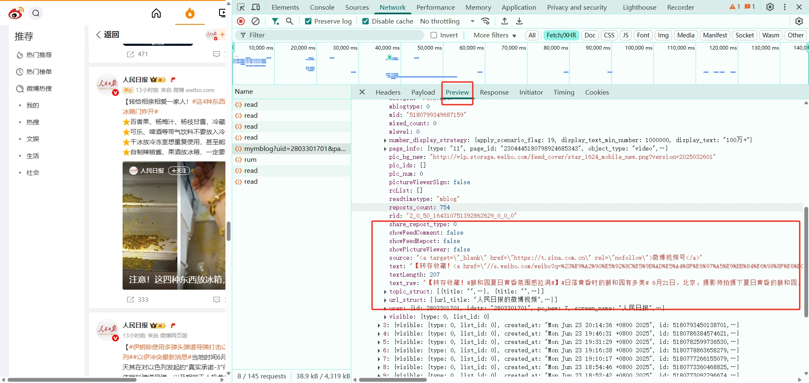
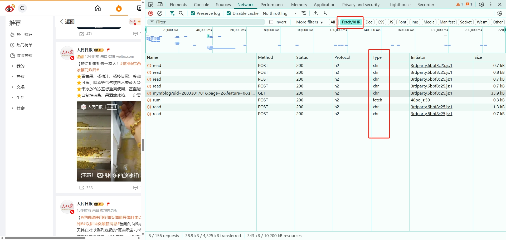
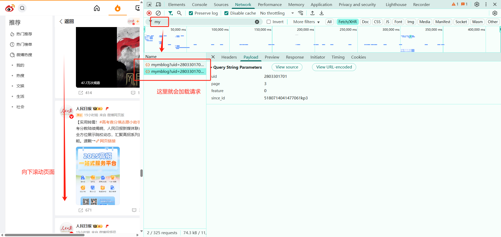
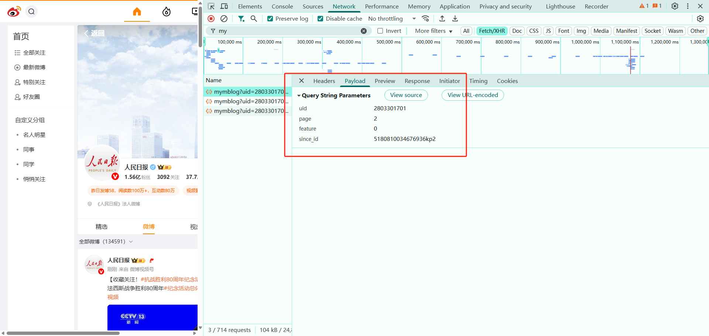

## 第8章：异步请求 - Ajax 

---

有时候在用 Requests 抓取页面的时候，得到的结果可能和在浏览器中看到的不一样。在浏览器中可以看到正常显示的页面数据，但是使用 Requests 得到的结果并没有。这种情况就是数据的异步加载，是浏览器经过JavaScript处理数据后生成的结果，可能通过 Ajax 加载的，可能是包含在 HTML 文档中，也可能是经过 JavaScript 和特定算法计算后生成的。

所以，这样的网页，直接利用 Requests 是无法获取数据的，需要使用 Requests 来模拟 Ajax 请求，就可以成功获取数据了。

### 8.1  什么是Ajax

Ajax，全称为 Asynchronous JavaScript and XML，即异步的 JavaScript 和 XML。它不是一门编程语言，而是利用 JavaScript 在保证页面不被刷新、页面链接不改变的情况下与服务器交换数据并更新部分网页的技术。

对于传统的网页，如果想更新其内容，那么必须要刷新整个页面，但有了 Ajax，便可以在页面不被全部刷新的情况下更新其内容。在这个过程中，页面实际上是在后台与服务器进行了数据交互，获取到数据之后，再利用 JavaScript 改变网页，这样网页内容就会更新了。

#### 8.1.1 基本原理

初步了解了 Ajax 之后，我们再来详细了解它的基本原理。发送 Ajax 请求到网页更新的这个过程可以简单分为以下 3 步：

* 发送请求
* 解析内容
* 渲染网页

##### 8.1.2 发送请求

JavaScript 可以实现页面的各种交互功能，Ajax 也不例外，它也是由 JavaScript 实现的，实际上执行了如下代码：

```javascript
var xmlhttp;
if (window.XMLHttpRequest) {
    //code for IE8+, Firefox, Chrome, Opera, Safari
    xmlhttp=new XMLHttpRequest();} else {//code for IE6, IE5
    xmlhttp=new ActiveXObject("Microsoft.XMLHTTP");
}
xmlhttp.onreadystatechange=function() {if (xmlhttp.readyState==4 && xmlhttp.status==200) {document.getElementById("myDiv").innerHTML=xmlhttp.responseText;
    }
}
xmlhttp.open("POST","/ajax/",true);
xmlhttp.send();
```

这是 JavaScript 对 Ajax 最底层的实现，实际上就是新建了 XMLHttpRequest 对象，然后调用 onreadystatechange 属性设置了监听，然后调用 open() 和 send() 方法向某个链接（也就是服务器）发送了请求。前面用 Python 实现请求发送之后，可以得到响应结果，但这里请求的发送变成 JavaScript 来完成。由于设置了监听，所以当服务器返回响应时，onreadystatechange 对应的方法便会被触发，然后在这个方法里面解析响应内容即可。

##### 8.1.3 解析内容

得到响应之后，onreadystatechange 属性对应的方法便会被触发，此时利用 xmlhttp 的 responseText 属性便可取到响应内容。这类似于 Python 中利用 requests 向服务器发起请求，然后得到响应的过程。那么返回内容可能是 HTML，可能是 JSON，接下来只需要在方法中用 JavaScript 进一步处理即可。比如，如果是 JSON 的话，可以进行解析和转化。

##### 8.1.4 渲染网页

JavaScript 有改变网页内容的能力，解析完响应内容之后，就可以调用 JavaScript 来针对解析完的内容对网页进行下一步处理了。比如，通过 document.getElementById().innerHTML 这样的操作，便可以对某个元素内的源代码进行更改，这样网页显示的内容就改变了，这样的操作也被称作 DOM 操作，即对 Document 网页文档进行操作，如更改、删除等。

因此，我们知道，真实的数据其实都是一次次 Ajax 请求得到的，如果想要抓取这些数据，需要知道这些请求到底是怎么发送的，发往哪里，发了哪些参数。如果我们知道了这些，不就可以用 Python 模拟这个发送操作，获取到其中的结果了。

### 8.2 Ajax分析方法

查看微博内容，滚动页面就会刷新页面内容，就是通过 Ajax 加载的，而且页面的 URL 没有变化。

#### 8.2.1 查看请求

这里需要借助浏览器的开发者工具，以 Chrome 浏览器为例来介绍。使用 Chrome 浏览器打开微博的链接 https://weibo.com/u/2803301801 ，随后在页面中点击鼠标右键，从弹出的快捷菜单中选择 “检查” 选项，此时便会弹出开发者工具。



此时，在 Elements 选项卡中便会观察到经过渲染之后的页面代码，右侧便是节点的样式。切换到 Network 选项卡，随后重新刷新页面，可以发现这里出现了非常多的条目。在 Name 一栏其实就是页面在加载过程中浏览器与服务器之间发送请求和接收响应的所有记录。



Ajax 其实有其特殊的请求类型，它叫作 xhr。我们可以发现一个名称以 getIndex 开头的请求，其 Type 为 xhr，这就是一个 Ajax 请求。用鼠标点击这个请求，可以查看这个请求的详细信息。



在右侧可以观察到其 Request Headers、URL 和 Response Headers 等信息。其中 Request Headers 中有一个信息为 X-Requested-With:XMLHttpRequest，这就标记了此请求是 Ajax 请求。



随后点击一下 Preview，即可看到响应的内容，它是 JSON 格式的。这里 Chrome 为我们自动做了解析，点击箭头即可展开和收起相应内容，观察可以发现，这里的返回结果是微博内容。JavaScript 接收到这些数据之后，再执行相应的渲染方法，整个页面就渲染出来了。



也可以切换到 Response 选项卡，从中观察到真实的返回数据。


#### 8.2.2 过滤请求

接下来，再利用 Chrome 开发者工具的筛选功能筛选出所有的 Ajax 请求。在请求的上方有一层筛选栏，直接点击 `Fetch/XHR`，此时在下方显示的所有请求便都是 Ajax 请求了。



不断滑动页面，可以看到页面底部有一条条新的微博被刷出，而开发者工具下方也一个个地出现 Ajax 请求，这样就可以捕获到所有的 Ajax 请求了。

### 8.3 提取结果

仍然以微博为例 https://weibo.com/u/2803301701 ，用 Python 来模拟这些 Ajax 请求，把微博内容爬取下来

#### 8.3.1 分析请求

打开 Ajax 的 XHR 过滤器，然后一直滑动页面以加载新的微博内容。可以看到，会不断有 Ajax 请求发出。选定其中一个请求，分析它的参数信息。点击该请求，进入详情页面。



可以发现，这是一个GET请求，请求的url是https://weibo.com/ajax/statuses/mymblog?uid=2803301701&page=1&feature=0&since_id=5180714041477061kp3点击Payload 选项卡你会发现请求的参数有三个：`uid`、`page`、`feature`、`since_id` 。继续滚动页面，看后续发送的请求，请求参数是否有变化。

会发现参数变多了，`uid` 和 `feature` 是不变的，page变成了 2 ，并且多了个since_id。`page=2` 可以理解，滚动页面后加载了更多的数据，相当于做了分页，从第一页切换到第二页了，那这个 since_id 是个什么鬼？查看第一条请求返回的数据可以看到，里面包含了`since_id` 而且你会发现，第一次请求返回数据中的 since_id 与 第二次请求参数中的 since_id 是相同的。所以，也就得出一个结论，下一次请求的参数，是在上一次请求的返回数据中。以此类推，每一页的请求参数就都齐全了。



#### 8.3.2 分析响应

观察这个请求的响应内容，是JSON格式的，浏览器开发者工具自动做了解析以便我们查看。重点关注 `list` 和 `since_id` ,`list` 里面存放着微博的内容，`since_id` 是下一次请求的参数。其他的字段信息如分享、评论、点赞等等，暂且先不关注。本次的目标拿到前10页的所有微博正文内容。

所以，第一次请求接口url会得到20条微博和下次请求的 `since_id` , 那么循环请求10次，每循环一次修改一次 `since_id` 和 `page` 参数，是不是就可以获取10页得所有数据了。


#### 8.3.3 实战演练

使用Python程序模拟 Ajax 请求，完成仙逆动漫账号的前10页内容提取。梳理一下思路：

- 第一步：定义主方法，用来定义全局url、headers、params、分页等信息
- 第二步：定义获取数据方法，用来请发请求，返回数据
- 第三步：定义解析方法，用来解析返回的数据，并提取标目数据
- 第四步：处理since_id 和 分页逻辑

本次案例，在控制台输出微博正文即视为成功，后续的存储逻辑可自行补充。

```python
import requests

def parser_data(data):
    """
    解析数据
    :return:
    """
    global params # 修改全局变量
    content_lst = data["data"]["list"]
    for content in content_lst:
        txt_row = content["text_raw"].strip()  # 每一条微博的内容
        print(txt_row)

    # 这是下一次请求要用的since_id
    since_id = data["data"]["since_id"]
    return since_id


def get_page_data(url, params, headers):
    """
    发送请求，获取影响数据
    :return:json数据
    """
    resp = requests.get(url, params=params, headers=headers)
    resp.encoding = "utf-8"
    data = resp.json()
    return data


def main():
    """
    主方法
    :return:
    """
    page = 1
    while page <= 5:
        # 请求的url
        url = "https://weibo.com/ajax/statuses/mymblog"
        # 请求头，这里需要携带Cookies信息
        headers = { 
            "user-agent": "Mozilla/5.0 (Windows NT 10.0; Win64; x64) AppleWebKit/538.36 (KHTML, like Gecko)    Chrome/135.0.0.0 Safari/538.36",
            "referer": "https://weibo.com/u/6904550522",
            "cookie": "<REDACTED_SECRET>",
            "x-requested-with": "XMLHttpRequest",
        }
        # 请求参数
        params = {
            "uid": "6904550522",
            "page": page,
            "feature": "0",
        }
        data = get_page_data(url, params=params, headers=headers)
        since_id = parser_data(data)
        # 修改请求参数
        params["since_id"] = since_id
        # 处理分页
        page += 1


if __name__ == '__main__':
    """程序入口"""
    main()


```

案例的目的是为了演示 Ajax 的模拟请求过程，爬取的结果不是重点。该程序仍有很多可以完善的地方，可以尝试一下。通过这个案例，主要学会了怎样去分析 Ajax 请求，怎样用程序来模拟抓取 Ajax 请求。


