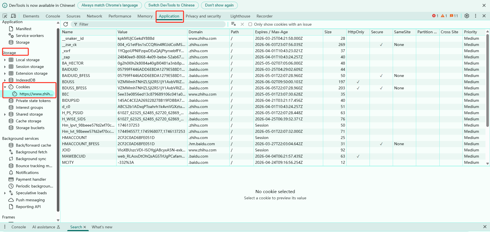

## 第9章：Session 和 cookie 

---

在浏览网站的过程中，经常会遇到需要登陆的情况，有些页面只有登陆之后才可以访问，而且登陆之后就可以连续访问很多次网站。但是有时候过一段时间就需要重新登陆。还有一些网站，再打开浏览器的时候就自动登陆了，而且很长时间都不会失效，这其实里面都涉及了会话（Session）和 Cookies 的相关知识。

### 9.1 静态与动态网页

网页内容由 HTML 代码编写，文字、图片等内容均通过写好的 HTML 代码来指定，这种页面叫做**静态网页**。特点是加载速度快、编写简单。缺点是可维护性差，不能根据 URL 灵活多变的显示内容。

页面还可以由 `jsp`、`PHP`、`Python` 等语言编写，不再是单纯的 `HTML` ，可以动态解析 `URL` 中参数的变化，关联数据库并动态呈现不同的页面内容，非常灵活多变，这种叫做**动态网页**。

### 9.2 无状态HTTP

`HTTP` 的无状态是指 `HTTP` 协议对事物处理是没有记忆能力的，也就是说服务器不知道客户端是什么状态。当客户端向服务器发送请求后，服务器解析此请求，然后返回对应的响应，服务器负责完成这个过程，而且这个过程是全完独立的，服务器不会记录前后状态的变化，也就是缺少了状态记录。所以，如果后续需要处理前面的信息，必须重新请求，但这势必会造成资源的浪费。

此时，用于保持`HTTP`链接状态的技术就出现了，他们分别是会话`Session`和 `Cookies`。 `Session` 在服务端，也就是网站的服务器，用来保存用户的会话信息；`Cookies` 在客户端，也可以理解为浏览器，浏览器在下次访问网页时会自动附带上`Cookies`发送给服务器，服务器通过识别 `Cookies `并鉴定是哪个用户，然后再判断用户是否是登陆状态，然后返回对应的响应。

可以理解为` Cookies `里面保存了登陆的凭证，有了它，在下次请求时就不必重新输入用户名和密码了。所以，在爬虫中，遇到需要登陆后才能访问的页面时，一般会将登陆成功后获取的 `Cookies`放在请求头里面直接请求，而不必重新模拟登陆。

### 9.3 Session 会话

会话，其本意是指有始有终的一系列动作或者消息。比如，打电话时从拿起电话拨号到挂断电话这中间的一些列过程可以成为一个会话。而在 `web` 中，会话用来存储特定用户会话所需的属性及配置信息。这样，当用户在应用程序的 `Web` 页之间跳转时，存储在会话对象中的变量将不会丢失，而是在整个用户会话中一直存在下去。当用户请求来自应用程序的 `Web` 页时，如果该用户还没有会话，则 `Web` 服务器将自动创建一个会话对象。当会话过期或被放弃后，服务器将终止该会话。

### 9.4  Cookies

`HTTP` 请求不是连续的，一次请求对应一次响应就结束了。所以需要服务器端的 `Session` 保持会话并且保存登陆的状态。`Session` 数据类似字典一样有 `key` 和 `value` 。在 `Session` 中最重要的一个字段是 `Id`，这个字段会随着响应，通过`Set-Cookie`字段发送给客户端，用来标记是哪一个用户。在客户端存储为`Session_Id`，后续的所有请求都会带着`Session_id`。服务器会判断请求中是否有`Session_id`，如果有，则用户已登陆，如果没有，则要求用户去登陆。

`Cookies` 指网站为了辨别用户身份、进行会话跟踪而存储在用户本地浏览器上的数据。如果`Session_id`这个变量存储在浏览器中，当关闭浏览器后这个变量就会丢失。所以`Session_id`会写入一个文件，这个文件就是 Cookies 。这个文件里面会存储一个超大号的字符串，实现长时间存储，在过期时间内登陆浏览器，会自动提取跟登陆网站相关的`Session_id`信息发给对应的服务器。

#### 9.4.1 Cookies属性结构

Cookies 文件里面主要是：

  - URL
  - Session_id（不同的网站会叫不同的名字，比如：_ntes_uid 等）
  - 字符串的键值对
  - 过期时间

以知乎为例，在浏览器开发者工具中打开 Application 选项卡，在左侧会有一个 Storage 部分，找到 Cookies，将其点开。



可以看到，这里有很多条目，其中每个条目可以称为 Cookie。它有如下几个属性：

* Name，即该 Cookie 的名称。Cookie 一旦创建，名称便不可更改
* Value，即该 Cookie 的值。如果值为 Unicode 字符，需要为字符编码。如果值为二进制数据，则需要使用 BASE64 编码。
* Max Age，即该 Cookie 失效的时间，单位秒，也常和 Expires 一起使用，通过它可以计算出其有效时间。Max Age 如果为正数，则该 Cookie 在 Max Age 秒之后失效。如果为负数，则关闭浏览器时 Cookie 即失效，浏览器也不会以任何形式保存该 Cookie。
* Path，即该 Cookie 的使用路径。如果设置为 /path/，则只有路径为 /path/ 的页面可以访问该 Cookie。如果设置为 /，则本域名下的所有页面都可以访问该 Cookie。
* Domain，即可以访问该 Cookie 的域名。例如如果设置为 .zhihu.com，则所有以 zhihu.com，结尾的域名都可以访问该 Cookie。
* Size 字段，即此 Cookie 的大小。
* Http 字段，即 Cookie 的 httponly 属性。若此属性为 true，则只有在 HTTP Headers 中会带有此 Cookie 的信息，而不能通过 document.cookie 来访问此 Cookie。
* Secure，即该 Cookie 是否仅被使用安全协议传输。安全协议。安全协议有 HTTPS，SSL 等，在网络上传输数据之前先将数据加密。默认为 false。

#### 9.4.2 会话Cookie 和持久Cookie

从表面意思来说，会话 `Cookie` 就是把 `Cookie` 放在浏览器内存里，浏览器在关闭之后该 `Cookie` 即失效；持久 `Cookie` 则会保存到客户端的硬盘中，下次还可以继续使用，用于长久保持用户登录状态。

其实严格来说，没有会话 `Cookie` 和持久 `Cookie` 之分，只是由 `Cookie` 的 `Max Age` 或 `Expires` 字段决定了过期的时间。因此，一些持久化登录的网站其实就是把 `Cookie` 的有效时间和会话有效期设置得比较长，下次我们再访问页面时仍然携带之前的 `Cookie`，就可以直接保持登录状态。

### 9.5 Session 的使用方式

#### 9.5.1 Cookie生成方式

我们已经了解到`Set_cookie`是在响应头中，而`cookie`在请求头中，所以，在当今的网站生态环境中`cookie`有两种生成方式：

- 第一种：随服务器的响应一起返回
- 第二种：通过 `JavaScript` 生成` cookie `
  - 在第一次请求时，服务器的响应返回 `HTML`、`CSS`、`JavaScript`，与此同时会产生一段非常长的字符串写入`cookie`中
  - 当第二次请求时，需要带上这个字符串，服务器通过解密，知道请求的内容是什么，返回响应数据。
  - 有些网站为了反爬，在每一次响应后都会产生一个新的字符串发给客户端，替换掉原来的字符串，再次请求时，携带新的字符串才可以，每一次请求和响应都会产生新的。

#### 9.5.2 使用方法

当目标网站需要登陆后才能提取数据时，有两种方式：

第一种：通过正常途径登录网站，然后获取登陆后生成的`cookie`，在下一次请求中放到`headers`中：

```py
import requests

# 登陆信息
data = {
    "username":"<REDACTED_CREDENTIAL>",
    "password":"<REDACTED_CREDENTIAL>",
}
# 发送请求登陆
resp = requests.post(url,data=data)
# 获取登陆之后的cookie
coo = resp.cookies 
# 再次访问需要登陆后才能访问的目标URL
URL = "BBBBBBB"
resp_2 = requests.get(url,cookies=coo) # 这里发送请求需要带着登陆后的cookie
print(resp_2.text)

```

第二种：`requests.session()` 能像浏览器一样自动处理`set-cookie`中的内容，在后续的请求中也会自动处理`cookie`

```python
import requests

# 1.创建一个session
session = requests.session()

# 可以提前给session设置好请求头
session.headers = {
    "user-Agent":"",
}

# 这个URL是没有登陆之前的URL
url = "XXXXXXXX"
# 用户名和密码
data = {
   "loginName":"<REDACTED_CREDENTIAL>",
   "password":"<REDACTED_CREDENTIAL>"
}
# 把登陆信息传给Session发送请求,这里返回的Cookie信息就会被更新到session.header中，全程session都会自动处理。
resp = session.post(url,data=data)

# 登陆后的url
url = "XXXXXX" 
# 此时的Session就是更新后的，会携带着Cookie信息
resp_2 = session.get(url) 
print(resp_2.text)

# 总结一下就是requests不需要保持会话，不会处理cookie，而session会保持会话，遇到登陆、连续处理业务的时候应该选择session
```

### 9.6 总结

- 生成逻辑
  - 服务器生成：特征(必须记住)，响应头里面通过`set-cookie`把值带过来。此时, 该值是由服务器生成的。所以生成规则，是不知道的。不要妄想能本地生成该值
  - 浏览器生成：浏览器执行`javascript`脚本，脚本进行计算，并处理cookie的值。此时，是可以看到该值的生成过程的。逆向的时候，需要特别注意。特征(必须记住)，在响应头里找不到该值，但是发请求又有这个值。

- 处理逻辑:
  - 直接从浏览器把`cookie`复制出，放到请求头中直接使用即可
    - 优点: 简单、粗暴
    - 问题: `cookie`的值是有时效性的，`cookie`值会过期, 需要重新复制一个

```python
import requests


url = "https://xueqiu.com/"

# 请求首页, 获取到cookie值
headers = {
    "accept": "text/html,application/xhtml+xml,application/xml;q=0.9,image/avif,image/webp,image/apng,*/*;q=0.8,application/signed-exchange;v=b3;q=0.7",
    "accept-encoding": "gzip, deflate, br, zstd",
    "accept-language": "zh-CN,zh;q=0.9,en;q=0.8",
    "cache-control": "no-cache",
    "connection": "keep-alive",
    "dnt": "1",
    "host": "xueqiu.com",
    "pragma": "no-cache",
    "sec-ch-ua": "/"Not)A;Brand/";v=/"99/", /"Google Chrome/";v=/"127/", /"Chromium/";v=/"127/"",
    "sec-ch-ua-mobile": "?0",
    "sec-ch-ua-platform": "/"Windows/"",
    "sec-fetch-dest": "document",
    "sec-fetch-mode": "navigate",
    "sec-fetch-site": "none",
    "sec-fetch-user": "?1",
    "upgrade-insecure-requests": "1",
    "user-agent": "Mozilla/5.0 (Windows NT 10.0; Win64; x64) AppleWebKit/537.36 (KHTML, like Gecko) Chrome/127.0.0.0 Safari/537.36"
}
resp = requests.get(url, headers=headers)
# 此时的响应头中返回了set-cookie字段
print(resp.headers.get("set-cookie"))
print(resp.cookies)

# 借助于响应头的cookie 发请求. 看看能否得到雪球上的数据
data_url ="https://xueqiu.com/statuses/hot/listV3.json?page=1&last_id="
resp = requests.get(data_url, headers=headers, cookies=resp.cookies)
# resp = requests.get(data_url, headers=headers)
print(resp.text)
print(resp.cookies)
```


- 可以使用`resp.cookie`把响应头中的`cookie`值拿出来，传递给下一个请求，手工携带`cookie`
    - `resp = requests.get(url)`

    - `resp2 = requests.get(url, cookie=resp.cookie)` 


```python
url = "https://xueqiu.com/"
# 创建Session
session = requests.session()
headers = {
    "accept": "text/html,application/xhtml+xml,application/xml;q=0.9,image/avif,image/webp,image/apng,*/*;q=0.8,application/signed-exchange;v=b3;q=0.7",
    "accept-encoding": "gzip, deflate, br, zstd",
    "accept-language": "zh-CN,zh;q=0.9,en;q=0.8",
    "cache-control": "no-cache",
    "connection": "keep-alive",
    "dnt": "1",
    "host": "xueqiu.com",
    "pragma": "no-cache",
    "sec-ch-ua": "/"Not)A;Brand/";v=/"99/", /"Google Chrome/";v=/"127/", /"Chromium/";v=/"127/"",
    "sec-ch-ua-mobile": "?0",
    "sec-ch-ua-platform": "/"Windows/"",
    "sec-fetch-dest": "document",
    "sec-fetch-mode": "navigate",
    "sec-fetch-site": "none",
    "sec-fetch-user": "?1",
    "upgrade-insecure-requests": "1",
    "user-agent": "Mozilla/5.0 (Windows NT 10.0; Win64; x64) AppleWebKit/537.36 (KHTML, like Gecko) Chrome/127.0.0.0 Safari/537.36"
}
resp = session.get(url, headers=headers)
data_url ="https://xueqiu.com/statuses/hot/listV3.json?page=1&last_id="
data_resp = session.get(data_url, headers=headers)
print(resp.text)
```


- 推荐使用的方式：使用`requests`模块提供的`session`方法，可以保持客户端和服务器之间的状态`cookie` 并且可以自动的维护响应头带回来的`cookie`值。
    - 最大的弊端是：不能维护`javascript`生成的`cookie` 。`javascript`生成的`cookie`需要手工去维护。
    - 使用`JavaScript`生成`cookie`值，放到`session`中就可以了。

```python
import requests

url = "https://xueqiu.com/"
headers = {
    "accept": "text/html,application/xhtml+xml,application/xml;q=0.9,image/avif,image/webp,image/apng,*/*;q=0.8,application/signed-exchange;v=b3;q=0.7",
    "accept-encoding": "gzip, deflate, br, zstd",
    "accept-language": "zh-CN,zh;q=0.9,en;q=0.8",
    "cache-control": "no-cache",
    "connection": "keep-alive",
    "dnt": "1",
    "host": "xueqiu.com",
    "pragma": "no-cache",
    "sec-ch-ua": "/"Not)A;Brand/";v=/"99/", /"Google Chrome/";v=/"127/", /"Chromium/";v=/"127/"",
    "sec-ch-ua-mobile": "?0",
    "sec-ch-ua-platform": "/"Windows/"",
    "sec-fetch-dest": "document",
    "sec-fetch-mode": "navigate",
    "sec-fetch-site": "none",
    "sec-fetch-user": "?1",
    "upgrade-insecure-requests": "1",
    "user-agent": "Mozilla/5.0 (Windows NT 10.0; Win64; x64) AppleWebKit/537.36 (KHTML, like Gecko) Chrome/127.0.0.0 Safari/537.36"
}
session = requests.session()
# 设置默认的头. 以后, 头就不用管了. 有两个值需要单独维护
# 1. content-type, 需要手工维护
# 2. referer, 需要手工维护
session.headers = headers
data_url = "https://xueqiu.com/statuses/hot/listV3.json?page=1&last_id="
resp = session.get(data_url)
print(resp.text)

```

### 9.7 实战案例

```python
"""
目标网站: http://www.woaidu.cc/login.php?jumpurl=

需求:
1. 完成登陆操作, 看到书架中的内容
2. 案例涉及内容Session和cookie保持会话
3. 过验证码
    1. 使用ddddocr
    2. 使用三方平台 图鉴

"""

# 方式二：访问登录页面 -> 登录 -> 访问书架 -> 请求书架地址 -> 获取书架内容
# 此方式使用Session保持会话，使用ddddocr过掉验证码
import base64
import json
import requests
import ddddocr


# 创建会话，保存请求头信息到Session中
session = requests.Session()
session.headers = {
    "accept": "image/avif,image/webp,image/apng,image/svg+xml,image/*,*/*;q=0.8",
    "accept-encoding": "gzip, deflate",
    "accept-language": "zh-CN,zh;q=0.9",
    "cache-control": "no-cache",
    "connection": "keep-alive",
    "dnt": "1",
    "host": "www.woaige.net",
    "pragma": "no-cache",
    "referer": "http://www.woaige.net/book/1255314/",
    "upgrade-insecure-requests": "1",
    "user-agent": "Mozilla/5.0 (Windows NT 10.0; Win64; x64) AppleWebKit/537.36 (KHTML, like Gecko) Chrome/136.0.0.0 Safari/537.36"
}

# 识别验证码
code_url = "http://www.woaige.net/code.php?0.8272758415126823"
code_resp = session.get(code_url)
# 查看Cookies中是否有c=……开头的值，这是校验验证码用的
print(session.cookies)
# 识别图片方式一：ddddocr
dd = ddddocr.DdddOcr(show_ad=False)
# 读取图片
result = dd.classification(code_resp.content)
print(result)


# 识别方式二：付费平台图鉴
# 下载识别码图片
# with open("code.jpg", "wb") as f:
#     f.write(code_resp.content)
#
#
# def base64_api(uname, pwd, img, typeid):
#     with open(img, 'rb') as f:
#         base64_data = base64.b64encode(f.read())
#         b64 = base64_data.decode()
#     data = {"username": uname, "password": pwd, "typeid": typeid, "image": b64}
#     result = json.loads(requests.post("http://api.ttshitu.com/predict", json=data).text)
#     if result['success']:
#         return result["data"]["result"]
#     else:
#         # 注意：返回 人工不足等 错误情况 请加逻辑处理防止脚本卡死 继续重新 识别
#         return result["message"]
#     return ""
#
#
# result = base64_api(uname='<REDACTED_CREDENTIAL>', pwd=<REDACTED_CREDENTIAL>, img="code.jpg", typeid=1)
# print(result)

# 组织登录信息，发送登录请求
login_url = "http://www.woaige.net/login.php"
my_form_data = {
    "LoginForm[username]": "<REDACTED_CREDENTIAL>",
    "LoginForm[password]": "<REDACTED_CREDENTIAL>",
    "LoginForm[captcha]": result,
    "action": "login",
    "submit": "登  录"
}

login_resp = session.post(login_url, data=my_form_data)
print(login_resp.text)# 看到首页内容，证明登录成功

# 继续请求书架信息
bookshelf_url = "http://www.woaige.net/bookcase.php"
bookshelf_resp = session.get(bookshelf_url)
print(bookshelf_resp.text) # 搜索"我的心动女邻居"，可以看到内容
```


